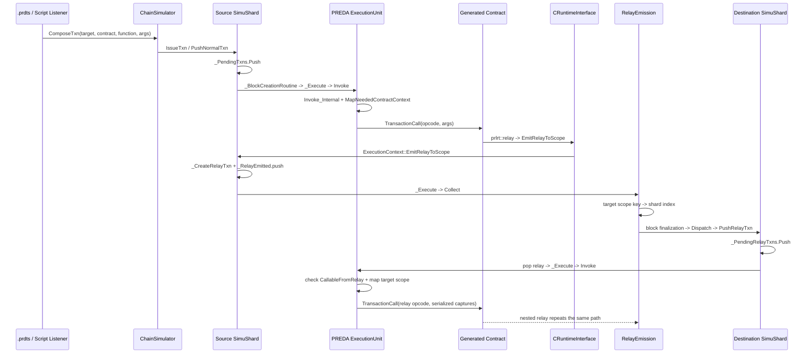

# PREDA Relay Architecture Map

本文档按当前仓库源码还原 `.prd` 合约从解析、代码生成、分片执行到 relay 再执行的真实路径。它是后续实现 relay protocol 推断与静态验证的代码地图，不包含行为修改。

## 0. 结论先行

- PREDA 编译器目前**没有独立、持久化的通用 AST 或 IR**。所谓 AST 实际上是 ANTLR 生成的 `PredaParser::*Context` parse tree；`PredaRealListener` 在遍历 parse tree 时完成名称解析、类型/作用域检查并直接输出 C++。
- `relay@target` 没有独立的静态 IR 节点。语法节点是 `RelayStatementContext`；具名 relay 在 listener 中直接降成 `prlrt::relay(...)`，lambda relay 只额外保存为临时的 `PendingRelayLambda`。
- runtime 中没有名为 `RelayDescriptor` 的类型。实际 relay descriptor 是带 `RelayInbound` 标志的 `SimuTxn`，创建点是 `SimuShard::_CreateRelayTxn()`。
- execution unit 不是 scope partition 本身。模拟器为**每个 shard、每个已挂载 engine**创建一个 execution unit；`ScopeTarget -> shard index` 的哈希映射决定由哪个 shard 的 execution unit 执行。
- relay 不是在 `EmitRelayToScope()` 中直接跨 shard 执行。它先进入本次交易的 `_RelayEmitted`，再由 `RelayEmission::Collect()` 路由，最后由 `Dispatch()` 压入目标 shard 的 relay queue。
- 当前 stopwatch 的 `TPS` 是观测窗口内 pending 数量的净下降速率；`uTPS` 是所有已确认 `SimuTxn` 的速率。后者包含源交易和 relay 执行，不能直接理解为用户源交易 TPS。

## 1. `.prd` parser 与 AST

### 1.1 语法与生成代码

| 层 | 位置 | 作用 |
|---|---|---|
| PREDA grammar | [`oxd_preda/spec/Preda.g4`](oxd_preda/spec/Preda.g4) | `.prd` 的权威语法定义 |
| 顶层/contract/function/state | [`Preda.g4:1`](oxd_preda/spec/Preda.g4#L1) | `predaSource`、contract、state、function |
| scope grammar | [`Preda.g4:38`](oxd_preda/spec/Preda.g4#L38) | `@shard`、`@global`、`@address`、`@uint*` |
| relay grammar | [`Preda.g4:147`](oxd_preda/spec/Preda.g4#L147) | relay target、relay type、lambda 参数 |
| ANTLR parser | [`oxd_preda/transpiler/antlr_generated/PredaParser.h`](oxd_preda/transpiler/antlr_generated/PredaParser.h) | `PredaParser::*Context` parse-tree 节点 |
| listener API | [`oxd_preda/transpiler/antlr_generated/PredaListener.h`](oxd_preda/transpiler/antlr_generated/PredaListener.h) | parse-tree 回调接口 |

### 1.2 构建与消费 parse tree

入口类 `CTranspiler` 同时持有字符流、lexer、token stream、parser 和 parse tree：

1. [`CTranspiler::BuildParseTree()`](oxd_preda/transpiler/transpiler.cpp#L70) 调用 `m_parser.predaSource()`。
2. [`CTranspiler::Compile()`](oxd_preda/transpiler/transpiler.cpp) 创建 `PredaRealListener`。
3. `PredaParseTreeWalker` 遍历 parse tree。
4. listener 同步更新语义表，并通过 `CodeSerializer` 输出 C++。

因此当前数据流是：

```text
.prd text
  -> PredaLexer
  -> token stream
  -> PredaParser::PredaSourceContext
  -> PredaRealListener
       + ConcreteType / FunctionSignature / DefinedIdentifier
       + PredaTranspilerContext
       + CodeSerializer
  -> generated C++
```

这里的 `ConcreteType`、`FunctionSignature`、`DefinedIdentifier` 是语义对象，但它们没有组成一棵可供后续 pass 重访的完整 AST/IR。

## 2. `relay@target` 对应的 AST / IR

### 2.1 parse-tree 节点

[`Preda.g4:147`](oxd_preda/spec/Preda.g4#L147) 中的核心规则是：

```antlr
relayStatement
relayType
relayLambdaDefinition
relayLambdaParameter
```

对应的 parse-tree 类型为：

```text
PredaParser::RelayStatementContext
PredaParser::RelayTypeContext
PredaParser::RelayLambdaDefinitionContext
PredaParser::RelayLambdaParameterContext
```

### 2.2 语义检查与 lowering

核心入口是 [`PredaRealListener::enterRelayStatement()`](oxd_preda/transpiler/PredaRealListener.cpp#L1086)：

1. 解析 target expression。
2. 由 target 的 `ConcreteType` 推导目标 `ScopeType`。
3. 区分 custom scope、`shards`、`global`、`next`。
4. 对具名目标函数做函数查找、参数数量/类型和 scope 检查。
5. 对 lambda 捕获参数类型并分配 exported function slot/opcode。
6. 直接输出以下 runtime helper 调用之一：

```cpp
prlrt::relay(target, scopeType, opCode, args...);
prlrt::relay_shards(opCode, args...);
prlrt::relay_global(opCode, args...);
prlrt::relay_next(opCode, args...);
```

lambda relay 的临时语义记录定义在
[`PredaRealListener.h`](oxd_preda/transpiler/PredaRealListener.h)：

- `RelayType { CustomScope, Shards, Global }`
- `PendingRelayLambda`
  - parse context
  - 捕获参数类型
  - relay 类型
  - function scope
  - exported function slot
  - base function

[`DeclareRelayLambdaFunction()`](oxd_preda/transpiler/PredaRealListener.cpp#L1335) 把它加入 pending 列表；随后 `DefinePendingRelayLambdas()` 合成 `__relaylambda_<slot>_<base>` 函数，并赋予 `CallableFromRelay` 和 scope flags。

**关键缺口：**具名 relay 与 lambda relay 没有汇总成统一、持久化的 protocol IR。若要做静态协议推断，不能只依赖 `PendingRelayLambda`。

## 3. scope declaration 与 scope-key 类型

### 3.1 源语言声明

[`Preda.g4:38`](oxd_preda/spec/Preda.g4#L38) 定义：

```text
@shard
@global
@address
@uint32 / @uint64 / @uint96 / @uint128 / @uint160 / @uint256 / @uint512
```

state variable 在
[`PredaRealListener::DefineStateVariable()`](oxd_preda/transpiler/PredaRealListener.cpp#L1759)
中通过 `GetScopeFromScopeCtx()` 取得 scope；省略时默认为 global。

### 3.2 编译器 scope 类型

[`transpiler/PredaCommon.h`](oxd_preda/transpiler/transpiler/PredaCommon.h) 中的 `ScopeType` 包括：

```text
Global, Shard, Address,
Uint32, Uint64, Uint96, Uint128, Uint160, Uint256, Uint512
```

`FunctionFlags` 的低位编码函数 scope，并同时携带 `CallableFromRelay` 等调用属性。类型与 scope 的双向映射位于：

- [`ScopeTypeToConcreteType()`](oxd_preda/transpiler/PredaRealListener.cpp#L3459)
- [`ConcreteTypeToScopeType()`](oxd_preda/transpiler/PredaRealListener.cpp#L3485)

需要注意：枚举保留了 `uint96`、`uint160` scope，但当前编译器 concrete-type 映射并不完整支持所有保留项。

### 3.3 engine/runtime scope 与 key

[`PredaScopeToRvmScope()`](oxd_preda/engine/preda_engine/ContractData.h#L125)
把编译器 scope 编码成 `rvm::SCOPE_MAKE(...)`。

模拟器用 [`ScopeTarget`](oxd_preda/simulator/shard_data.h#L93) 保存目标：

- `target_size` 作为 tag/长度；
- union 保存 address 或 `u32/u64/u96/u128/u160/u256/u336/u512`。

scope partition 映射在
[`ChainSimulator::GetShardIndex()`](oxd_preda/simulator/chain_simu.h#L112)：

```cpp
address -> ADDRESS_SHARD_DWORD(address) & shardBitmask
keyed scope -> SCOPEKEY_SHARD_DWORD(ScopeKey{bytes, size}) & shardBitmask
```

这意味着动态 target 的真实分区只取决于序列化后的 scope key 和当前 shard bitmask。

## 4. Native / WASM module 生成与加载

### 4.1 `.prd -> C++`

[`CContractDatabase::CompileContract()`](oxd_preda/engine/preda_engine/ContractDatabase.cpp#L1198)
调用 transpiler，取得：

- 生成的 C++ intermediate code；
- contract scope/function/export metadata；
- 编译诊断。

### 4.2 C++ -> module

link/build 逻辑位于
[`ContractDatabase.cpp:1380`](oxd_preda/engine/preda_engine/ContractDatabase.cpp#L1380)：

1. 写入 `intermediate/_stage*.cpp`。
2. 生成 `transpiledCode.cpp`，包含 `compile_env/contract_template.h` 和中间代码。
3. Native 路径用 `g++ -O3 -shared -fPIC -std=c++17` 生成共享库。
4. WASM 路径用 Emscripten `emcc -Oz -sRELOCATABLE ...` 生成 `.wasm`。

### 4.3 module 加载

[`CContractDatabase::GetContractModule()`](oxd_preda/engine/preda_engine/ContractDatabase.cpp#L713)：

- Native：`os::LoadDynamicLibrary()` -> `ContractModule::FromLibrary()`。
- WASM：Wasmtime compile/deserialize -> `ContractModule::FromWASMModule()`。

Native export 解析位于
[`ContractRuntimeInstance.cpp:50`](oxd_preda/engine/preda_engine/ContractRuntimeInstance.cpp#L50)，包括 `CreateInstance`、`TransactionCallEntry`、`MapContractContextToInstance` 等符号。

WASM host hook 在
[`WASMRuntime.cpp:306`](oxd_preda/engine/preda_engine/WASMRuntime.cpp#L306) 注册；WASM 合约调用 `predaEmitRelayToScope` 后仍转发到同一个 `CRuntimeInterface::EmitRelayToScope()`，所以下游 relay router 与 Native 共用。

> 仓库包含 WASM 生成/加载实现；当前 `chsimu` 初始化路径主要启用 Native engine，不能据此把两套编译后端误认为两套不同的 relay protocol。

## 5. execution unit 与 scope partition mapping

### 5.1 execution unit 的层级

ABI 定义在 [`vm_interfaces.h`](oxd_preda/native/abi/vm_interfaces.h)：

- `rvm::ExecutionUnit`：engine 创建的合约执行器，可包含多个 runtime instance。
- `rvm::ExecutionContext`：单次调用期间由 host 提供 scope target/state、block 信息和 relay emission API。

模拟器中的 [`ExecutionUnit`](oxd_preda/simulator/simu_shard.h#L17) 是按 engine id 索引的 unit 数组。每个 `SimuShard` 都持有一份 `_ExecUnits`。

初始化路径：

```text
SimuShard::Init()
  -> ChainSimulator::CreateExecuteUnit()
       -> each mounted engine: Engine::CreateExecuteUnit()
```

对应位置：

- [`SimuShard::Init()`](oxd_preda/simulator/simu_shard.cpp#L404)
- [`ChainSimulator::CreateExecuteUnit()`](oxd_preda/simulator/chain_simu.cpp#L591)

因此数量关系是：

```text
execution units ≈ shard instances × mounted engines
```

global shard 也有自己的 `SimuShard` 与 execution units。

### 5.2 scope 到 execution unit

```text
ScopeTarget
  -> ChainSimulator::GetShardIndex()
  -> target SimuShard
  -> SimuShard::_ExecUnits[contract.engine_id]
  -> rvm::ExecutionUnit::Invoke()
```

PREDA engine 内部再由
[`CExecutionEngine::MapNeededContractContext()`](oxd_preda/engine/preda_engine/ExecutionEngine.cpp)
根据函数 scope flags，把 global/shard/address/keyed scope state 映射给 contract instance。

[`CExecutionEngine::Invoke()`](oxd_preda/engine/preda_engine/ExecutionEngine.cpp#L177)
进入 `Invoke_Internal()` 后验证调用权限、压入 contract stack、创建/取得 instance、映射 context、调用 `TransactionCall()`，最后序列化并提交修改后的 scope state。

## 6. relay descriptor 的创建点

运行时实际 descriptor 是 [`SimuTxn`](oxd_preda/simulator/shard_data.h#L140)，它同时表示源交易与 relay，主要字段包括：

- target `ScopeTarget`
- origin block height / shard / txn order
- `ContractInvokeId`
- opcode
- flags（relay 使用 `RelayInbound`）
- serialized args
- gas redistribution weight
- txn hash

唯一的公共 relay 构造入口是
[`SimuShard::_CreateRelayTxn()`](oxd_preda/simulator/simu_shard.cpp#L219)：

1. 分配 `SimuTxn`；
2. 设置 `RelayInbound`；
3. 写入 contract/scope、opcode；
4. 记录 origin height/shard/order；
5. 拷贝 serialized arguments；
6. 设置 gas weight 并计算 hash。

随后具体 emission API 补充目标：

- [`EmitRelayToScope()`](oxd_preda/simulator/simu_shard.cpp#L248)
- `EmitRelayToGlobal()`
- `EmitRelayToShards()`
- `EmitRelayDeferred()`

## 7. relay router 与 queue push 点

### 7.1 合约到 host

生成代码调用 [`compile_env/include/relay.h`](oxd_preda/bin/compile_env/include/relay.h)：

```text
prlrt::relay*
  -> serialize args
  -> PREDA_CALL(EmitRelayToScope / Global / Shards / Deferred)
```

Native runtime interface 的桥接点是
[`CRuntimeInterface::EmitRelayToScope()`](oxd_preda/engine/preda_engine/RuntimeInterfaceImpl.cpp#L297)：

1. 把 compiler scope 转成 `rvm::Scope`；
2. 构造 `rvm::ScopeKey` 与 `ConstData`；
3. 调用当前 `ExecutionContext` 的 `EmitRelayToScope()`。

在 `chsimu` 中，这个 `ExecutionContext` 就是正在执行交易的 `SimuShard`。

### 7.2 transaction-local emission buffer

`SimuShard::EmitRelayToScope()` 创建 `SimuTxn` 后，先追加到 `_RelayEmitted`。它还没有进入目标 shard queue。

源交易执行完成后，`SimuShard::_Execute()` 把 `_RelayEmitted` 交给
[`RelayEmission::Collect()`](oxd_preda/simulator/simu_shard.cpp#L503)：

| relay 类别 | 路由结果 |
|---|---|
| global | `_ToGlobal` |
| shards broadcast | clone 到每个 `_ToShards[i]` |
| custom target，目标为当前 shard | `_IntraRelayTxns` |
| custom target，目标为其他 shard | `_ToShards[targetShard]` |
| deferred/next | next-block buffer |

custom target 的核心路由计算是：

```cpp
uint32_t si = _pSimulator->GetShardIndex(t->Target);
```

### 7.3 queue push

[`RelayEmission::Dispatch()`](oxd_preda/simulator/simu_shard.cpp#L569) 在 block 收尾时调用：

```text
_ToGlobal       -> globalShard.PushRelayTxn()
_ToShards[i]    -> shard[i].PushRelayTxn()
```

队列封装为 [`PendingTxns`](oxd_preda/simulator/shard_data.h#L295)，内部是 mutex 保护的 `std::deque<SimuTxn*>`；实际 push/pop 位于
[`shard_data.cpp:67`](oxd_preda/simulator/shard_data.cpp#L67)。

`SimuShard` 的三类主要输入是：

- `_PendingTxns`：外部/source transactions；
- `_PendingRelayTxns`：已路由进来的 relay；
- `_IntraRelayTxns`：当前 shard 内产生的 relay。

[`SimuShard::_BlockCreationRoutine()`](oxd_preda/simulator/simu_shard.cpp#L775)
中的执行优先级大致为：

```text
deferred relay
  -> inbound relay queue
  -> normal/source transaction queue
  -> intra-shard relay
  -> block finalization and relay dispatch
```

## 8. TPS / uTPS 统计位置与语义

stopwatch snapshot：

- [`enterStopWatchRestart()`](oxd_preda/simulator/simu_script.cpp#L633)
  - 记录开始时 pending 数；
  - 记录开始时 executed 数。

report：

- [`enterStopWatchReport()`](oxd_preda/simulator/simu_script.cpp#L642)

公式为：

```text
TPS  = (pending_at_start - pending_now) * 1000 / elapsed_ms
uTPS = (executed_now - executed_at_start) * 1000 / elapsed_ms
```

计数更新在 [`chain_simu.h`](oxd_preda/simulator/chain_simu.h)：

- `OnTxnPushed()` 增加 pending；
- `OnTxnsConfirmed()` 减少 pending，并增加 executed。

解释：

- `TPS` 实际是 pending backlog 的净消化速度。窗口中新增的 relay/source txn 会增加 pending，因此它不严格等于 source transaction completion rate。
- `uTPS` 是 execution-unit transaction throughput，即已确认 `SimuTxn` 数；source tx 和 relay tx 都会计数。
- 含多级 relay 的 workload 中，一笔 source tx 可以贡献多个 uTPS 单位，所以横向实验必须同时报告 source transaction 数、relay execution 数和 relay depth/count。

## 9. 一笔 source tx 到 relay execution 的真实调用链



逐步对应代码：

1. script 的 [`ResolveIssueTxn()` / issue handler](oxd_preda/simulator/simu_script.cpp#L826) 解析合约函数、目标 scope 与参数。
2. [`ChainSimulator::ComposeTxn()`](oxd_preda/simulator/chain_simu.cpp#L836) 经 engine `ArgumentsJsonParse()` 序列化参数并创建普通 `SimuTxn`。
3. `ScopeTarget` 计算 shard index；`ChainSimulator::IssueTxn()` 调用 `SimuShard::PushNormalTxn()`。
4. `_PendingTxns.Push()`。
5. shard thread 的 `_BlockCreationRoutine()` pop 普通交易并调用 `_Execute()`。
6. [`SimuShard::_Execute()`](oxd_preda/simulator/simu_shard.cpp#L632) 按 contract engine id 选择 `_ExecUnits[]`，调用 `rvm::ExecutionUnit::Invoke()`。
7. `CExecutionEngine::Invoke()` -> `Invoke_Internal()` -> scope state mapping -> generated contract `TransactionCall()`。
8. 合约执行 `prlrt::relay*()`；`relay.h` 序列化参数。
9. `PREDA_CALL` -> `CRuntimeInterface::EmitRelayToScope()` -> 当前 `SimuShard::EmitRelayToScope()`。
10. `_CreateRelayTxn()` 创建带 origin metadata 的 relay `SimuTxn`，并进入 `_RelayEmitted`。
11. 当前调用返回后，`_Execute()` 调用 `RelayEmission::Collect()`。
12. router 按 global/broadcast/deferred 或 scope-key shard hash 分类。
13. block 收尾时 `Dispatch()` 调用目标 shard 的 `PushRelayTxn()`。
14. relay 进入目标 `_PendingRelayTxns`。
15. 目标 shard 优先 pop inbound relay，再次进入 `_Execute()` 和 engine `Invoke()`。
16. `Invoke_Internal()` 验证目标 opcode 带 `CallableFromRelay`，映射目标 scope state，执行 relay function/lambda 并提交状态。
17. relay handler 若再发 relay，则从第 8 步递归形成 nested relay chain。

同 shard relay 是一个重要例外：`Collect()` 把它放入 `_IntraRelayTxns`，由当前 shard block routine 在 normal tx 后执行，不经过跨 shard 的 `_PendingRelayTxns` push。

## 10. 对 relay protocol 静态验证最合适的接入点

在不大改现有执行代码的前提下，建议先增加只读的 typed relay protocol IR：

```text
RelaySite
  source contract/function/source location
  relay kind: target/global/shards/next
  target expression + inferred scope/key type
  target contract/function/opcode
  serialized argument types
  captured state/value relations
  possible cardinality

RelayHandler
  target function/opcode
  accepted scope
  parameter types
  CallableFromRelay

RelayProtocolEdge
  RelaySite -> RelayHandler
  guard/refinement constraints
```

优先插入位置：

1. **采集层：**`PredaRealListener::enterRelayStatement()`
   此时 target expression、目标 scope、函数签名、参数类型和 source context 都还存在。
2. **lambda 补全层：**`DeclareRelayLambdaFunction()` / `DefinePendingRelayLambdas()`
   在 exported slot/opcode 确定后回填 handler identity。
3. **contract 汇总层：**`CContractDatabase::CompileContract()`
   与现有 function/scope metadata 一起保存或导出 protocol metadata。
4. **动态验证层：**`SimuShard::_CreateRelayTxn()` 与 `RelayEmission::Collect()`
   只做 assertion/trace 对照：静态预测 target scope、count、depth 与运行时 `SimuTxn` 是否一致。
5. **统计层：**在 source tx 与 relay tx 分开计数后，再报告 source TPS、relay uTPS、relay amplification 和 depth。

不建议把第一版分析器直接塞进 queue/router：到该层时源代码表达式、静态类型、参数关系和 source location 已经丢失，只剩序列化 bytes 与 runtime target。

## 导航速查

| 问题 | 首要文件/函数 |
|---|---|
| `.prd` grammar | `oxd_preda/spec/Preda.g4` |
| parse tree 构建 | `transpiler/transpiler.cpp::BuildParseTree` |
| relay 静态语义/lowering | `transpiler/PredaRealListener.cpp::enterRelayStatement` |
| scope 枚举与 flags | `transpiler/transpiler/PredaCommon.h` |
| `.prd -> C++` | `engine/preda_engine/ContractDatabase.cpp::CompileContract` |
| Native/WASM link/load | `ContractDatabase.cpp`, `ContractRuntimeInstance.cpp`, `WASMRuntime.cpp` |
| runtime relay helper | `bin/compile_env/include/relay.h` |
| engine-to-host bridge | `engine/preda_engine/RuntimeInterfaceImpl.cpp::EmitRelayToScope` |
| relay descriptor | `simulator/shard_data.h::SimuTxn` |
| descriptor creation | `simulator/simu_shard.cpp::_CreateRelayTxn` |
| target partition | `simulator/chain_simu.h::GetShardIndex` |
| relay routing | `simulator/simu_shard.cpp::RelayEmission::Collect` |
| queue push | `RelayEmission::Dispatch`, `SimuShard::PushRelayTxn`, `PendingTxns::Push` |
| execution loop | `simulator/simu_shard.cpp::_BlockCreationRoutine` |
| TPS/uTPS | `simulator/simu_script.cpp::enterStopWatchReport` |
