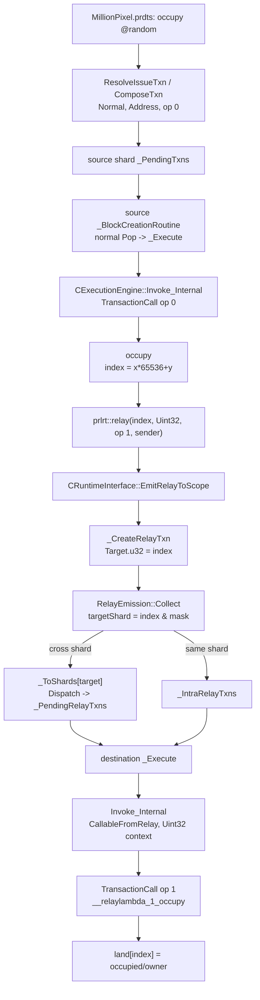
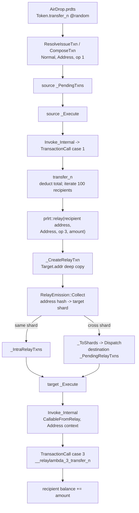
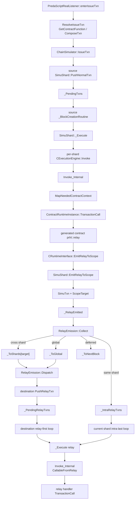

# PREDA Native Engine Architecture Map

> 第一阶段代码审计。路径均相对于 PREDA 仓库根目录。
> 审计基线：`main @ d58fe79fd0070ee139a4370e691aeebf741db242`。
> 本阶段只定位、追踪和记录，不修改 PREDA 编译或执行语义。

## 0. 审计结论

1. 仓库登记的唯一 git submodule `oxd_preda/3rdParty/antlr4` 已递归初始化，HEAD 与 superproject gitlink 完全一致。
2. `.prd` 的“AST”是 ANTLR parse tree；当前编译器没有独立、持久化、可供多 pass 使用的 typed AST/IR。
3. `relay@target` 的语法节点是 `PredaParser::RelayStatementContext`。listener 完成类型/函数/scope 检查后直接输出 `prlrt::relay*()` C++。
4. 编译期 function scope 编码在 `FunctionSignature.flags` 的低 4 bits；runtime scope 编码在 `rvm::Scope` 和 `ContractInvokeId` 中。
5. Native runtime 没有名为 `RelayDescriptor` 的类型。真正的 relay descriptor 是带 `TXN_RELAY` 的 `SimuTxn`。
6. target key 先以 `rvm::ScopeKey` 非 owning view 传递，再由 `SimuShard::EmitRelayToScope()` 深拷贝到 `SimuTxn::Target`；descriptor 保存完整 key，不只保存 shard hash。
7. 每个 global/normal shard 各有一个 worker thread，并为每个 mounted engine 持有一个 execution unit。
8. custom relay 的真实路径是：

```text
_CreateRelayTxn
  -> SimuTxn::Target
  -> _RelayEmitted
  -> RelayEmission::Collect
  -> same-shard _IntraRelayTxns
     或 cross-shard _ToShards -> Dispatch -> _PendingRelayTxns
  -> destination _Execute
```

9. stopwatch `TPS` 是 pending backlog 的净下降率；`uTPS` 是所有确认执行单元的速率，包括 source tx 和 relay tx。
10. Native 实测验证：
    - MillionPixel：10,000 source tx 产生并执行 10,000 relay，stopwatch 窗口确认 20,000 个执行单元。
    - AirDrop：1 个 `transfer_n` source tx 产生并执行 100 个 relay，stopwatch 窗口确认 101 个执行单元。

## 1. 仓库与 submodule 完整性

### 1.1 主仓库

| 项目 | 审计结果 |
|---|---|
| 根目录 | `<repo-root>` |
| branch | `main` |
| HEAD | `d58fe79fd0070ee139a4370e691aeebf741db242` |
| upstream | 相对 `origin/main` ahead 1 |
| object connectivity | `git fsck --connectivity-only --no-dangling` 通过 |

审计开始前已有未跟踪目录/文件：

```text
ARCHITECTURE_MAP.md
bin/
build-gcc12/
oxd_libsec/lib/
```

它们不属于本阶段语义修改，本审计没有清理或覆盖它们。

### 1.2 submodule

[`/.gitmodules`](.gitmodules) 只登记一个 submodule：

| path | URL | superproject gitlink | 实际 HEAD |
|---|---|---|---|
| `oxd_preda/3rdParty/antlr4` | `https://github.com/antlr/antlr4.git` | `a2c349f9bf268cf75aaf8cddff90a767e703d489` | 同一 commit，tag `4.12.0` |

执行并通过：

```bash
git submodule sync --recursive
git submodule update --init --recursive
git submodule status --recursive
git -C oxd_preda/3rdParty/antlr4 fsck --connectivity-only --no-dangling
```

`git submodule status --recursive` 的 commit 前缀为空格，不是 `-`、`+` 或 `U`；submodule 工作树干净，也没有嵌套 submodule。结论是：**仓库登记的所有 submodule 已完整初始化并 checkout 到预期 gitlink。**

## 2. `.prd` parser、AST 与 relay statement

### 2.1 parser

权威 grammar 是 [`oxd_preda/spec/Preda.g4`](oxd_preda/spec/Preda.g4)：

| grammar | 位置 | 含义 |
|---|---:|---|
| `predaSource` | [`Preda.g4:2`](oxd_preda/spec/Preda.g4#L2) | `.prd` 顶层 |
| `contractDefinition` | [`Preda.g4:24`](oxd_preda/spec/Preda.g4#L24) | contract |
| `stateVariableDeclaration` | [`Preda.g4:38`](oxd_preda/spec/Preda.g4#L38) | state 及可选 scope |
| `functionDeclaration` | [`Preda.g4:63`](oxd_preda/spec/Preda.g4#L63) | function scope/signature |
| `relayStatement` | [`Preda.g4:147`](oxd_preda/spec/Preda.g4#L147) | relay target + named handler/lambda |
| `relayType` | [`Preda.g4:150`](oxd_preda/spec/Preda.g4#L150) | expression/shards/global/next |
| `relayLambdaDefinition` | [`Preda.g4:153`](oxd_preda/spec/Preda.g4#L153) | relay lambda body |
| `relayLambdaParameter` | [`Preda.g4:156`](oxd_preda/spec/Preda.g4#L156) | typed/auto capture 或 `^identifier` |

ANTLR 生成文件：

- [`oxd_preda/transpiler/antlr_generated/PredaLexer.h`](oxd_preda/transpiler/antlr_generated/PredaLexer.h)
- [`oxd_preda/transpiler/antlr_generated/PredaParser.h`](oxd_preda/transpiler/antlr_generated/PredaParser.h)
- [`oxd_preda/transpiler/antlr_generated/PredaListener.h`](oxd_preda/transpiler/antlr_generated/PredaListener.h)
- [`oxd_preda/transpiler/antlr_generated/PredaBaseListener.h`](oxd_preda/transpiler/antlr_generated/PredaBaseListener.h)

[`CTranspiler`](oxd_preda/transpiler/transpiler.cpp#L21) 持有：

```text
ANTLRInputStream
PredaLexer
CommonTokenStream
PredaParser
antlr4::tree::ParseTree*
PredaRealListener
```

真实构建路径：

```text
CTranspiler::BuildParseTree()                 transpiler.cpp:70-80
  -> m_parser.predaSource()
CTranspiler::PreCompile()                     transpiler.cpp:81-91
  -> PredaPreCompileListener
CTranspiler::Compile()                        transpiler.cpp:92-115
  -> PredaParseTreeWalker::walk(PredaRealListener)
  -> CodeSerializer::GetCode()
```

### 2.2 AST 的真实边界

当前没有另一套 `AstNode`/`IRNode` 层。实际结构是：

```text
ANTLR parse tree:
  PredaParser::*Context

临时语义对象:
  ConcreteType
  QualifiedConcreteType
  DefinedIdentifier
  FunctionSignature
  PredaTranspilerContext

输出:
  CodeSerializer -> generated C++
```

也就是说 parse tree 被 listener 直接消费，类型和 relay 关系没有汇总成可持久化 protocol graph。

### 2.3 relay statement 节点与 lowering

生成的节点类型位于
[`PredaParser.h:846`](oxd_preda/transpiler/antlr_generated/PredaParser.h#L846)：

```text
RelayStatementContext
RelayTypeContext
RelayLambdaDefinitionContext
RelayLambdaParameterContext
```

核心语义入口是
[`PredaRealListener::enterRelayStatement()`](oxd_preda/transpiler/PredaRealListener.cpp#L1086)：

1. [`1104-1119`](oxd_preda/transpiler/PredaRealListener.cpp#L1104)：解析 target expression，并由 target concrete type 推导目标 `ScopeType`。
2. [`1121-1165`](oxd_preda/transpiler/PredaRealListener.cpp#L1121)：处理 `shards/global/next`。
3. [`1174-1249`](oxd_preda/transpiler/PredaRealListener.cpp#L1174)：解析 lambda capture 类型及序列化参数。
4. [`1251-1309`](oxd_preda/transpiler/PredaRealListener.cpp#L1251)：解析具名 handler、重载、scope、参数和 opcode。
5. [`1312-1328`](oxd_preda/transpiler/PredaRealListener.cpp#L1312)：直接输出：

```cpp
prlrt::relay(target, scopeType, opCode, args...);
prlrt::relay_shards(opCode, args...);
prlrt::relay_global(opCode, args...);
prlrt::relay_next(opCode, args...);
```

lambda 的临时记录是
[`PredaRealListener::PendingRelayLambda`](oxd_preda/transpiler/PredaRealListener.h#L183)，保存 parse context、参数类型、relay 类别、handler scope、export slot/opcode 和 source function。

[`DeclareRelayLambdaFunction()`](oxd_preda/transpiler/PredaRealListener.cpp#L1335)
先占用 export slot；[`DefinePendingRelayLambdas()`](oxd_preda/transpiler/PredaRealListener.cpp#L2382)
再生成：

```text
__relaylambda_<export-slot>_<source-function>
flags = CallableFromRelay | handler-scope
```

**审计结论：**`PendingRelayLambda` 只覆盖 lambda relay；具名 relay 没有同构记录。因此它不能直接充当完整 R-PREDA manifest。

## 3. scope 类型、scope target 与函数 scope

### 3.1 编译器表示

[`transpiler::ScopeType`](oxd_preda/transpiler/transpiler/PredaCommon.h#L6)：

```text
None, Global, Shard, Address,
Uint32, Uint64, Uint96, Uint128, Uint160, Uint256, Uint512
```

[`transpiler::FunctionFlags`](oxd_preda/transpiler/transpiler/PredaCommon.h#L22)：

- 低 4 bits：`ScopeTypeMask`
- `CallableFromTransaction`
- `CallableFromRelay`
- `CallableFromOtherContract`
- `CallableFromSystem`
- `IsConst`
- `HasRelayScopeStatement`
- `HasRelayShardsStatement`
- `HasRelayGlobalStatement`
- `GlobalStateDependency`

所以 function scope 不是单独字段，而是：

```cpp
ScopeType(signature.flags & uint32_t(FunctionFlags::ScopeTypeMask))
```

源语言 scope 解析在
[`GetScopeFromScopeCtx()`](oxd_preda/transpiler/PredaRealListener.cpp#L1473)；
state declaration 进入 [`DefineStateVariable()`](oxd_preda/transpiler/PredaRealListener.cpp#L1759)。

target type 与 scope 的映射：

- [`ScopeTypeToConcreteType()`](oxd_preda/transpiler/PredaRealListener.cpp#L3459)
- [`ConcreteTypeToScopeType()`](oxd_preda/transpiler/PredaRealListener.cpp#L3485)

`uint96`/`uint160` 在 enum/runtime 中保留，但当前 compiler concrete-type mapping 明确尚未支持。

### 3.2 ABI/runtime 表示

[`rvm::Scope`](oxd_preda/native/abi/vm_types.h#L68) 是 12-bit packed value：

```text
[ScopeType:2][ScopeKeySized:6][slot:4]
```

[`rvm::ContractInvokeId`](oxd_preda/native/abi/vm_types.h#L121) 把 build、scope、contract serial、engine 和 dapp 编进 64-bit id。常用函数：

- `CONTRACT_SET_SCOPE`
- `CONTRACT_SCOPE`
- `CONTRACT_ENGINE`
- `CONTRACT_UNSET_SCOPE`
- `SCOPE_MAKE`
- `SCOPE_KEYSIZETYPE`

PREDA compiler scope 到 ABI scope 的桥接是
[`PredaScopeToRvmScope()`](oxd_preda/engine/preda_engine/ContractData.h#L154)。

函数 metadata 有三层：

1. 编译期 [`ContractCompileData::functions`](oxd_preda/engine/preda_engine/ContractData.h#L50)，每个 `ContractFunction` 保存 flags/signature。
2. engine delegate 把 scope/flags 暴露为 RVM contract interface。
3. simulator 在 [`SimuGlobalShard::_FinalizeFunctionInfo()`](oxd_preda/simulator/simu_global.cpp#L306) 建立：
   - `ContractFunction{Contract, Op, FunctionSignature}`
   - `ContractInfo::ScopeOfOpcode[256]`

script 发交易时
[`ChainSimulator::GetContractFunction()`](oxd_preda/simulator/chain_simu.cpp#L796)
用 `ScopeOfOpcode[op]` 构造 scoped `ContractInvokeId`。

### 3.3 target key 与持久化 target

ABI 的 [`rvm::ScopeKey`](oxd_preda/native/abi/vm_address.h#L107) 只有：

```cpp
const uint8_t* Data;
uint32_t Size;
```

它是非 owning view。

模拟器的 owning 表示是
[`ScopeTarget`](oxd_preda/simulator/shard_data.h#L93)：

```text
target_size
union {
  Address
  u32/u64/u96/u128/u160/u256/u336/u512
}
```

[`SimuTxn`](oxd_preda/simulator/shard_data.h#L140) 内嵌 `ScopeTarget Target`，因此 relay 入队后 key bytes 仍然有效。

## 4. PREDA Native / WASM code generation

### 4.1 `.prd -> generated C++`

```text
CContractDatabase::_Compile
  -> ITranspiler::BuildParseTree
  -> ITranspiler::PreCompile
  -> CContractDatabase::CompileContract
       -> ITranspiler::Compile
       -> GetOutput() generated C++
       -> collect function/scope/state metadata
```

关键位置：

- [`CContractDatabase::_Compile()`](oxd_preda/engine/preda_engine/ContractDatabase.cpp#L841)
- [`CContractDatabase::CompileContract()`](oxd_preda/engine/preda_engine/ContractDatabase.cpp#L1198)
- [`out_intermediate_code = pTranspiler->GetOutput()`](oxd_preda/engine/preda_engine/ContractDatabase.cpp#L1216)
- function metadata 收集从 [`ContractDatabase.cpp:1255`](oxd_preda/engine/preda_engine/ContractDatabase.cpp#L1255) 开始

### 4.2 generated C++ -> Native/WASM module

[`CContractDatabase::LinkContract()`](oxd_preda/engine/preda_engine/ContractDatabase.cpp#L1374)：

1. 写 `intermediate/_stage*.cpp`。
2. 写 `transpiledCode.cpp`：

```cpp
#include ".../compile_env/contract_template.h"
#include ".../intermediate/_stage*.cpp"
```

3. Native：

```text
g++ -O3 -shared -fPIC -std=c++17
-> bin/_stage*.so
```

对应 [`ContractDatabase.cpp:1427-1449`](oxd_preda/engine/preda_engine/ContractDatabase.cpp#L1427)。

4. WASM：

```text
emcc -Oz --no-entry -sRELOCATABLE -sALLOW_MEMORY_GROWTH ...
-> bin/_stage*.wasm
```

对应 [`ContractDatabase.cpp:1450-1484`](oxd_preda/engine/preda_engine/ContractDatabase.cpp#L1450)。

### 4.3 module 加载与调用

[`CContractDatabase::GetContractModule()`](oxd_preda/engine/preda_engine/ContractDatabase.cpp#L713)：

- Native：`os::LoadDynamicLibrary()` -> `ContractModule::FromLibrary()`
- WASM/CWASM：Wasmtime compile/deserialize -> `ContractModule::FromWASMModule()`

Native export function pointers 在
[`ContractModule::FromLibrary()`](oxd_preda/engine/preda_engine/ContractRuntimeInstance.cpp#L50)
解析，包括：

```text
Contract_<id>_CreateInstance
Contract_<id>_MapContractContextToInstance
Contract_<id>_TransactionCallEntry
Contract_<id>_SerializeOutContractContext
```

[`ContractRuntimeInstanceDLL::TransactionCall()`](oxd_preda/engine/preda_engine/ContractRuntimeInstance.cpp#L107)
直接调用 `fnTransactionCall`。

WASM 的 `predaEmitRelayToScope` host import 在
[`WASMRuntime.cpp:306`](oxd_preda/engine/preda_engine/WASMRuntime.cpp#L306)，最终进入和 Native 相同的 `CRuntimeInterface::EmitRelayToScope()`。

engine factory：

- [`CreateEngine("-native")`](oxd_preda/engine/preda_engine/main.cpp#L9) -> `RuntimeMode::NATIVE`
- `CreateEngine("-wasm")` -> `RuntimeMode::CWASM`

当前 `chsimu` 初始化代码
[`ChainSimulator::Init()`](oxd_preda/simulator/chain_simu.cpp#L10)
只启用 Native；WASM 与 EVM 初始化行被注释。因此本文的两条动态轨迹都是 PREDA Native，不是 EVM/Crystality。

## 5. Native relay descriptor 与 target key 生命周期

### 5.1 合约 runtime helper

[`prlrt::relay<TScope>()`](oxd_preda/bin/compile_env/include/relay.h#L58)：

1. burn relay gas；
2. 序列化 capture arguments；
3. 以 `&scope_key` 和 `sizeof(TScope)` 传递 target；
4. 调用 `PREDA_CALL(EmitRelayToScope, ...)`。

### 5.2 engine/runtime bridge

[`CRuntimeInterface::EmitRelayToScope()`](oxd_preda/engine/preda_engine/RuntimeInterfaceImpl.cpp#L297)：

```cpp
rvmScope = PredaScopeToRvmScope(scope_type);
rvm::ScopeKey key{scope_key, scope_key_size};
m_pExecutionContext->EmitRelayToScope(
    CONTRACT_SET_SCOPE(currentContract, rvmScope),
    &key,
    opcode,
    &args,
    1);
```

此处 `key` 仍是非 owning view。当前 execution context 是 source shard worker 正在执行的 `SimuShard`。

### 5.3 descriptor 创建与 key 深拷贝

[`SimuShard::_CreateRelayTxn()`](oxd_preda/simulator/simu_shard.cpp#L219) 创建 `SimuTxn`：

| 字段 | 写入内容 |
|---|---|
| `Type` | `InvokeContextType::RelayInbound` |
| `Contract` | 已带 target scope 的 `ContractInvokeId` |
| `Op` | relay handler opcode |
| `Flag` | `TXN_RELAY` |
| origin metadata | block height / shard index / shard order |
| `GasRedistributionWeight` | runtime weight |
| `SerializedData` | relay arguments |
| `Hash` | descriptor 内容 hash |

此时 custom target 尚未写入，所以 `_CreateRelayTxn()` **不是完整 manifest runtime hook**。

[`SimuShard::EmitRelayToScope()`](oxd_preda/simulator/simu_shard.cpp#L248)
根据 `SCOPE_KEYSIZETYPE(Contract)` 把 key 深拷贝为：

```text
ScopeTarget(Address)
ScopeTarget(uint32_t)
...
ScopeTarget(UInt512)
```

然后设置 initiator，并在 [`simu_shard.cpp:297`](oxd_preda/simulator/simu_shard.cpp#L297)
把 descriptor 放入本次 invocation 的 `_RelayEmitted`。

完整生命周期：

```text
typed PREDA target value
  -> generated C++ TScope
  -> rvm::ScopeKey {pointer, size}
  -> SimuTxn::Target owning copy
  -> shard hash
  -> target execution context exposes same bytes via GetScopeTarget()
```

[`SimuShard::GetScopeTarget()`](oxd_preda/simulator/simu_shard.cpp#L82)
在 relay execution 时重新暴露 `SimuTxn::Target`。

## 6. scope target -> shard -> execution context

### 6.1 shard partition

[`ChainSimulator::_InitChain()`](oxd_preda/simulator/chain_simu.cpp#L477)：

```text
shardBitmask = ADDRESS_SHARD_BITMASK(shardOrder)
shardCount = 1 << shardOrder
create one SimuGlobalShard
create shardCount SimuShard
```

mapping 位于 [`chain_simu.h:112-113`](oxd_preda/simulator/chain_simu.h#L112)：

```cpp
Address:
  ADDRESS_SHARD_DWORD(address) & shardBitmask

ScopeTarget:
  SCOPEKEY_SHARD_DWORD(
      ScopeKey{target bytes, target_size}
  ) & shardBitmask
```

key folding 算法在
[`vm_address.h:113-128`](oxd_preda/native/abi/vm_address.h#L113)：

- 36-byte address：`d[0] ^ d[4] ^ d[7]`
- generic key：`d[0] ^ d[size/8] ^ d[size/4 - 1]`
- 4-byte uint32 最终等价于该 `uint32` 值

### 6.2 execution unit/context

[`SimuShard`](oxd_preda/simulator/simu_shard.h#L59) 本身继承 `rvm::ExecutionContext`。

每个 shard 持有：

```text
ExecutionUnit _ExecUnits[engine id]
one _BlockCreator worker
scope state stores
current SimuTxn
```

[`SimuShard::Init()`](oxd_preda/simulator/simu_shard.cpp#L404)：

```text
ChainSimulator::CreateExecuteUnit(&_ExecUnits)
_BlockCreator.Create(_BlockCreationRoutine)
```

[`ChainSimulator::CreateExecuteUnit()`](oxd_preda/simulator/chain_simu.cpp#L591)
对每个 mounted engine 调用 `RvmEngine::CreateExecuteUnit()`。Native 返回
[`new CExecutionEngine(this)`](oxd_preda/engine/preda_engine/ContractDatabase.cpp#L2034)。

因此拓扑是：

```text
(1 global shard + N normal shards)
  ×
(one execution unit per mounted engine)
```

执行时 [`SimuShard::_Execute()`](oxd_preda/simulator/simu_shard.cpp#L632)：

```cpp
pexec = _ExecUnits.Get(txn.GetEngineId());
pexec->Invoke(this, gas, Contract, Op, args);
```

这里的 `this` 就是已由 target routing 选中的 shard execution context。

### 6.3 function scope 到 state context

Native path：

```text
CExecutionEngine::Invoke
  -> Invoke_Internal
  -> verify invocation type against function flags
  -> MapNeededContractContext
  -> ContractRuntimeInstance::TransactionCall
```

关键位置：

- [`CExecutionEngine::Invoke()`](oxd_preda/engine/preda_engine/ExecutionEngine.cpp#L177)
- [`Invoke_Internal()`](oxd_preda/engine/preda_engine/ExecutionEngine.cpp#L283)
- normal/relay callable gate：[`ExecutionEngine.cpp:296-300`](oxd_preda/engine/preda_engine/ExecutionEngine.cpp#L296)
- [`MapNeededContractContext()`](oxd_preda/engine/preda_engine/ExecutionEngine.cpp#L95)
- generated transaction entry：[`ExecutionEngine.cpp:326`](oxd_preda/engine/preda_engine/ExecutionEngine.cpp#L326)

[`SimuShard::GetState()`](oxd_preda/simulator/simu_shard.cpp#L120)：

- global state 从 global shard 读取；
- shard state 从当前 shard 读取；
- address/uint keyed scope 用 `{SimuTxn.Target, ContractScopeId}` 查询 `_AddressStates`。

这个成员名虽然叫 `_AddressStates`，实际上也承载 uint 等 contract-defined keyed scope。

## 7. relay 创建、路由与 enqueue

### 7.1 transaction-local emission

relay handler 尚未直接进入目标 queue：

```text
generated contract
  -> prlrt::relay
  -> CRuntimeInterface::EmitRelayToScope
  -> SimuShard::_CreateRelayTxn
  -> SimuShard::EmitRelayToScope
  -> current invocation _RelayEmitted
```

source invocation 返回后
[`SimuShard::_Execute():746-748`](oxd_preda/simulator/simu_shard.cpp#L746)
才把 `_RelayEmitted` 交给 `RelayEmission::Collect()`。

### 7.2 router

[`RelayEmission`](oxd_preda/simulator/simu_shard.h#L30) 的 routing buffers：

```text
_ToGlobal
_ToShards[shard]
_ToNextBlock
```

[`RelayEmission::Collect()`](oxd_preda/simulator/simu_shard.cpp#L503)：

| relay kind | 路径 |
|---|---|
| deferred/next | `_ToNextBlock` |
| global | `_ToGlobal` |
| shards broadcast | clone 到所有 `_ToShards[i]` |
| custom same-shard | `_IntraRelayTxns` |
| custom cross-shard | `_ToShards[targetShard]` |

custom scope 在
[`simu_shard.cpp:552`](oxd_preda/simulator/simu_shard.cpp#L552)
调用 `GetShardIndex(t->Target)`。

目标 shard index **不预先持久化在 relay descriptor 中**。descriptor 保存完整 target bytes；routing destination 暂时体现在 `_ToShards[si]` bucket/目标 queue。真正执行时 `_Execute()` 才把当前 shard 写回 `txn->ShardIndex`。

### 7.3 enqueue

跨 shard/global 在 block finalize 时由
[`RelayEmission::Dispatch()`](oxd_preda/simulator/simu_shard.cpp#L569)：

```text
_ToGlobal -> globalShard.PushRelayTxn
_ToShards[i] -> shard[i].PushRelayTxn
```

[`SimuShard::PushRelayTxn()`](oxd_preda/simulator/simu_shard.cpp#L468)
最终调用 `_PendingRelayTxns.Push(txns, count)`。

same-shard 由
[`PushIntraRelay()`](oxd_preda/simulator/simu_shard.h#L221)
进入 `_IntraRelayTxns`。

一个实现细节：same-shard relay 虽然进入 intra queue，但当前 simulator 没有把 `SimuTxn::Type` 从 `_CreateRelayTxn()` 写入的 `RelayInbound` 改成 `RelayIntra`。engine gate 同时接受两者，因此本文按真实代码称为“same-shard/intra queue”，不声称 descriptor type 已变成 `RelayIntra`。

## 8. per-shard worker、队列与批处理循环

### 8.1 worker 与队列

[`SimuShard`](oxd_preda/simulator/simu_shard.h#L59)：

```text
_PendingTxns        source/normal
_PendingRelayTxns   inbound cross/global relay
_IntraRelayTxns     same-shard relay
_TxnEmitted         block-level routing buffers
_RelayEmitted       current invocation emissions
_BlockCreator       one worker thread
```

[`PendingTxns`](oxd_preda/simulator/shard_data.h#L295) 是：

```cpp
std::deque<SimuTxn*> _Queue;
std::mutex _Mutex;
```

源码注释明确它是 multiple-producer/single-consumer queue。

实际操作：

- [`PendingTxns::Push(single)`](oxd_preda/simulator/shard_data.cpp#L67)
- [`PendingTxns::Push(array)`](oxd_preda/simulator/shard_data.cpp#L77)
- [`PendingTxns::Push_Front()`](oxd_preda/simulator/shard_data.cpp#L93)
- [`PendingTxns::Pop()`](oxd_preda/simulator/shard_data.cpp#L102)

没有 batch-pop API。

### 8.2 block/gas-bounded batch

[`SimuShard::_BlockCreationRoutine()`](oxd_preda/simulator/simu_shard.cpp#L754)
是实际 per-shard worker loop。

每轮顺序：

```text
wait/signal
  -> create new block
  -> previous-block deferred relays
  -> inbound relay queue
  -> normal/source queue
  -> same-shard intra relay queue
  -> finalize block
  -> dispatch newly emitted relays
  -> confirm counters
  -> advance height / coordinate shards
```

精确位置：

| phase | 代码 |
|---|---|
| wait | [`775-785`](oxd_preda/simulator/simu_shard.cpp#L775) |
| deferred | [`798-806`](oxd_preda/simulator/simu_shard.cpp#L798) |
| inbound relay | [`808-828`](oxd_preda/simulator/simu_shard.cpp#L808) |
| normal/source | [`830-843`](oxd_preda/simulator/simu_shard.cpp#L830) |
| intra relay | [`845-847`](oxd_preda/simulator/simu_shard.cpp#L845) |
| finalize block | [`849-860`](oxd_preda/simulator/simu_shard.cpp#L849) |
| dispatch | [`862-864`](oxd_preda/simulator/simu_shard.cpp#L862) |
| confirm | [`866-872`](oxd_preda/simulator/simu_shard.cpp#L866) |

“batch”在这里是一个 block 内反复单笔 `Pop()` 形成的隐式 batch：

- inbound relay 和 normal loop 受 `_TotalGasBurnt < gas_limit` 约束；
- deferred 与 intra loop 当前没有这个 guard；
- sync 模式下，非 global 的 cross-shard relay 不允许与 origin transaction 同 height 执行，代码在 [`812-824`](oxd_preda/simulator/simu_shard.cpp#L812) 把它 push-front 到下一 block。

脚本的 `batch` 不是 worker batch：

- [`enterBatchInsertTxnOnChain()`](oxd_preda/simulator/simu_script.cpp#L319) 仍逐笔 `IssueTxn()`；
- [`ResolveIssueTxn()`](oxd_preda/simulator/simu_script.cpp#L826) 对大于 100 笔只并行 compose，随后仍逐笔 enqueue。

## 9. TPS / uTPS

### 9.1 counters

[`ChainSimulator::runtimeInfo`](oxd_preda/simulator/chain_simu.h#L42)：

```text
pendingTxnCount
executedTxnCount
shardsExecutedTxnCount
```

更新函数在 [`chain_simu.h:138-140`](oxd_preda/simulator/chain_simu.h#L138)：

```text
OnTxnPushed:
  pending += count

OnTxnsConfirmed:
  pending -= count
  executed += count
```

normal、cross-shard relay、same-shard relay、deferred relay 都会进入 pending 口径。block finalize 对 `_TxnExecuted.GetSize()` 做 confirmed 更新；失败的 invocation 也已经进入 `_TxnExecuted`。

### 9.2 stopwatch 公式

[`enterStopWatchRestart()`](oxd_preda/simulator/simu_script.cpp#L633)
保存 pending/executed snapshot。

[`enterStopWatchReport()`](oxd_preda/simulator/simu_script.cpp#L642)：

```text
TPS =
  (pending_at_start - pending_now) * 1000 / elapsed_ms

uTPS =
  (executed_now - executed_at_start) * 1000 / elapsed_ms
```

所以：

- `uTPS` 是 execution-unit throughput，包含 source 和所有 relay。
- `TPS` 是 backlog 的净下降率，不是直接递增的 source-confirmed counter。
- 当全部 source tx 在 stopwatch 之前入队、计时期间不再注入、最后完全 drain 时，TPS 才近似 source TPS。
- 一笔 source 产生 `k` 个 relay 时，理想完整 drain 下 `uTPS` 计数约为 `source + k`。
- 若计时中 pending 反而增长，当前无符号 snapshot 表达式还存在下溢风险。

另有 [`ChainSimulator::VizProfiling()`](oxd_preda/simulator/chain_simu.cpp#L340) 的 per-shard profiling TPS，算法和 stopwatch 不同，不能混为同一指标。

## 10. MillionPixel：一笔 source tx 到 relay execution

### 10.1 benchmark 与合约事实

Native 文件：

- [`oxd_preda/simulator/contracts/MillionPixel.prd`](oxd_preda/simulator/contracts/MillionPixel.prd)
- [`oxd_preda/simulator/contracts/MillionPixel.prdts`](oxd_preda/simulator/contracts/MillionPixel.prdts)

不要与 Crystality/EVM 版本
`contracts/crystality/MP.xtl` 混淆。当前 `chsimu` 配置可直接执行的是 `.prd` Native 版本。

合约：

```preda
@uint32 Land land;

@address function occupy(uint16 x, uint16 y) export {
    uint32 index = uint32(x) * 65536u32 + uint32(y);
    relay@index (address sender = __transaction.get_self_address()) {
        if (!land.occupied) {
            land.occupied = true;
            land.owner = sender;
        }
    }
}
```

确定的 metadata：

| 项 | 值 |
|---|---|
| source handler | `occupy` |
| source scope | Address |
| source opcode | 0 |
| relay target | `index = x * 65536 + y` |
| target scope/key | Uint32 / 4 bytes |
| captured arg | source address `sender` |
| generated handler | `__relaylambda_1_occupy` |
| relay opcode | 1 |
| handler scope | Uint32 |
| handler flag | `CallableFromRelay` |

实际生成代码也确认 lowering 为：

```cpp
prlrt::relay(index, 4 /* ScopeType::Uint32 */, 1, sender);
```

### 10.2 一笔交易的逐步路径

1. [`MillionPixel.prdts:8`](oxd_preda/simulator/contracts/MillionPixel.prdts#L8) 发 `occupy*10000 @random`。
2. [`PredaScriptRealListener::enterIssueTxn()`](oxd_preda/simulator/simu_script.cpp#L281)
   -> [`ResolveIssueTxn()`](oxd_preda/simulator/simu_script.cpp#L826)。
3. `GetContractFunction()` 解出 address-scoped contract id 与 opcode 0。
4. [`ChainSimulator::ComposeTxn()`](oxd_preda/simulator/chain_simu.cpp#L836)
   创建 `SimuTxn{Type=Normal, Op=0}` 并序列化 `x/y`。
5. `@random` 地址写入 `txn.Target`，地址 hash 得到 source shard，保存到 `txn.ShardIndex`。
6. `ChainSimulator::IssueTxn()` -> source shard `PushNormalTxn()` -> `_PendingTxns`。
7. source worker normal phase pop -> `_Execute()` -> shard 的 Native `CExecutionEngine::Invoke()`。
8. `Invoke_Internal()` 验证 `CallableFromTransaction`，map Address context，调用 generated transaction entry case 0 -> `occupy`。
9. `occupy` 计算 `index`；`get_self_address()` 从当前 Address scope target 取得 source 地址。
10. `prlrt::relay(index, Uint32, 1, sender)` 序列化 36-byte sender。
11. `CRuntimeInterface::EmitRelayToScope()` 构造 4-byte `ScopeKey`。
12. `_CreateRelayTxn()` 创建 `SimuTxn{RelayInbound, Op=1}`。
13. `EmitRelayToScope()` 把 index 深拷贝到 `Target.u32`，进入 `_RelayEmitted`。
14. source `_Execute()` 返回后 -> `RelayEmission::Collect()`。
15. target shard：

```text
SCOPEKEY_SHARD_DWORD(index) & shardBitmask
```

默认 `order=2` 时：

```text
targetShard = index & 3 = y & 3
```

16. cross-shard：`_ToShards[target] -> Dispatch -> destination _PendingRelayTxns`。
17. same-shard：`_IntraRelayTxns`，当前 block normal tx 后执行。
18. destination `_Execute()` -> `Invoke_Internal()` 验证 `CallableFromRelay`。
19. map Uint32 context，以 `{Target.u32=index, ContractScopeId}` 查 `land`。
20. generated entry case 1 -> `__relaylambda_1_occupy(sender)` -> 更新 `land[index]`。

### 10.3 MillionPixel Mermaid



### 10.4 动态验证

从 `bin/bin_release` 执行：

```bash
PATH="$CONDA_PREFIX/bin:$PATH" \
./chsimu \
  ../../oxd_preda/simulator/contracts/MillionPixel.prdts \
  -order:2 -perftest -stdout
```

审计运行结果：

```text
source tx queued:       10,000
stopwatch executions:  20,000 = 10,000 source + 10,000 relay
overall confirmed:     20,001 including deployment
elapsed:               215 ms
reported TPS:          46,511
reported uTPS:         93,023
```

此运行用于验证 1:1 source/relay 结构；单次 timing 不是严谨性能结论。

## 11. AirDrop：一笔 source tx 到 100 个 relay execution

### 11.1 benchmark 与合约事实

Native AirDrop 没有单独的 `AirDrop.prd`：

- script：[`oxd_preda/simulator/contracts/AirDrop.prdts`](oxd_preda/simulator/contracts/AirDrop.prdts)
- contract：[`oxd_preda/simulator/contracts/Token.prd`](oxd_preda/simulator/contracts/Token.prd)

script：

- 部署 `Token.prd`
- 把所有 1024 个 address scope balance 设为 `10^13`
- 发 `Token.transfer_n*$~count$ @random`
- 每个 source tx 包含 100 个 payments

[`Token.transfer_n()`](oxd_preda/simulator/contracts/Token.prd#L32)：

```preda
@address function bool transfer_n(array<payment> recipients) export {
    ...
    balance -= total;
    for (...) {
        if (recipients[i].amount > 0ib) {
            relay@recipients[i].to
                (bigint amount = recipients[i].amount) {
                balance += amount;
            }
        }
    }
}
```

每组四笔金额为 `100+200+150+50=500`；25 组共 100 recipients，总额 12,500。成功 source tx 发 100 个 address-target relay。

确定的 metadata：

| 项 | 值 |
|---|---|
| source handler | `transfer_n` |
| source scope | Address |
| source opcode | 1 |
| relay target | `recipients[i].to` |
| target key | 36-byte Address |
| capture | `bigint amount` |
| generated handler | `__relaylambda_3_transfer_n` |
| relay opcode | 3 |
| handler scope | Address |
| effect | target `balance += amount` |
| relay count | successful tx 中每个 positive recipient 一笔，本脚本为 100 |

当前生成物确认：

```cpp
prlrt::relay(recipient.to, 3 /* Address */, 3, recipient.amount);
```

### 11.2 一笔 AirDrop 的逐步路径

1. [`AirDrop.prdts:12-38`](oxd_preda/simulator/contracts/AirDrop.prdts#L12) 构造一笔 `transfer_n @random` source tx。
2. `enterIssueTxn()` -> `ResolveIssueTxn()` -> `GetContractFunction()` 得到 Address/opcode 1。
3. `ComposeTxn()` 通过 Native engine `ArgumentsJsonParse()` 序列化 `array<payment>`。
4. 随机 source address 写入 `SimuTxn.Target`，地址 hash 选择 source shard。
5. `IssueTxn()` -> `PushNormalTxn()` -> source `_PendingTxns`。
6. source worker -> `_Execute()` -> Native `Invoke_Internal()` -> generated transaction entry case 1。
7. `transfer_n` 验证余额，source address balance 扣 12,500。
8. 循环每个 positive payment，执行 `prlrt::relay(recipient.to, Address, op 3, amount)`。
9. 每个 relay 分别创建一个 `SimuTxn`，amount 写入 `SerializedData`。
10. `EmitRelayToScope()` 把 36-byte recipient address 深拷贝到 `SimuTxn.Target.addr`。
11. `_RelayEmitted` 在 source call 结束后一次性交给 `RelayEmission::Collect()`。
12. 每个 recipient 的 target shard：

```text
(address words d[0] ^ d[4] ^ d[7]) & shardBitmask
```

13. same-shard recipient -> `_IntraRelayTxns`。
14. cross-shard recipient -> `_ToShards[si]`；block finalize 后 batch `PushRelayTxn()` 到目标 `_PendingRelayTxns`。
15. 目标 worker relay-first pop，same-shard 则 intra-last pop。
16. `Invoke_Internal()` 验证 opcode 3 `CallableFromRelay`，map recipient Address context。
17. generated entry case 3 反序列化 amount -> `__relaylambda_3_transfer_n` -> target balance 加款。

### 11.3 AirDrop Mermaid



### 11.4 动态验证

从 `bin/bin_release` 执行：

```bash
PATH="$CONDA_PREFIX/bin:$PATH" \
./chsimu \
  ../../oxd_preda/simulator/contracts/AirDrop.prdts \
  -count:1 -order:2 -perftest -stdout
```

结果：

```text
source tx queued:       1
stopwatch executions:  101 = 1 source + 100 relay
overall confirmed:     102 including deployment
elapsed:               2 ms
reported TPS:          500
reported uTPS:         50,500
```

2 ms 窗口过短，数值不用于性能结论；它验证的是 `1 -> 100 -> 101 execution units` 的 relay amplification。

## 12. 通用 source transaction -> relay execution 调用链



## 13. R-PREDA manifest 插入位置

### 13.1 推荐的 typed manifest

第一版可以只增加旁路 metadata，不改 router/worker 语义：

```text
RelaySite
  source contract/function/opcode/scope
  source file/line/column
  relay kind: custom/global/shards/next
  target expression
  inferred target scope and key type/size
  target handler/opcode
  captured parameter names/types
  cardinality expression
  enclosing guards/loops

RelayHandler
  contract/function/opcode
  scope
  parameter types
  CallableFromRelay

RelayEdge
  RelaySite -> RelayHandler
  arithmetic refinements
  structural/cardinality/depth constraints
```

### 13.2 插入点分级

| 阶段 | 插入点 | 可获得信息 | 建议 |
|---|---|---|---|
| parse/type | `PredaRealListener::enterRelayStatement()` | source context、target expression、typed scope、arguments、handler | 创建 manifest draft 的最佳位置 |
| lambda finalize | `DeclareRelayLambdaFunction()` / `DefinePendingRelayLambdas()` | 最终 opcode、handler name、flags、scope、params | 回填 lambda handler identity |
| contract metadata | `GenerateExportFunctionMeta()` / `CContractDatabase::CompileContract()` | module function/scope metadata | 随 compile/link artifact 持久化 manifest |
| Native emit | `CRuntimeInterface::EmitRelayToScope()` | actual key bytes、size、scope、opcode | 可选 runtime assertion/trace |
| descriptor complete | `SimuShard::EmitRelayToScope()` 写完 `Target` 后 | 完整 `SimuTxn` + owning target | descriptor-manifest 对照的最早稳定点 |
| routing | `RelayEmission::Collect()` 的 `GetShardIndex()` 后 | actual destination shard、same/cross branch | 校验 target/shard constraint |
| enqueue | `SimuShard::PushRelayTxn()` / `PushIntraRelay()` | 实际 queue | trace enqueue，不改变顺序 |
| admission | `CExecutionEngine::Invoke_Internal()` callable gate | invoke type、opcode、handler flags | 校验 handler/manifest 匹配 |
| post-exec | state commit 前 | actual nested relay/effect | refinement/trace validation |

### 13.3 不建议的起点

- 只 hook `_CreateRelayTxn()`：custom `Target` 尚未写入。
- 只解析 generated C++：源代码 target expression、source location、loop/guard 与类型关系已经丢失。
- 只 hook `Dispatch()`：只能看到 queue destination，无法恢复静态 handler/参数关系。
- 把 `PendingRelayLambda` 当完整 manifest：它不覆盖具名 relay。
- 第一阶段改变 `_BlockCreationRoutine()`、gas limit 或 same/cross-shard ordering：会改变实验语义。

## 14. 第一阶段应保留的实现事实

以下是后续 R-PREDA 设计必须按真实代码处理、但本阶段不修改的事实：

1. 当前不存在统一 typed relay IR。
2. target shard index 不在 descriptor 创建时固定；router 根据完整 `ScopeTarget` 计算。
3. same-shard 和 cross-shard 走不同 queue/时序。
4. same-shard descriptor 当前仍是 `RelayInbound` type。
5. sync 模式把非 global cross-shard relay 延迟到 source height 之后。
6. intra/deferred loop 当前不受主 gas-limit condition 约束。
7. `uTPS` 同时统计 source 和 relay，不能直接当 source TPS。
8. `chsimu` 当前只挂载 PREDA Native；WASM/EVM code path 存在，但动态验证需要先启用相应 engine。
9. Native link 命令硬编码调用 `g++`，因此运行时 `PATH` 决定实际编译器。本机系统 g++ 8 缺少所需 `<memory_resource>`；使用已配置的 `preda-build` GCC 12 toolchain 后两项 Native benchmark 均成功。

## 15. 文件与函数速查

| 主题 | 文件 / 类 / 函数 |
|---|---|
| `.prd` grammar | `oxd_preda/spec/Preda.g4` |
| parser construction | `transpiler/transpiler.cpp::CTranspiler::BuildParseTree` |
| relay parse nodes | `antlr_generated/PredaParser.h::Relay*Context` |
| relay type/lowering | `PredaRealListener.cpp::enterRelayStatement` |
| relay lambda finalize | `PredaRealListener.cpp::DefinePendingRelayLambdas` |
| compiler scope/flags | `transpiler/PredaCommon.h::ScopeType/FunctionFlags` |
| ABI scope packing | `native/abi/vm_types.h::Scope/ContractInvokeId` |
| ABI key/hash | `native/abi/vm_address.h::ScopeKey/SCOPEKEY_SHARD_DWORD` |
| owning target | `simulator/shard_data.h::ScopeTarget` |
| runtime descriptor | `simulator/shard_data.h::SimuTxn` |
| `.prd -> C++` | `ContractDatabase.cpp::CompileContract` |
| C++ -> `.so/.wasm` | `ContractDatabase.cpp::LinkContract` |
| module load | `ContractDatabase.cpp::GetContractModule` |
| Native export dispatch | `ContractRuntimeInstance.cpp::ContractRuntimeInstanceDLL` |
| generated relay helper | `bin/compile_env/include/relay.h::prlrt::relay` |
| engine relay bridge | `RuntimeInterfaceImpl.cpp::EmitRelayToScope` |
| descriptor creation | `simu_shard.cpp::_CreateRelayTxn` |
| key persistence | `simu_shard.cpp::EmitRelayToScope` |
| target -> shard | `chain_simu.h::GetShardIndex` |
| router | `simu_shard.cpp::RelayEmission::Collect` |
| cross-shard dispatch | `simu_shard.cpp::RelayEmission::Dispatch` |
| queues | `shard_data.h/.cpp::PendingTxns` |
| per-shard worker | `simu_shard.cpp::_BlockCreationRoutine` |
| execution context | `simu_shard.h::SimuShard : rvm::ExecutionContext` |
| Native invocation | `ExecutionEngine.cpp::Invoke/Invoke_Internal` |
| scope state mapping | `ExecutionEngine.cpp::MapNeededContractContext` |
| stopwatch TPS/uTPS | `simu_script.cpp::enterStopWatchRestart/Report` |
| MillionPixel | `simulator/contracts/MillionPixel.prd/.prdts` |
| AirDrop | `simulator/contracts/AirDrop.prdts` + `Token.prd` |
