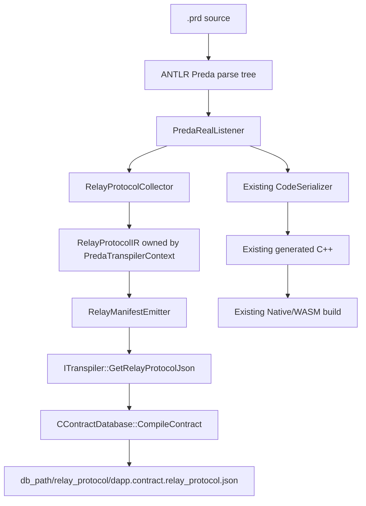
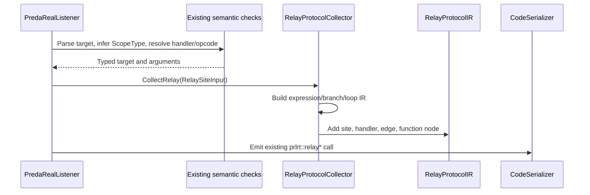
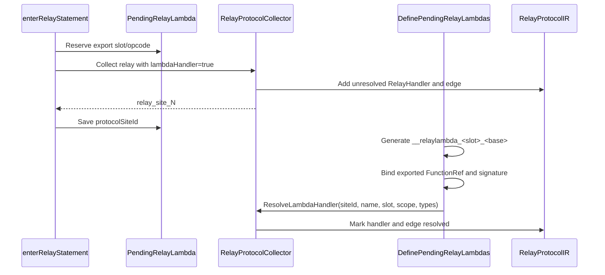

# PREDA Persistent Relay Protocol IR Implementation

## 1. Scope

This change adds an owning, typed, persistent representation of PREDA relay
protocols to the transpiler. It records relay sites while the ANTLR parse tree
is still available, resolves generated relay-lambda handlers after they are
defined, and exports the result as deterministic JSON.

The implementation is an analysis and artifact layer. It does not modify:

- `prlrt::relay*` calls emitted into generated C++;
- runtime relay serialization;
- `SimuTxn`;
- relay target hashing or shard selection;
- relay routing, queueing, batching, or execution.

The implementation follows the compiler boundary described in
[`ARCHITECTURE_MAP.md`](ARCHITECTURE_MAP.md): PREDA still lowers directly from
ANTLR contexts into C++, but relay information is now copied into a reusable
IR before those contexts disappear.

## 2. Resulting architecture



The two outputs are deliberately separate:

```text
CodeSerializer::GetCode()      -> existing C++ intermediate
RelayManifestEmitter::Emit()   -> relay protocol JSON
```

The JSON is not embedded into the generated C++, intermediate hash, module ID,
or runtime transaction.

## 3. Changed files

### 3.1 New relay protocol implementation

| File | Responsibility |
|---|---|
| [`oxd_preda/transpiler/relay_protocol/RelayExprIR.h`](oxd_preda/transpiler/relay_protocol/RelayExprIR.h) | Owning expression IR and source ranges |
| [`oxd_preda/transpiler/relay_protocol/RelayProtocolIR.h`](oxd_preda/transpiler/relay_protocol/RelayProtocolIR.h) | Relay sites, handlers, edges, function protocols, and protocol nodes |
| [`oxd_preda/transpiler/relay_protocol/RelayProtocolCollector.h`](oxd_preda/transpiler/relay_protocol/RelayProtocolCollector.h) | Collector input contract and collection API |
| [`oxd_preda/transpiler/relay_protocol/RelayProtocolCollector.cpp`](oxd_preda/transpiler/relay_protocol/RelayProtocolCollector.cpp) | Expression conversion, branch/loop discovery, site creation, and lambda resolution |
| [`oxd_preda/transpiler/relay_protocol/RelayManifestEmitter.h`](oxd_preda/transpiler/relay_protocol/RelayManifestEmitter.h) | JSON emitter interface |
| [`oxd_preda/transpiler/relay_protocol/RelayManifestEmitter.cpp`](oxd_preda/transpiler/relay_protocol/RelayManifestEmitter.cpp) | Deterministic schema-v2 JSON serialization, including static summaries |

### 3.2 Transpiler integration

| File | Change |
|---|---|
| [`oxd_preda/transpiler/transpiler/PredaTranspiler.h`](oxd_preda/transpiler/transpiler/PredaTranspiler.h) | `PredaTranspilerContext` owns the protocol IR and exposes it through a const accessor |
| [`oxd_preda/transpiler/PredaRealListener.h`](oxd_preda/transpiler/PredaRealListener.h) | Adds the collector and associates pending lambdas with relay-site IDs |
| [`oxd_preda/transpiler/PredaRealListener.cpp`](oxd_preda/transpiler/PredaRealListener.cpp) | Collects relay facts in `enterRelayStatement()`, resolves lambdas, and finalizes function protocols |
| [`oxd_preda/transpiler/transpiler.h`](oxd_preda/transpiler/transpiler.h) | Adds `ITranspiler::GetRelayProtocolJson()` |
| [`oxd_preda/transpiler/transpiler.cpp`](oxd_preda/transpiler/transpiler.cpp) | Owns the serialized JSON string and emits it after a successful compiler walk |
| [`oxd_preda/transpiler/CMakeLists.txt`](oxd_preda/transpiler/CMakeLists.txt) | Builds the new subdirectory and registers the protocol IR test |
| [`CMakeLists.txt`](CMakeLists.txt) | Enables CTest through `include(CTest)` |

### 3.3 Engine sidecar

| File | Change |
|---|---|
| [`oxd_preda/engine/preda_engine/ContractDatabase.cpp`](oxd_preda/engine/preda_engine/ContractDatabase.cpp) | Writes the JSON sidecar after successful PREDA transpilation |

### 3.4 Tests

| File or directory | Responsibility |
|---|---|
| [`oxd_preda/transpiler/test/RelayProtocolIRTests.cpp`](oxd_preda/transpiler/test/RelayProtocolIRTests.cpp) | Compiles fixtures, parses JSON, and checks typed relay facts |
| [`oxd_preda/transpiler/testcase/relay_protocol/`](oxd_preda/transpiler/testcase/relay_protocol/) | Seventeen focused PREDA fixtures |

## 4. Persistent typed IR

All persistent IR objects own their strings and children. They do not retain
ANTLR contexts, tokens, `ConcreteTypePtr`, or `string_view` values after
compilation.

### 4.1 Expression IR

`RelayExprIR` contains:

- `kind`;
- normalized expression `text`;
- inferred or declared `type`, when available;
- `operator`;
- `SourceLocation`;
- recursively owned `children`;
- `opaqueReason`.

Supported expression kinds are:

```text
Identifier
Literal
Keyword
MemberAccess
Index
Unary
Binary
Call
Group
Opaque
```

An unsupported expression becomes `Opaque`. Its text and source location are
retained, so it is not silently omitted.

### 4.2 Relay entities

`RelayProtocolIR` owns four top-level collections:

```text
relaySites : RelaySite[]
handlers   : RelayHandler[]
edges      : RelayProtocolEdge[]
functions  : FunctionProtocol[]
```

`RelaySite` records:

- source dapp/contract, function, canonical signature, overload index, stable
  function ID, scope, and source range;
- relay kind;
- target expression and inferred `ScopeType`;
- named target function, if present;
- argument expressions and types;
- enclosing branch predicates;
- enclosing loop facts;
- the referenced handler ID.

`RelayHandler` records:

- named or lambda kind;
- contract and generated/source handler name;
- handler scope;
- export-slot opcode;
- parameter types;
- source range;
- whether resolution completed.

`RelayProtocolEdge` connects:

```text
source function -> relay site -> relay handler
```

The edge repeats the source function ID, canonical signature, and overload
index so consumers can join an edge without relying on an ambiguous function
name. `FunctionProtocol` uses the stable source function ID as its collection
key, so two same-name overloads are never merged into one `Sequence`.

Named handlers with the same contract, name, scope, and opcode are reused.
Lambda handlers remain one-per-relay-site.

### 4.3 Function protocol nodes

The required node vocabulary is defined by `ProtocolNodeKind`:

```text
End
Emit
Branch
Sequence
Parallel
Repeat
Call
Opaque
```

The current collector builds them as follows:

| Source construct | Protocol representation |
|---|---|
| Function containing relays | `Sequence` root |
| Relay statement | `Emit` |
| Referenced relay handler | `Call` child of `Emit` |
| Enclosing `if`/`else if`/`else` | `Branch` wrapper |
| Enclosing loop | `Repeat` wrapper |
| `relay@shards` | `Parallel` wrapper |
| Opaque target expression | Expression-level `RelayExprIR::Opaque`; the known `Emit` remains visible |
| End of collected function protocol | `End` |

The `Sequence` order is listener collection order. It is not a replacement for
a complete PREDA control-flow graph.

### 4.4 Read-only context access

`PredaTranspilerContext` owns `m_relayProtocolIR` privately:

```cpp
const relay_protocol::RelayProtocolIR& GetRelayProtocolIR() const;
```

Only `RelayProtocolCollector`, declared as a friend, mutates the object. Other
transpiler consumers receive a const reference.

The dynamic-library boundary does not expose C++ containers or IR pointers.
`ITranspiler` exposes only the serialized result:

```cpp
virtual const char* GetRelayProtocolJson() const = 0;
```

`CTranspiler` owns the backing `std::string`, so the pointer remains valid
until the next compilation/reset or `ITranspiler::Release()`.

## 5. Collection lifecycle

### 5.1 Normal relay

Collection is integrated after existing relay type checking and handler
resolution in `PredaRealListener::enterRelayStatement()`.



The collector receives already checked information instead of repeating PREDA
overload or scope resolution. It records:

- `m_currentDAppName + "." + m_currentContractName`;
- the active `FunctionRef` name, canonical parameter signature, overload
  index, stable function ID, and scope;
- target expression text/tree and inferred type;
- target `ScopeType`;
- named handler and export opcode;
- arguments and their resolved parameter types.

For a custom keyed relay, the typed IR uses `RelayKind::CustomScope` and the
manifest emits `relay_kind: "custom_scope"`. The precise key type remains
available independently in `target_scope`, such as `address`, `uint32`, or
`uint256`.

### 5.2 Branch collection

The collector walks parse-tree parents from the relay statement to the nearest
function or relay-lambda boundary.

- `if` records its condition with positive polarity.
- `else` records the preceding `if` and all preceding `else if` predicates
  with negative polarity.
- `else if` records the preceding alternatives as false and its selected
  predicate as true.
- Nested branch groups are ordered from outermost to innermost.

The manifest stores predicates separately rather than flattening them into a
single generated Boolean expression.

### 5.3 Loop collection

The collector records `for`, `while`, and `do while` ancestors.

A `for` loop is marked `statically_bounded: true` only for the currently
recognized canonical form:

```text
local induction-variable declaration with literal initialization
+ matching induction variable
+ strict < or > comparison against a literal bound
+ matching ++ or -- update in the direction of the bound
+ no write to, or shadowing of, the induction variable in the loop body
```

Other loops remain present but carry `statically_bounded: false` and an
`opaque_reason`. In particular, zero-step updates, compound `+=`/`-=`
updates, non-strict `<=`/`>=` conditions, and body resets are not claimed to
be bounded. This deliberately favors a conservative false negative over an
unsound bounded-loop proof.

### 5.4 Lambda relay resolution

Lambda relays require two phases because their generated handler does not
exist when `enterRelayStatement()` first runs.



`DefinePendingRelayLambdas()` walks the pending-lambda vector with a
dynamically evaluated size. A relay lambda discovered inside another relay
lambda is therefore appended and generated during the same phase. After all
generated handlers are available, the resolution pass fills:

- generated handler name;
- export-slot opcode;
- handler scope;
- parameter types;
- `resolved: true` on the handler and edge.

`PredaRealListener::exitContractDefinition()` then calls
`RelayProtocolCollector::Finalize()`, which appends an `End` node to every
collected function protocol. After call-graph flags are propagated, it binds
handler relay reachability and builds each function's static summary. See
[`R_PREDA_STATIC_SUMMARY_IMPLEMENTATION.md`](R_PREDA_STATIC_SUMMARY_IMPLEMENTATION.md).

### 5.5 Manifest emission

After the listener walk succeeds:

```cpp
m_outputCode = m_listener.codeSerializer.GetCode();
m_relayProtocolJson =
    RelayManifestEmitter::Emit(
        m_listener.m_transpilerCtx.GetRelayProtocolIR());
```

`RelayManifestEmitter` uses the repository's bundled
`nlohmann::ordered_json` and `dump(2)`. This provides deterministic key order
and correct JSON escaping for source expressions and opaque reasons.

`BuildParseTree()` clears the previous C++ and JSON strings. The typed IR is
reset in `enterPredaSource()` when the next successful compiler walk begins.

## 6. JSON schema

The emitted schema version is currently `2`. Schema-v1 collections and fields
remain present; schema v2 adds exact handler identity and a per-function
`summary`.

### 6.1 Top level

```json
{
  "schema_version": 2,
  "dapp": "RelayProtocolTests",
  "contract": "ProtocolNamedAddress",
  "relay_sites": [],
  "handlers": [],
  "edges": [],
  "functions": []
}
```

IDs are deterministic within one compilation:

```text
relay_site_0, relay_site_1, ...
relay_handler_0, relay_handler_1, ...
relay_edge_0, relay_edge_1, ...
```

They are positional IDs, not stable content hashes.

Source function identity is separate from those positional entity IDs:

```text
source_function_signature = send(address,int32)
source_function_id        = RelayProtocolTests.ProtocolNamedAddress::send(address,int32)
```

The canonical signature uses parameter `exportName` values. This preserves
overload identity across repeated compilations while
`source_function_overload_index` also exposes the compiler's declaration-order
slot.

### 6.2 Source locations

Every source-backed expression and protocol entity uses:

```json
{
  "line": 9,
  "column": 8,
  "end_line": 9,
  "end_column": 36,
  "start_offset": 209,
  "end_offset": 236
}
```

`line` is ANTLR's one-based line number. `column` is zero-based.
`end_offset` follows ANTLR's inclusive stop-token offset, while `end_column`
is computed as the stop token's starting column plus its token length.

### 6.3 Named address relay example

The following is an abbreviated JSON illustration based on
`named_address.prd`; repetitive location and child fields are omitted for
readability:

```json
{
  "schema_version": 2,
  "dapp": "RelayProtocolTests",
  "contract": "ProtocolNamedAddress",
  "relay_sites": [
    {
      "id": "relay_site_0",
      "source_contract": "RelayProtocolTests.ProtocolNamedAddress",
      "source_function": "send",
      "source_function_id": "RelayProtocolTests.ProtocolNamedAddress::send(address,int32)",
      "source_function_signature": "send(address,int32)",
      "source_function_overload_index": 0,
      "source_scope": "address",
      "relay_kind": "custom_scope",
      "target": {
        "kind": "identifier",
        "text": "target",
        "type": "address",
        "operator": "primary"
      },
      "target_scope": "address",
      "target_function": "receive",
      "handler_id": "relay_handler_0",
      "arguments": [
        {
          "type": "int32",
          "expression": {
            "kind": "identifier",
            "text": "value",
            "type": "int32"
          }
        }
      ],
      "branches": [],
      "loops": []
    }
  ],
  "handlers": [
    {
      "id": "relay_handler_0",
      "kind": "named",
      "contract": "RelayProtocolTests.ProtocolNamedAddress",
      "name": "receive",
      "scope": "address",
      "opcode": 1,
      "resolved": true,
      "parameter_types": ["int32"]
    }
  ],
  "edges": [
    {
      "id": "relay_edge_0",
      "source_function": "send",
      "source_function_id": "RelayProtocolTests.ProtocolNamedAddress::send(address,int32)",
      "source_function_signature": "send(address,int32)",
      "source_function_overload_index": 0,
      "relay_site_id": "relay_site_0",
      "handler_id": "relay_handler_0",
      "resolved": true
    }
  ]
}
```

The complete emitted object additionally includes all `location`, `children`,
and `functions[].root` fields.

### 6.4 Branch and bounded-loop excerpts

An `if` arm is represented with an explicit polarity:

```json
{
  "branches": [
    {
      "condition": {
        "kind": "identifier",
        "text": "use_primary",
        "type": "bool"
      },
      "polarity": true,
      "arm": "if"
    }
  ]
}
```

A canonical bounded loop records both its expression IR and extracted facts:

```json
{
  "loops": [
    {
      "kind": "for",
      "statically_bounded": true,
      "induction_variable": "i",
      "initial_value": "0u32",
      "comparison": "<",
      "bound_value": "3u32",
      "step": "+1",
      "opaque_reason": ""
    }
  ]
}
```

### 6.5 Lambda handler example

The final JSON contains the resolved generated handler, not the temporary
unresolved name:

```json
{
  "id": "relay_handler_0",
  "kind": "lambda",
  "contract": "RelayProtocolTests.ProtocolLambdaAddress",
  "name": "__relaylambda_1_send",
  "scope": "address",
  "opcode": 1,
  "resolved": true,
  "parameter_types": ["int32"]
}
```

For a nested lambda, the inner relay site's `source_function` is the generated
name of the outer lambda. Both handlers and both edges are resolved before
serialization.

### 6.6 Opaque expression example

Schema v1 deliberately keeps ternary expressions opaque:

```json
{
  "kind": "opaque",
  "text": "use_first?first:second",
  "type": "address",
  "operator": "?:",
  "children": [],
  "opaque_reason": "ternary expression is not structurally modeled by relay protocol IR v2"
}
```

The complete entry also contains the expression's source location. This
preserves unsupported valid syntax for later analysis instead of discarding
it.

## 7. Sidecar output

`CContractDatabase::CompileContract()` writes the manifest after successful
transpilation and after obtaining the contract's dapp and name.

The path is:

```text
<db_path>/relay_protocol/<dapp>.<contract>.relay_protocol.json
```

For example:

```text
<db_path>/relay_protocol/RelayProtocolTests.ProtocolNamedAddress.relay_protocol.json
```

`db_path` is the path passed to `CContractDatabase::Initialize()` and normalized
into `m_dbPath`.

An end-to-end Native Engine smoke run through `chsimu` also exercised this
filesystem path and created:

```text
~/.preda/chsimu_repo/native/relay_protocol/chsimu.ProtocolNamedAddress.relay_protocol.json
```

Sidecar characteristics:

- the directory is created automatically;
- JSON is first written to a `.tmp` sibling and then published with
  `os::File::MoveFile`; on POSIX this takes the atomic-rename path;
- an existing file for the same dapp/contract is replaced only after the
  temporary write succeeds;
- an open or write failure makes `CompileContract()` fail with a compiler log
  message;
- the file is not part of `ContractCompileData` or `ContractLinkData`;
- it is not renamed with staged Native/WASM artifacts during deployment;
- it is not stored in the contract RocksDB entry;
- it does not participate in `intermediateHash` or `moduleId`.

The sidecar is therefore a compiler analysis artifact keyed by logical
dapp/contract name, not a versioned deployed-module artifact.

## 8. Compatibility and runtime non-changes

### 8.1 Preserved execution path

The original lowering statements remain:

```cpp
prlrt::relay(...);
prlrt::relay_global(...);
prlrt::relay_shards(...);
prlrt::relay_next(...);
```

No changes were made to:

```text
oxd_preda/bin/compile_env/include/relay.h
oxd_preda/engine/preda_engine/RuntimeInterfaceImpl.cpp
oxd_preda/simulator/shard_data.h
oxd_preda/simulator/simu_shard.cpp
```

Consequently, relay descriptor creation, target-key serialization, shard
mapping, routing, enqueue, worker ordering, and relay execution are unchanged.

The manifest is observational. `Parallel`, `Branch`, and `Repeat` describe
source protocol structure; they do not schedule runtime work.

### 8.2 Generated C++

Protocol collection only reads semantic results and parse-tree contexts.
Manifest emission reads the persistent IR after the compiler walk and does not
write to `CodeSerializer`.

The existing `m_outputCode = codeSerializer.GetCode()` path is retained. The
eight original required fixtures lock the complete generated C++ using both
its exact byte count and a 64-bit FNV-1a digest. Those eight baselines were
also compared directly, byte for byte, with output from a pristine checkout
of commit `d58fe79`; all eight were identical. The else-if fixture has an
additional generated-C++ golden. The expected `prlrt::relay*` lowering checks
remain as focused assertions.

### 8.3 Transpiler ABI

Adding the pure virtual method below changes the `ITranspiler` C++ vtable:

```cpp
GetRelayProtocolJson()
```

`CTranspiler::GetVersion()` is bumped to `0.0.2`. During
`CContractDatabase::Initialize()`, the engine calls the pre-existing
`GetVersion()` vtable slot before using the new method and rejects any version
other than `0.0.2` with an explicit incompatible-ABI error. This prevents a
new engine from calling the added slot on an old `0.0.1` transpiler.

`transpiler.so`/DLL/dylib and `preda_engine` should therefore still be rebuilt
and deployed together. The version gate turns an accidental mixed deployment
into an initialization failure instead of an unsafe vtable call.

This is a compiler plugin ABI change, not a contract runtime semantic change.

## 9. Tests

The test executable compiles each fixture through the public `ITranspiler`
interface and parses `GetRelayProtocolJson()` with `nlohmann::json`. It checks
the manifest for all fixtures and verifies exact generated-C++ byte counts and
FNV-1a digests for the baseline fixtures.

| Fixture | Coverage |
|---|---|
| `named_address.prd` | Named address relay, target and argument types, resolved handler |
| `lambda_address.prd` | Unresolved-to-resolved lambda lifecycle |
| `global.prd` | `relay@global` |
| `shards.prd` | `relay@shards` and `Parallel` node |
| `if_else.prd` | Branch predicates and opposite polarities |
| `else_if_chain.prd` | Real guard order `!if -> !prior else-if -> selected else-if` in both site and protocol tree |
| `bounded_for.prd` | Canonical bounded loop and `Repeat` node |
| `unbounded_zero_step.prd` | A zero-step compound update is not marked bounded |
| `unbounded_body_reset.prd` | A body write to the induction variable is not marked bounded |
| `unbounded_non_strict.prd` | A non-strict comparison is conservatively not marked bounded |
| `nested_lambda.prd` | Lambda created inside another generated lambda |
| `opaque_fallback.prd` | Ternary target retained as `Opaque` with location |
| `overloaded_source.prd` | Same-name overloads retain distinct signatures, IDs, edges, and function protocols |

The test also checks that expected `prlrt::relay`, `relay_global`, and
`relay_shards` calls remain in generated C++. The generated-C++ baselines were
independently compared byte for byte against pristine commit `d58fe79`, with
identical output for all eight fixtures.

### 9.1 Configure and build

From the repository root:

```bash
cmake -S . -B build -G Ninja \
  -DCMAKE_BUILD_TYPE=Release \
  -DBUILD_TESTING=ON

cmake --build build --target relay_protocol_ir_tests -j2
```

If an existing configured build directory is available:

```bash
cmake --build build-gcc12 --target relay_protocol_ir_tests -j2
```

### 9.2 Run through CTest

```bash
ctest --test-dir build-gcc12 \
  -R '^relay_protocol_ir$' \
  --output-on-failure
```

The CMake test registration supplies `LD_LIBRARY_PATH` on Linux and
`DYLD_LIBRARY_PATH` on macOS so that the test process can load the newly built
transpiler shared library.

### 9.3 Run the executable directly

On Linux:

```bash
LD_LIBRARY_PATH="$PWD/bin/bin_release:${LD_LIBRARY_PATH:-}" \
  ./build-gcc12/oxd_preda/transpiler/relay_protocol_ir_tests \
  ./oxd_preda/transpiler/testcase/relay_protocol
```

At the time of this document, the verified result is:

```text
[PASS] named address relay
[PASS] lambda address relay
[PASS] global relay
[PASS] shards broadcast
[PASS] relay inside if/else
[PASS] relay inside else-if chain
[PASS] relay inside bounded for-loop
[PASS] zero-step for-loop is not statically bounded
[PASS] for-loop body reset is not statically bounded
[PASS] non-strict for-loop is not statically bounded
[PASS] nested relay lambda
[PASS] opaque expression fallback
[PASS] static summary for conditional relay
[PASS] static summary for sequential relay sites
[PASS] static summary for recursive relay handler
[PASS] opaque protocol node stays conservative
[PASS] ordinary relay-reachable call keeps depth unknown
[PASS] overloaded source functions
18 relay protocol IR tests passed
```

The registered CTest result is one passing test containing eighteen logical
cases.

### 9.4 Native Engine sidecar smoke

The unit executable validates the public JSON getter. A separate end-to-end
`chsimu` smoke run validated the `CContractDatabase::CompileContract()` write
path and produced:

```text
~/.preda/chsimu_repo/native/relay_protocol/chsimu.ProtocolNamedAddress.relay_protocol.json
```

## 10. Known limitations

1. **Ternary expressions are expression-level Opaque in schema v2.** Their
   normalized text, type, operator, and source range are retained. The known
   relay emission remains visible, so target opacity does not force an unknown
   relay count.

2. **`getText()` is normalized token text.** ANTLR `getText()` omits
   hidden-channel whitespace and comments. For example,
   `use_first ? first : second` is stored as
   `use_first?first:second`. Source offsets and line/column ranges still point
   into the original source, but an exact raw source slice is not stored.

3. **This is not a full compiler CFG.** Function `Sequence` nodes reflect
   relay discovery order. Ordinary function calls and non-relay statements are
   not modeled as protocol nodes.

4. **Static loop-bound recognition is intentionally narrow.** It recognizes
   locally declared, literal-initialized induction variables with strict
   literal bounds, unit `++`/`--` progress, and no body write or shadowing.
   Compound steps and non-strict comparisons are currently rejected even when
   a more complete arithmetic proof could establish termination. Noncanonical
   `for`, `while`, and `do while` loops remain present but are not claimed to
   be statically bounded.

5. **Type detail is strongest at relay boundaries.** Target and argument root
   expressions carry inferred types. Arbitrary nested expression children may
   have an empty `type`.

6. **Handler locations currently identify the relay site.** They do not yet
   provide a separate named-function declaration range or lambda-body range.

7. **IDs are positional.** Reordering or inserting relay statements can
   renumber sites, handlers, and edges.

8. **Only successfully type-checked relays are collected.** A relay rejected
   by the existing compiler does not produce a manifest entry. Unsupported but
   valid expressions that reach collection become `Opaque`.

9. **The sidecar is not module-versioned.** Recompiling the same logical
   dapp/contract overwrites the previous sidecar, and the file is not moved
   through Link/Deploy artifact renaming.

10. **The JSON pointer is compiler-instance-owned.**
    `GetRelayProtocolJson()` must be copied before `ITranspiler::Release()`.

11. **The engine sidecar write is smoke-tested, not part of the unit CTest.**
    `relay_protocol_ir_tests` validates `GetRelayProtocolJson()` and the
    generated-C++ golden values; the physical
    `CContractDatabase::CompileContract()` write path was checked separately
    through `chsimu`.

## 11. R-PREDA insertion point

The new IR creates a stable boundary for subsequent R-PREDA analysis:

```text
successful PREDA semantic checking
  -> finalized RelayProtocolIR
  -> R-PREDA manifest/refinement analysis
  -> JSON sidecar
```

An arithmetic-refinement or relay-protocol pass can consume:

- `RelaySite.target` and typed arguments;
- `targetScope`;
- branch predicate lists;
- loop bound facts;
- resolved handler/opcode edges;
- per-function protocol nodes.

The static summary pass is inserted after
`RelayProtocolCollector::Finalize()` and propagated call-graph flags, and
before `RelayManifestEmitter::Emit()`. It does not alter `prlrt::relay*`,
`SimuTxn`, routing, queueing, or execution. Its complete design and schema are
documented in
[`R_PREDA_STATIC_SUMMARY_IMPLEMENTATION.md`](R_PREDA_STATIC_SUMMARY_IMPLEMENTATION.md).
