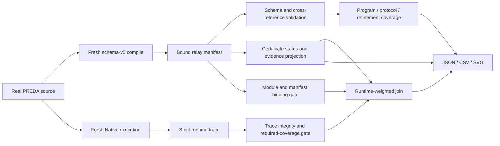

# R-PREDA Coverage and Scalability Evaluation

## 1. Scope

This deliverable adds a read-only evaluation layer for the existing R-PREDA
analysis and Native runtime-validation stack. It answers three separate
questions:

1. how much of the relay behavior in real PREDA contracts is represented by
   the compiler IR, summaries, refinements, and finite-bound certificates;
2. which certificate properties are established, which conservatively fall
   back, and why;
3. how the offline analysis behaves as synthetic program, relay-graph,
   control-flow, and formula dimensions increase.

The implementation does **not** change PREDA contract semantics, ordinary
`prlrt::relay*` lowering, generated C++, `SimuTxn`, relay serialization,
routing, queue insertion, worker scheduling, or runtime execution. Z3 is used
only by the offline compiler analysis. No solver is invoked by the Native
runtime.

The retained publication-facing artifacts are:

```text
results/coverage/
  coverage.json
  coverage.csv

results/certificate/
  certificate_quality.json
  certificate_quality.csv
  certificate_distribution.svg
  unknown_reason_breakdown.svg

results/scalability/
  scalability.json
  scalability.csv
  scalability_curve.svg
```

All JSON paths and tool paths in these results are repository-relative or
portable labels. Temporary compiler homes, generated programs, and raw traces
are intentionally excluded from the retained aggregate.

## 2. Modified files

### 2.1 Analysis profiling and compiler integration

| File | Responsibility |
|---|---|
| `oxd_preda/transpiler/relay_protocol/metrics/RelayAnalysisMetrics.h` | Declares an explicitly enabled, thread-local phase profiler and the stable phase schema. |
| `oxd_preda/transpiler/relay_protocol/metrics/RelayAnalysisMetrics.cpp` | Implements scoped timing and read-only metric snapshots. |
| `oxd_preda/CMakeLists.txt` | Adds `RPREDA_ENABLE_ANALYSIS_PROFILING`, keeps profiling independent of runtime trace/optimization, and registers evaluation tools. |
| `oxd_preda/transpiler/CMakeLists.txt` | Compiles the profiler and exports the profiling/bound-manifest definitions. |
| `oxd_preda/transpiler/PredaRealListener.cpp` | Measures total offline analysis and exposes profiling-only metadata without changing relay lowering. |
| `oxd_preda/transpiler/relay_protocol/cfg/PredaCFGBuilder.cpp` | Separately measures CFG, call-graph, effect, and relay-ICFG construction. |
| `oxd_preda/transpiler/relay_protocol/RelayProtocolCollector.cpp` | Measures summary, refinement generation, solver, and certificate phases. |
| `oxd_preda/transpiler/relay_protocol/RelayManifestEmitter.cpp` | Measures manifest serialization; timing is not part of semantic manifest content. |

### 2.2 Isolated analysis driver

| File | Responsibility |
|---|---|
| `oxd_preda/tools/rpreda_coverage/AnalysisDriver.cpp` | Compiles one `.prd` program and writes its manifest, optional generated C++, build-feature fingerprint, and `analysis_metrics.json`. |
| `oxd_preda/tools/rpreda_coverage/AnalysisProcessRunner.py` | Runs one analysis in a fresh process and records timeout, wall time, peak RSS, hashes, and process provenance. |
| `oxd_preda/tools/rpreda_coverage/CMakeLists.txt` | Builds the driver and wires optional Z3/RPATH and CTest support. |
| `oxd_preda/tools/rpreda_coverage/test_analysis_driver.py` | Checks profiling on/off behavior, byte-for-byte generated-C++ invariance, and absence of trace ABI calls in the profiling-only build. |

### 2.3 Evaluation pipeline

| File | Responsibility |
|---|---|
| `oxd_preda/tools/rpreda_evaluation/CoverageAnalyzer.py` | Validates schema-v5 manifests and cross-references, computes static and runtime-weighted coverage, projects certificate outcomes, and classifies conservative reasons. |
| `oxd_preda/tools/rpreda_evaluation/CoverageScalabilityRunner.py` | Orchestrates fresh real-contract runs and round-major synthetic measurements; validates binding, traces, structures, hashes, and build features. |
| `oxd_preda/tools/rpreda_evaluation/SyntheticPredaGenerator.py` | Deterministically generates exact-size PREDA programs with controlled function, statement, relay, branch, loop, call, and argument dimensions. |
| `oxd_preda/tools/rpreda_evaluation/MeasurementWorker.py` | Captures isolated-process resource and timeout observations. |
| `oxd_preda/tools/rpreda_evaluation/FigureEmitter.py` | Emits the three publication-facing SVG figures and represents zero-candidate percentages as N/A. |
| `oxd_preda/tools/rpreda_evaluation/benchmarks.json` | Defines the six real workloads, required trace coverage, seed, timeout, warm-up policy, and nine scalability sweeps. |
| `oxd_preda/tools/rpreda_evaluation/test_evaluation.py` | Contains 32 unit tests for denominators, evidence, schemas, trust gates, conservative fallback, generation, and sampling. |
| `oxd_preda/tools/rpreda_evaluation/CMakeLists.txt` | Registers the Python evaluation suite with CTest. |
| `oxd_preda/tools/rpreda_evaluation/README.md` | Documents commands, denominators, sampling, and interpretation boundaries. |

The evaluation consumes the runtime trace and certificate implementation from
earlier R-PREDA phases. It does not add or alter simulator/runtime code.

## 3. Benchmark configuration

The real-program matrix is defined in
`oxd_preda/tools/rpreda_evaluation/benchmarks.json`.

| Workload | PREDA source | Static scope | Native runtime | Purpose |
|---|---|---|---|---|
| Token | `oxd_preda/simulator/contracts/Token.prd` | Whole contract | Enabled | Conditional address relay. |
| Ballot | `oxd_preda/simulator/contracts/Ballot.prd` | Whole contract | Enabled | Shards broadcast and multi-stage aggregation. |
| MillionPixel | `oxd_preda/simulator/contracts/MillionPixel.prd` | Whole contract | Enabled | Arithmetic keyed-scope relay target. |
| Kitty | `oxd_preda/simulator/contracts/Kitty.prd` | Whole contract | Enabled | Nested relay handlers and synchronous composition. |
| AirDrop | `Token.transfer_n` in `Token.prd` | Function slice | Enabled | Repeated one-to-many emissions from one static site. |
| FCA | `oxd_preda/simulator/contracts/FCA.prd` | Whole contract | Disabled | Additional real static-analysis contract. |

AirDrop is a real Native workload but not a sixth unique contract artifact. It
shares Token's manifest-bound `module_id`, so its function slice is excluded
from static aggregate denominators and retained in runtime-weighted results.
Static totals are deduplicated by `artifact_binding.module_id`.

Every enabled runtime workload specifies required function and relay-site IDs.
A trace that fails to exercise a required ID, fails manifest binding, contains
instrumentation or execution-integrity errors, or disagrees with validation
counters is made unavailable or classified as fallback. Missing data is never
treated as zero coverage.

## 4. Coverage pipeline



`CoverageAnalyzer.py` fails closed on malformed formula sorts, duplicate stable
IDs, broken site/function/constraint/evidence references, incompatible module
bindings, invalid instrumentation counters, or untrusted trace identities.
Every covered datum retains the evidence IDs used to justify it.

### 4.1 Program coverage

The report distinguishes **analyzable** from **complete** CFG/ICFG results.
`Conservative` functions remain analyzable but are not counted as complete.
This avoids presenting a sound over-approximation as an exact control-flow
model.

### 4.2 Protocol coverage

Relay-site denominators include source relay statements in the selected static
scope. The primary bound metrics are relay-relevant:

- direct logical work;
- transitive logical work across handler edges;
- physical route work after fanout;
- relay-tree depth.

The JSON also retains all-function bound coverage, including trivial
zero-relay functions, under a separately labelled object.

### 4.3 Refinement coverage

Target, argument, and guard formulas count only supported Formula IR relations
with resolvable symbols and evidence. Semantic definitions established by the
compiler are not misreported as independent solver proofs.

Schema v5 has no refinement-depth obligation. Consequently the refinement
depth entry is explicitly `0/34`, marks
`available_in_refinement_ir=false`, and points to
`parallel_certificate.functions[].relay_tree_depth`. The separate certificate
depth result is reported in Section 6.

## 5. RQ1: real-program coverage results

Five unique artifacts compiled successfully. All 34 functions had analyzable
CFG and ICFG representations; only 3/34 were exact/complete after conservative
paths were excluded.

### 5.1 Aggregate program coverage

| Metric | Result |
|---|---:|
| Unique contract artifacts | 5 |
| Source functions | 20 |
| Generated relay-lambda functions | 14 |
| All functions | 34 |
| Relay sites | 14 |
| Resolved synchronous calls | 17 |
| Unresolved calls | 0 |
| CFG analyzable | 34/34 (100%) |
| CFG complete | 3/34 (8.824%) |
| ICFG analyzable | 34/34 (100%) |
| ICFG complete | 3/34 (8.824%) |
| CFG nodes excluding entry/exit | 353 |

### 5.2 Aggregate protocol and refinement coverage

| Layer | Property | Covered / eligible | Percentage |
|---|---|---:|---:|
| Protocol | Relay sites recorded | 14/14 | 100% |
| Protocol | Handler relations | 14/14 | 100% |
| Protocol | Fanout information | 14/14 | 100% |
| Protocol | Direct logical work bound | 12/14 | 85.714% |
| Protocol | Transitive logical work bound | 9/14 | 64.286% |
| Protocol | Physical route bound | 11/14 | 78.571% |
| Protocol | Relay-tree depth bound | 14/14 | 100% |
| Refinement | Target formulas | 3/14 | 21.429% |
| Refinement | Custom-scope target formulas | 3/9 | 33.333% |
| Refinement | Argument formulas | 9/24 | 37.5% |
| Refinement | Guard formulas | 12/14 | 85.714% |
| Refinement | Nontrivial guard formulas | 1/3 | 33.333% |
| Refinement | Guard equivalence | 0/14 | 0% |
| Refinement | Direct-count equality | 31/34 | 91.176% |
| Refinement | Count upper bound | 32/34 | 94.118% |
| Refinement | Count non-negativity | 34/34 | 100% |
| Refinement | Depth formula in Refinement IR | 0/34 | 0% (not represented in schema v5) |

### 5.3 Per-workload relay coverage

| Workload | Functions | Sites | Direct | Transitive | Physical | Depth | Target | Arguments | Guard | Runtime |
|---|---:|---:|---:|---:|---:|---:|---:|---:|---:|---|
| Token | 5 | 2 | 1/2 | 1/2 | 1/2 | 2/2 | 1/2 | 1/2 | 1/2 | Passed |
| Ballot | 11 | 4 | 4/4 | 2/4 | 4/4 | 4/4 | 0/4 | 0/2 | 4/4 | Passed |
| MillionPixel | 2 | 1 | 1/1 | 1/1 | 1/1 | 1/1 | 1/1 | 1/1 | 1/1 | Passed |
| Kitty | 11 | 6 | 5/6 | 4/6 | 4/6 | 6/6 | 0/6 | 7/18 | 5/6 | Passed |
| AirDrop | 2 | 1 | 0/1 | 0/1 | 0/1 | 1/1 | 0/1 | 0/1 | 0/1 | Passed; static slice excluded from aggregate |
| FCA | 5 | 1 | 1/1 | 1/1 | 1/1 | 1/1 | 1/1 | 0/1 | 1/1 | NotRun |

Low formula coverage does not mean a relay site was dropped: every site and
handler relation remains present. Unsupported targets or arguments remain
explicit in the manifest and are excluded only from the supported-formula
numerator.

## 6. RQ2: certificate quality

### 6.1 Outcome table

| Property | Candidate count | Proved | Unknown | Unsupported |
|---|---:|---:|---:|---:|
| MutualExclusive | 0 | 0 | 0 | 0 |
| MustPrecede | 0 | 0 | 0 | 0 |
| CoEmissionIndependent | 0 | 0 | 0 | 0 |
| WorkBound | 42 | 32 | 10 | 0 |
| DepthBound | 14 | 14 | 0 | 0 |

The three pair properties have a zero static candidate denominator in this
real-contract corpus. Their result is therefore **N/A**, not a 0% proof rate.
This experiment does not establish real-contract pair-property coverage.

All 46 `Proved` records have unique IDs, valid cross-referenced evidence, and
non-empty CFG fact IDs. Their proof strength is `FiniteUpperBound`; all retain
`raw_status=Conservative` and `exact_known=false`. Here, `Proved` means a sound
finite upper bound is established from compiler facts. It does not mean that
the exact work value is known, and these records are not relabelled as Z3
proofs.

### 6.2 Conservative fallback reasons

| Primary reason | Count |
|---|---:|
| Loop occurrence unsupported | 8 |
| Unsupported scope relation | 2 |
| Recursive handler | 0 |
| Unresolved call | 0 |
| Unsupported formula | 0 |
| Unknown effect | 0 |
| Ambiguous call context | 0 |
| Solver timeout | 0 |
| Other conservative | 0 |

The eight loop results arise where no finite occurrence bound can be proved.
The two scope-relation results are Ballot all-shards handler cases for which
physical broadcast clones cannot yet be collapsed into one logical subtree.
All zero-valued taxonomy categories are retained in JSON/CSV so downstream
analysis does not mistake omission for missing instrumentation.

## 7. Runtime-weighted validation

Runtime-weighted coverage joins a strict Native trace to the exact bound
manifest using module identity, module-local relay ordinal, source function,
and validation evidence. It is a validation of observed executions against
static certificates, not a replacement for static coverage.

| Runtime metric | Result |
|---|---:|
| Runtime-enabled workloads | 5 |
| Source transactions | 29 |
| Complete certificates | 23 (79.31%) |
| Partial certificates | 6 (20.69%) |
| Fallback transactions | 0 (0%) |
| Observed logical relay emissions | 47 |
| Manifest identity resolved | 47/47 (100%) |
| Certificate-covered emissions | 35/47 (74.468%) |
| Executed relay trees | 23 |
| Trees with finite work bound | 18/23 (78.261%) |
| Trees with finite depth bound | 23/23 (100%) |

There were 29 dynamic pair occurrences, all produced by repeated executions of
the same static relay site. Because Phase E has no occurrence-indexed
certificate, all-occurrence pair coverage is 0/29 (0%), while the eligible
distinct-site denominator is zero and its percentage is N/A. Both denominators
are emitted separately.

The retained traces contain 803 `Passed` checks and 178 expected
`SkippedUnsupported` checks, with zero binding, manifest-load, instrumentation,
integrity, or mismatch failures. Every function and relay site required by the
benchmark configuration was exercised. FCA has only static results because no
Native runtime script is configured.

## 8. Synthetic scalability generator

The generator emits deterministic PREDA source and verifies the realized
structure against the request before accepting a sample. The source hash,
normalized manifest hash, Formula IR hash, actual structure, build-feature
fingerprint, and solver-status multiset must be stable across repetitions.

The base configuration is 16 functions, 128 statements, 4 relay sites, width
4, depth 1, no branch/loop/synchronous-call nesting, one argument per relay,
and one target-expression term. The sweeps are:

```text
functions:           8, 16, 32, 64
statements:          32, 64, 128, 256
relay sites:         1, 2, 4, 8, 16
relay width:         1, 2, 4, 8, 16
relay depth:         1, 2, 4, 8
branch depth:        0, 1, 2, 4
loop depth:          0, 1, 2, 3
synchronous calls:  0, 1, 2, 4, 8
arguments/relay:     0, 1, 2, 4, 8
```

The statement metric is semicolon-terminated source statements plus `if` and
`for` control statements; semicolons in `for` headers are excluded.

Some graph dimensions are mathematically coupled and are labelled in each
point:

- width uses 16 total relay sites, so width 1/2/4/8/16 implies depth
  16/8/4/2/1;
- all width points use the same 17-function floor, and `functions` is recorded
  as a coupled dimension rather than silently drifting;
- depth uses 8 total relay sites, so increasing depth reduces width;
- the function sweep holds total statements at 128 and therefore changes the
  number and placement of statements per function.

No conclusion below treats those coupled sweeps as independent causal tests.

## 9. Measurement and metrics

The profiling build records these non-overlapping or explicitly nested phases:

- CFG construction;
- call-graph construction;
- effect analysis;
- relay-ICFG construction;
- summary analysis;
- refinement generation;
- refinement solver;
- certificate generation;
- total analysis;
- manifest emission.

`analysis_total` ends before separately reported manifest serialization;
therefore manifest emission must not be added twice. `solver_time_ms` in the
aggregate is the sum of elapsed times persisted on individual obligations; it
is not the wall-clock refinement-solver phase. Formula IR constraint count
includes semantic definitions established by construction. Actual
solver-facing volume is reported separately as solver goals, assumption
references, and unique assumption constraints.

Each case runs in a fresh driver process. Three complete warm-up rounds precede
five measured rounds. Each round uses a seed-derived deterministic hash shuffle
of all 40 cases. Every point includes min, quartiles, median, max, IQR, and an
interpolated p95. With only five observations, p95 is descriptive and is not a
tail-latency estimate.

The recorded host had 12 logical CPUs, 15 GiB RAM, Linux x86-64, and GCC 12.4.
The profiling driver fingerprint confirms:

```json
{
  "analysis_profiling": true,
  "bound_manifest": true,
  "runtime_optimization": false,
  "runtime_trace": false,
  "z3": true
}
```

Thus scalability samples do not include runtime-trace or runtime-optimization
overhead. Their manifests are marked
`analysis_only_unbound_at_transpiler_boundary`; they are not presented as
Native runtime-bound artifacts.

## 10. Scalability results

All 40 points and all 200 measured samples completed. Including 120 warm-up
samples, the driver executed successfully 320/320 times. All realized
structures were valid, each case's five normalized manifest and Formula IR
hashes were identical, solver status multisets were stable, and
`diagnostics=[]`.

The table reports endpoint medians. RSS is Linux `RUSAGE_CHILDREN.ru_maxrss`.

| Sweep | Endpoint | Analysis ms | ICFG ms | Refinement solver ms | Certificate ms | Median peak RSS KiB |
|---|---:|---:|---:|---:|---:|---:|
| Functions | 8 -> 64 | 579.741 -> 403.402 | 252.562 -> 43.697 | 187.931 -> 308.500 | 138.374 -> 35.534 | 47,008 -> 49,328 |
| Statements | 32 -> 256 | 139.398 -> 2,583.959 | 2.834 -> 2,154.511 | 103.335 -> 266.827 | 33.326 -> 159.728 | 41,700 -> 95,408 |
| Relay sites | 1 -> 16 | 451.996 -> 3,367.621 | 220.615 -> 264.072 | 207.520 -> 1,730.101 | 0.374 -> 1,434.542 | 45,184 -> 115,620 |
| Relay width | 1 -> 16 | 426.939 -> 3,083.781 | 211.458 -> 213.984 | 211.720 -> 1,665.610 | 1.015 -> 1,237.699 | 48,272 -> 115,628 |
| Relay depth | 1 -> 8 | 1,398.664 -> 422.984 | 230.619 -> 214.327 | 546.796 -> 221.087 | 620.185 -> 0.518 | 58,652 -> 46,284 |
| Branch depth | 0 -> 4 | 617.249 -> 649.818 | 195.189 -> 216.912 | 294.215 -> 280.681 | 140.581 -> 162.310 | 47,248 -> 62,528 |
| Loop depth | 0 -> 3 | 610.397 -> 536.770 | 194.153 -> 261.845 | 279.071 -> 234.111 | 133.586 -> 0.413 | 47,408 -> 47,032 |
| Sync-call depth | 0 -> 8 | 616.233 -> 743.448 | 227.492 -> 303.571 | 288.710 -> 282.741 | 136.819 -> 153.140 | 47,352 -> 65,124 |
| Arguments/relay | 0 -> 8 | 596.769 -> 743.770 | 190.563 -> 309.224 | 256.554 -> 293.543 | 133.700 -> 142.872 | 46,912 -> 53,400 |

### 10.1 Interpretation

- **Program statements.** From 32 to 256 statements, median analysis time
  increases by 18.54x. ICFG construction grows from 2.834 ms to 2,154.511 ms,
  while Formula IR and normalized certificate sizes remain fixed. The observed
  bottleneck is CFG/ICFG path structure, not an increase in solver goals.
- **Relay sites and width.** At 16 sites, solver goals reach 376/377 and the
  refinement-solver and certificate phases dominate. This is consistent with
  the growing relay-pair frontier. The experiment reports empirical growth; it
  does not claim a formal complexity bound.
- **Relay depth.** The apparent speedup at greater depth is caused by the
  fixed-site design: width shrinks from 8 to 1, and solver goals fall from 100
  to 16. It is not evidence that deeper relay chains are intrinsically easier.
- **Loops.** The certificate phase falls to 0.413 ms at loop depth 3 because
  conservative Unsupported/Unknown paths reduce the proof frontier. This is
  fallback behavior, not improved loop scalability.
- **Functions.** Total statements stay fixed at 128 and are redistributed
  across functions. The endpoint decrease must not be generalized as
  "more functions are faster."
- **Arguments.** Formula IR constraints rise from 56 to 88 and obligations
  from 62 to 94, but solver goals, assumption references, and unique
  assumptions remain 34, 56, and 40. This sweep measures IR construction,
  serialization, and memory growth, not independent Z3-assumption scaling.

### 10.2 Timing-stability qualification

The semantic and structural checks passed, but the advisory timing control did
not:

```text
threshold (max/min):                 1.2
measured-round median max/min:       1.975811
identical-baseline case max/min:     1.284172
coefficient of variation:            0.355101
status:                              ExceedsAdvisoryThreshold
```

The five measured-round medians for seven byte-identical normalized baseline
manifests were 619.511, 614.749, 616.233, 665.641, and 1,214.628 ms. The final
round experienced a host-wide slowdown. Structure counts, solver statuses,
hashes, and artifact sizes remain valid, but absolute time values and small
timing differences are exploratory and must not be presented as stable
performance laws. A paper-quality timing claim requires a quiet host, fixed
CPU policy/affinity, and a repeated run that passes the declared threshold.

There is no topology-fixed sweep that independently increases the number of
solver assumptions. That experiment remains future work.

## 11. Commands

### 11.1 Profiling-only build

```bash
cmake -S . -B /tmp/preda-analysis-profile-only-build -G Ninja \
  -DRPREDA_ENABLE_ANALYSIS_PROFILING=ON \
  -DRPREDA_ENABLE_Z3=ON \
  -DRPREDA_ENABLE_RUNTIME_TRACE=OFF \
  -DRPREDA_ENABLE_RUNTIME_OPTIMIZATION=OFF \
  -DZ3_ROOT=/path/to/z3

cmake --build /tmp/preda-analysis-profile-only-build \
  --target rpreda_analysis_driver relay_protocol_ir_tests -j2
```

### 11.2 Real-contract coverage and certificate quality

Use a trace-enabled Native build. The explicit GCC 12 path is required on a
host whose default compiler cannot compile PREDA's C++17 Native support
headers.

```bash
PYTHONDONTWRITEBYTECODE=1 \
RPREDA_REPO_ROOT="$PWD" \
LD_LIBRARY_PATH="$PWD/bin/bin_release:/path/to/z3/lib" \
python3 oxd_preda/tools/rpreda_evaluation/CoverageScalabilityRunner.py real \
  --config oxd_preda/tools/rpreda_evaluation/benchmarks.json \
  --output-root results \
  --work-root /tmp/rpreda-coverage-real \
  --chsimu bin/bin_release/chsimu \
  --library-path /path/to/z3/lib \
  --path-prefix /path/to/gcc-12/bin
```

### 11.3 Synthetic scalability

```bash
PYTHONDONTWRITEBYTECODE=1 \
RPREDA_REPO_ROOT="$PWD" \
LD_LIBRARY_PATH="$PWD/bin/bin_release:/path/to/z3/lib" \
python3 oxd_preda/tools/rpreda_evaluation/CoverageScalabilityRunner.py scalability \
  --config oxd_preda/tools/rpreda_evaluation/benchmarks.json \
  --output-root results \
  --work-root /tmp/rpreda-scalability \
  --analysis-driver bin/bin_release/rpreda_analysis_driver
```

### 11.4 Tests

```bash
PYTHONDONTWRITEBYTECODE=1 \
RPREDA_REPO_ROOT="$PWD" \
python3 -m unittest discover \
  -s oxd_preda/tools/rpreda_evaluation \
  -p 'test_*.py' -v

ctest --test-dir /tmp/preda-analysis-profile-only-build \
  -R 'rpreda_coverage_scalability_python_tests|rpreda_analysis_driver_tests' \
  --output-on-failure

ctest --test-dir /tmp/preda-phase-ef-z3-build \
  -R 'relay_protocol_ir|relay_runtime_trace_tests' \
  --output-on-failure
```

## 12. Figures

- `results/certificate/certificate_distribution.svg` shows status counts for
  each certificate property. Zero-candidate pair properties are not described
  as failed proofs.
- `results/certificate/unknown_reason_breakdown.svg` shows the complete primary
  conservative-fallback taxonomy.
- `results/scalability/scalability_curve.svg` shows analysis-time and memory
  curves against program/relay/formula size. Its Formula IR constraint axis
  starts at the observed minimum rather than zero.

The JSON files are authoritative. CSV and SVG are deterministic projections of
the same aggregates.

## 13. Validation evidence

The final run produced:

- 32/32 Python evaluation tests passed;
- 56 Relay Protocol IR C++ cases passed inside `relay_protocol_ir`;
- the strict relay runtime-trace C++ suite passed;
- 320/320 isolated scalability processes completed;
- 200/200 measured structures validated;
- 40/40 scalability points completed;
- zero diagnostics in coverage, certificate, and scalability JSON;
- 56 unique certificate IDs;
- every `Proved` record has resolvable evidence IDs;
- every `Unknown`/`Unsupported` record has an explicit reason;
- generated C++ is byte-for-byte identical with profiling disabled/enabled,
  and ordinary `prlrt::relay*` lowering remains present.

The final result hashes are:

| Artifact | SHA-256 |
|---|---|
| `coverage/coverage.json` | `5fa1cf2ccb88ed3390c05a9486c985d6f96b5166842e0eed828d0a6a807d0e5c` |
| `coverage/coverage.csv` | `226ee0d5cbc33edc75e7d4e3f15bf7a27eda5beb3d4a7a91bcca1b0f538f0dd5` |
| `certificate/certificate_quality.json` | `17fd6701da25b3cc7710912bb5fa11f5cc8d42a5c66ea5e703ab90913e05bbfb` |
| `certificate/certificate_quality.csv` | `bf45e1a917e35c4e276bd6094d0d7d2f81f270f018a43c965468f03eaadd88b0` |
| `scalability/scalability.json` | `0ce9527422e3ea22481db00df3ba5dfa8d826410e8c8aa0bd970a0f2e4952598` |
| `scalability/scalability.csv` | `53ee6ae21dc2cccb29fe9d12f3b89767d08e839f72a927ea242e0b71e2933e22` |

## 14. Limitations

1. Only five unique real static artifacts are included; AirDrop is a Token
   function-slice workload rather than a separate contract.
2. Real-contract pair-certificate candidate counts are zero. The current real
   corpus therefore supports work/depth conclusions, not pair-property proof
   rates.
3. All dynamic pairs are repeated occurrences of one static site. There is no
   occurrence-indexed pair certificate yet.
4. CFG/ICFG analyzability is 100%, but exact completeness is only 8.824%.
5. Every reported `Proved` certificate is a conservative finite upper bound,
   not an exact work formula.
6. Formula support remains limited for Ballot and Kitty targets/arguments;
   unsupported expressions remain explicit rather than being guessed.
7. All-shards handler subtree collapse is not modeled for two Ballot bounds.
8. Refinement IR has no depth-obligation kind; depth is represented in the
   parallel certificate.
9. FCA has no Native runtime run.
10. Real contracts evaluate coverage and certificate validity. The performance
    scalability experiment deliberately uses generated programs so individual
    dimensions can be controlled; it does not claim real-contract throughput
    measurements.
11. The final timing run exceeds the advisory stability threshold. Use the
    retained structural, status, evidence, and size results without
    qualification; treat absolute timing as exploratory until rerun on a
    controlled host.
12. Each point has five samples, so p95 is descriptive only.
13. Relay width/depth and function/statement placement have disclosed
    couplings. No independent solver-assumption-count sweep is present.
14. Compile and runtime invocations produce semantically equal manifests, but
    per-obligation elapsed-time fields may change their full-file hashes. The
    runtime binds its own exact manifest; aggregate joining uses stable
    `module_id`.

## 15. Paper mapping

The task specification uses `RQ3` both for runtime-weighted coverage in the
body and for scalability in its final mapping. To avoid ambiguity, use:

- **RQ1 -- Real-world analysis coverage:** Sections 3--5 and
  `results/coverage/coverage.{json,csv}`.
- **RQ2 -- Certificate quality and conservative fallback:** Section 6 and
  `results/certificate/`.
- **RQ3 -- Scalability:** Sections 8--10 and `results/scalability/`.
- **Supporting runtime validation:** Section 7 and the runtime-weighted fields
  in `coverage.json`.

The primary paper conclusions supported by the current artifacts are:

- all relay sites and handlers in five unique real artifacts are preserved;
- finite depth is available for every real relay site, while direct,
  transitive, and physical work have 85.714%, 64.286%, and 78.571% coverage;
- the ten non-proved work bounds have explicit conservative causes rather than
  silent analysis loss;
- observed Native executions resolve every emission identity and validate
  finite depth for every executed relay tree;
- large statement graphs are currently ICFG-bound, while wide/many-site relay
  graphs are refinement-solver/certificate-bound;
- pair-property coverage and stable wall-clock performance remain open
  evaluation gaps and must be reported as such.
