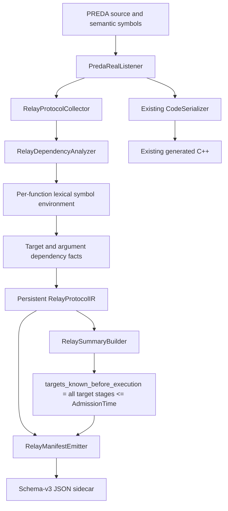

# R-PREDA Expression Dependency Analysis Implementation

## 1. Scope

This change replaces the relay summary's coarse syntax-based target check with
a conservative expression-origin and availability analysis. Every persistent
relay target and argument now records:

```text
dependency set
earliest availability stage
admission-time evaluability
```

The analysis is implemented entirely in the PREDA transpiler and manifest
layer. It does not modify:

- PREDA relay lowering or generated `prlrt::relay*` calls;
- relay argument serialization;
- `SimuTxn`;
- relay target hashing, shard mapping, routing, or queue insertion;
- per-shard workers, batching, scheduling, or runtime execution.

The relay protocol manifest is now schema version `3`. All schema-v2 protocol
and static-summary fields remain present; schema v3 adds dependency facts to
relay targets and arguments.

## 2. Analysis architecture



Dependency analysis runs while the listener still has both the semantic
function context and the ANTLR expression tree. Results are copied into owning
IR objects at each relay site. No parser contexts or compiler symbol pointers
are retained in the manifest.

## 3. Changed files

### 3.1 New analysis files

| File | Responsibility |
|---|---|
| `oxd_preda/transpiler/relay_protocol/analysis/RelayExpressionDependency.h` | Dependency classes, availability stages, and the per-expression result type |
| `oxd_preda/transpiler/relay_protocol/analysis/RelayDependencyAnalyzer.h` | Symbol-origin environment and transfer-function interface |
| `oxd_preda/transpiler/relay_protocol/analysis/RelayDependencyAnalyzer.cpp` | Dependency joins, expression evaluation, call/cast handling, mutable-binding effects, opaque taint, and lvalue transfer |

### 3.2 Updated implementation files

| File | Change |
|---|---|
| `oxd_preda/transpiler/relay_protocol/RelayProtocolIR.h` | Adds target and argument dependency records and sets the schema version to `3` |
| `oxd_preda/transpiler/relay_protocol/RelayProtocolCollector.h/.cpp` | Owns the analyzer, converts listener events into symbol effects, analyzes relay expressions, and performs loop widening |
| `oxd_preda/transpiler/PredaRealListener.cpp` | Registers contract symbols, starts and ends function environments, mirrors lexical scopes, records local declarations and assignments, and handles generated lambda functions |
| `oxd_preda/transpiler/relay_protocol/RelayManifestEmitter.cpp` | Emits schema-v3 dependency objects |
| `oxd_preda/transpiler/relay_protocol/analysis/RelaySummaryBuilder.cpp` | Derives the compatibility target-known boolean from target availability instead of expression syntax |
| `oxd_preda/transpiler/CMakeLists.txt` | Builds the dependency-analysis sources |
| `oxd_preda/transpiler/test/RelayProtocolIRTests.cpp` | Validates schema v3, target/argument dependencies, availability, loop widening, and compatibility-summary derivation |

### 3.3 New fixtures

The focused fixtures under
`oxd_preda/transpiler/testcase/relay_protocol/` are:

```text
dependency_literal.prd
dependency_arithmetic_cast.prd
dependency_unary.prd
dependency_current_scope_key.prd
dependency_next.prd
dependency_state_owner.prd
dependency_member.prd
dependency_array_index.prd
dependency_local_parameter.prd
dependency_conditional_initialization.prd
dependency_local_overwrite.prd
dependency_parameter_overwrite.prd
dependency_state_call_write.prd
dependency_external_call.prd
dependency_opaque_effect.prd
dependency_loop_widening.prd
dependency_existing_loop_variable.prd
```

Existing fixtures such as `named_address.prd`, `bounded_for.prd`, and
`opaque_fallback.prd` additionally validate parameter arguments, loop
variables, and opaque targets.

## 4. Dependency and availability lattices

### 4.1 Dependency classes

`RelayDependencyClass` contains:

```text
Constant
TransactionArgument
CurrentScopeKey
CurrentScopeState
LocalDerived
LoopVariable
ExternalCallResult
Opaque
```

Dependency information forms a finite powerset lattice. Combining operands is
a set union. The emitter uses a deterministic enum order, removes duplicates,
and removes `Constant` when a dynamic dependency is also present. For example:

```text
x * 65536u32 + y
-> {TransactionArgument, Constant}
-> {TransactionArgument}
```

Removing `Constant` in this case does not discard a dynamic origin; it avoids
reporting literal operands as an additional runtime dependency.

### 4.2 Availability stages

Availability is an ordered lattice:

```text
CompileTime
  < AdmissionTime
  < AfterScopeLoad
  < DuringExecution
  < Unknown
```

The earliest stage for a compound expression is the join, or maximum, of the
stages required by all of its dependencies:

| Dependency class | Earliest stage |
|---|---|
| `Constant` | `CompileTime` |
| `TransactionArgument` | `AdmissionTime` |
| `CurrentScopeKey` | `AdmissionTime` |
| `CurrentScopeState` | `AfterScopeLoad` |
| `LocalDerived` | `DuringExecution` |
| `LoopVariable` | `DuringExecution` |
| `ExternalCallResult` | `DuringExecution` |
| `Opaque` | `Unknown` |

The per-expression boolean is defined mechanically:

```text
admission_time_evaluable =
    earliest_availability <= AdmissionTime
```

No separate heuristic is used.

## 5. Function symbol-origin environments

`RelayFunctionSymbolEnvironment` stores:

```text
stable function ID
function scope
stack of lexical name -> RelaySymbolOrigin maps
```

Its lifecycle is:

1. `RelayProtocolCollector::Reset()` clears protocol and dependency state for
   the next contract.
2. Contract state declarations are registered as `CurrentScopeState`.
   Contract constants are registered as `Constant`, and struct/enum names are
   registered as type symbols for cast recognition.
3. `PredaRealListener::enterFunctionDefinition()` starts an environment after
   the compiler has resolved the real function signature. Contract symbols
   are copied into the root lexical scope, forming a function-local state
   overlay. Every source parameter is then inserted as
   `TransactionArgument`.
4. A keyed source function also receives a semantic
   `$current_scope_key` binding. The source-facing address getter is handled
   by the pure-call summary described below.
5. Listener callbacks push and pop matching dependency scopes for `if`,
   `else if`, `else`, `for`, `while`, `do while`, and explicit user blocks.
6. Local declarations install either the initializer's dependency or
   `LocalDerived` for an uninitialized/default-initialized local.
7. Expression statements, declaration initializers, and relevant
   condition/update expressions apply assignment, call, increment/decrement,
   and opaque-expression effects to the active environment.
8. `exitFunctionDefinition()` saves the completed environment and clears the
   active one.

Generated relay lambdas are not entered through the ordinary
`enterFunctionDefinition()` callback. `DefinePendingRelayLambdas()` therefore
starts an environment explicitly using the generated function ID, lambda
scope, and lambda parameter names before walking the lambda body, and ends it
after that walk. Nested relay lambdas consequently receive the same analysis
as source-declared functions.

The environment is analysis-only. It is not consulted by code generation or
the runtime. In particular, side-effect taint on a copied state binding is
retained only in the current function environment and cannot leak into the
initial environment of an independently analyzed function.

## 6. Expression transfer rules

`RelayDependencyAnalyzer::Analyze()` implements the following rules.

| Expression | Result |
|---|---|
| Literal | `Constant` |
| `global` / `shards` keyword | `Constant` |
| `next` keyword | `CurrentScopeKey` |
| Known identifier | Dependency stored in its nearest lexical or contract binding |
| Unknown identifier | `Opaque`, `Unknown`, with a reason containing the identifier |
| Group | Dependency union of its child |
| Unary | Dependency union of its children |
| Binary | Dependency union of its children |
| Member access | Dependency of the value-bearing receiver children |
| Index | Union of the container and index dependencies |
| Cast | Dependency union of cast operands |
| Pure summarized call | Registered summary joined with call arguments |
| Other call | `ExternalCallResult`, `DuringExecution` |
| Opaque expression | `Opaque`, `Unknown`, preserving the existing reason |

### 6.1 Member and index expressions

`RelayExprIR` stores the member-name token as the final synthetic identifier
child of a member access. The analyzer treats that token as a selector rather
than a value origin. The receiver still contributes all of its dependencies.

An index expression unions both value-bearing children:

```text
targets[i]

targets -> CurrentScopeState
i       -> TransactionArgument

result  -> {TransactionArgument, CurrentScopeState}
stage   -> AfterScopeLoad
```

### 6.2 Calls and pure summaries

Calls are conservatively classified as `ExternalCallResult` unless a pure
dependency summary is registered. An unsummarized call is not treated as
admission-time evaluable merely because all of its arguments are transaction
arguments.

The current built-in pure summary is:

```text
__transaction.get_self_address()
-> CurrentScopeKey
-> AdmissionTime
```

`RegisterPureCallSummary()` is the extension point for future compiler-proved
pure functions. For a summarized call, the summary is joined with its
arguments.

Call-result analysis and call-effect analysis are separate. When an
unsummarized call occurs in an effect context,
`RecordUnsummarizedCallEffects()` conservatively unions
`ExternalCallResult` into:

- every state binding in the current function-local state overlay;
- the root binding of a member-call receiver; and
- the root binding of every call argument.

Root lookup follows grouping, member, and index nodes. This avoids assuming
that an ordinary PREDA call is state-free or that receiver/argument values
cannot be changed through reference-like data. Pure summarized calls and
recognized casts/value constructors do not receive this side-effect taint.

For example:

```preda
owner = choose(target);
relay@owner receive();
```

produces:

```text
{CurrentScopeState, ExternalCallResult}, DuringExecution
```

The relay target `choose(target)` itself is still classified by its result as
`{ExternalCallResult}` rather than by the admission-time origin of `target`.

### 6.3 Cast recognition

PREDA uses the call-shaped grammar form for casts and value constructors. A
callee is treated as a type when it is:

- a built-in type/container keyword in `RelayExprIR`; or
- a registered struct or enum type symbol.

A cast preserves the dependency of its operands. A zero-argument value
constructor is a compile-time default value. This is why:

```text
uint32(x) * 65536u32 + uint32(y)
```

remains `{TransactionArgument}` at `AdmissionTime` rather than becoming an
`ExternalCallResult`.

### 6.4 Opaque expressions

Unsupported expressions never receive an optimistic dependency. For example,
the existing ternary target remains:

```text
RelayExprIR::Opaque
dependency = {Opaque}
availability = Unknown
admission_time_evaluable = false
```

Its text, source location, type, operator, and opaque reason remain in the
manifest. Relay cardinality still counts the known relay statement itself;
expression opacity does not erase the `Emit` node.

An opaque expression can also hide calls or writes. When it is encountered in
an effect context, `TaintMutableBindings()` unions `Opaque` into every mutable
parameter, function-local state overlay, local, and loop-variable binding.
Constants and the current-scope-key binding are not mutable and are not
tainted. This turns every later use of a potentially affected value into
`Unknown` instead of retaining an optimistic earlier stage.

For example, the opaque ternary initializer in
`dependency_opaque_effect.prd` contains calls that may update `owner`.
The later `relay@owner` is therefore:

```text
{CurrentScopeState, Opaque}, Unknown
```

## 7. Locals and assignment effects

A local initialized from an analyzable expression inherits that expression's
origins. The analyzer does not add `LocalDerived` when the original
dependencies are known:

```preda
address local_target = target;
relay@local_target receive();
```

produces:

```text
{TransactionArgument}, AdmissionTime
```

Declaration initialization creates the initial symbol fact. Every subsequent
write uses a conservative monotone join; there is no first-write strong
replacement:

- simple and compound assignments always retain the previous origin and join
  the right-hand-side origins;
- parameters, function-local state overlays, locals, and loop variables are
  writable analysis bindings;
- constants and the semantic current-scope-key binding remain immutable;
- nested assignments are visited recursively;
- `++` and `--` join the analyzed operand back into its root binding.

Consequently, an uninitialized/default-initialized local starts as
`LocalDerived`. Even a syntactically first assignment does not remove that
fact, because listener discovery does not prove that a branch executes:

```preda
address local_target;
if (enabled) {
    local_target = target;
}
relay@local_target receive();
```

produces:

```text
{TransactionArgument, LocalDerived}, DuringExecution
```

Therefore:

```preda
address local_target = target;
local_target = owner;
relay@local_target receive();
```

produces:

```text
{TransactionArgument, CurrentScopeState}, AfterScopeLoad
```

The old origin is intentionally retained. This is conservative across
branches and repeated executions and avoids a false admission-time claim.

The same rule applies to writable parameters:

```preda
target = owner;
relay@target receive();
```

produces:

```text
{TransactionArgument, CurrentScopeState}, AfterScopeLoad
```

For structured lvalues, `RootIdentifier()` descends through group, member, and
index nodes. A simple member/index write joins the right-hand side with the
lvalue's receiver/index dependencies; a compound write does the same because
it also reads the old value. Increment/decrement effects analyze the complete
operand and join it into the resolved root binding.

PREDA assignment expressions have type `void`. The tests therefore exercise
writes through valid statement and initializer contexts; they do not use an
assignment as a relay target or relay argument.

## 8. Loop variables and fixed-point widening

A locally declared `for` induction variable is classified as `LoopVariable`
and joins any initializer origins, so an argument such as `value + i` is
available only `DuringExecution`.

PREDA also permits a previously declared local to be used as the induction
variable:

```preda
uint32 i = 0u32;
for (i = 0u32; i < 3u32; i++) {
    relay@i receive();
}
```

`PromoteLoopVariableDependency()` recognizes the root updated by the `for`
update expression, changes the binding kind to `LoopVariable`, and joins the
`LoopVariable` origin before the body is walked. The target above is therefore
`{LoopVariable}`, `DuringExecution`.

Source-order analysis alone is insufficient for a loop:

```preda
address local_target = target;
for (uint32 i = 0u32; i < 2u32; i++) {
    relay@local_target receive();
    local_target = owner;
}
```

The first listener visit sees the relay before the write, but a later
iteration may observe the state-derived value. To cover that case,
`RelayProtocolCollector::WidenLoopDependencies()`:

1. collects assignment expressions in the loop parse subtree;
2. excludes nested relay-lambda bodies, which have independent function
   environments;
3. replays the loop's monotone assignment transfer functions;
4. uses `N + 1` rounds for `N` collected assignments, sufficient for a chain
   of transfers over this finite origin lattice;
5. re-analyzes targets and arguments for relay sites whose source ranges are
   inside the loop;
6. joins the widened result with the site-local result.

If a block-local name has already gone out of scope, a newly produced
`Opaque` result is not allowed to poison a previously informative site result
solely because that textual binding is no longer visible.

The example above therefore widens to:

```text
{TransactionArgument, CurrentScopeState}, AfterScopeLoad
```

This widening changes only manifest facts. It does not change loop execution,
relay cardinality, or runtime scheduling.

## 9. Why `CurrentScopeKey` is `AdmissionTime`

The `AdmissionTime` classification follows the existing PREDA invocation API;
it does not introduce a new runtime phase.

The concrete code path is:

1. `oxd_preda/engine/preda_engine/ExecutionEngine.cpp`,
   `CExecutionEngine::Invoke_Internal()`, calls
   `m_runtimeInterface.SetExecutionContext(executionContext)` before
   `MapNeededContractContext(...)`. The latter loads and maps contract state
   through `executionContext->GetState(...)`.
2. `oxd_preda/bin/compile_env/include/contexts.h`,
   `prlrt::__prlt___transaction::__prli_get_self_address()`, invokes the
   existing `Transaction_GetSelfAddress` runtime operation.
3. `oxd_preda/engine/preda_engine/RuntimeInterfaceImpl.cpp`,
   `CRuntimeInterface::Transaction_GetSelfAddress()`, reads
   `m_pExecutionContext->GetScopeTarget().Data` directly.
4. `oxd_preda/native/abi/vm_interfaces.h` declares `GetScopeTarget()` on
   `InvocationInfo` alongside transaction/invocation metadata such as opcode,
   contract ID, and invoke type. State access is exposed separately through
   `ChainStates::GetState()`.
5. In the simulator,
   `oxd_preda/simulator/simu_shard.cpp`,
   `SimuShard::GetScopeTarget()`, returns the already attached
   `_pTxn->Target` for keyed scopes.

The execution context, including its scope target, is therefore installed
before scope state is mapped. The current scope key is part of the admitted
invocation, and the `get_self_address()` path does not require a
contract-state read. It is classified as:

```text
CurrentScopeKey, AdmissionTime, admission_time_evaluable=true
```

Contract state variables remain:

```text
CurrentScopeState, AfterScopeLoad, admission_time_evaluable=false
```

## 10. Schema-v3 JSON

The schema version is:

```json
{
  "schema_version": 3
}
```

Each `relay_sites[]` item adds `target_dependency`, and each
`arguments[]` item adds `dependency`:

```json
{
  "relay_sites": [
    {
      "target": {
        "kind": "identifier",
        "text": "target",
        "type": "address"
      },
      "target_dependency": {
        "dependencies": [
          "TransactionArgument"
        ],
        "earliest_availability": "AdmissionTime",
        "admission_time_evaluable": true
      },
      "arguments": [
        {
          "type": "int32",
          "expression": {
            "kind": "identifier",
            "text": "value",
            "type": "int32"
          },
          "dependency": {
            "dependencies": [
              "TransactionArgument"
            ],
            "earliest_availability": "AdmissionTime",
            "admission_time_evaluable": true
          }
        }
      ]
    }
  ]
}
```

### 10.1 Literal target

```json
{
  "target_dependency": {
    "dependencies": [
      "Constant"
    ],
    "earliest_availability": "CompileTime",
    "admission_time_evaluable": true
  }
}
```

### 10.2 Current scope key

```json
{
  "target": {
    "kind": "call",
    "text": "__transaction.get_self_address()"
  },
  "target_dependency": {
    "dependencies": [
      "CurrentScopeKey"
    ],
    "earliest_availability": "AdmissionTime",
    "admission_time_evaluable": true
  }
}
```

`relay@next` receives the same dependency and availability classification.

### 10.3 Parameter plus state

```json
{
  "target_dependency": {
    "dependencies": [
      "TransactionArgument",
      "CurrentScopeState"
    ],
    "earliest_availability": "AfterScopeLoad",
    "admission_time_evaluable": false
  }
}
```

### 10.4 Opaque target

```json
{
  "target_dependency": {
    "dependencies": [
      "Opaque"
    ],
    "earliest_availability": "Unknown",
    "admission_time_evaluable": false,
    "reason": "ternary expression is not structurally modeled by the current relay protocol expression IR"
  }
}
```

The expression-level opaque reason retains the wording of the expression IR
version in which the ternary became opaque. The enclosing manifest version is
still schema `3`.

## 11. Compatibility summary boolean

The existing field is preserved:

```json
{
  "summary": {
    "targets_known_before_execution": true
  }
}
```

It is no longer computed from expression kinds. For each function:

```text
targets_known_before_execution =
    all relay sites have target_dependency.admission_time_evaluable
```

Equivalently, every target must have:

```text
earliest_availability <= AdmissionTime
```

A missing relay-site record forces the compatibility boolean to `false`.
Consequences include:

| Target | Compatibility boolean |
|---|---|
| Literal | `true` |
| Transaction argument | `true` |
| Arithmetic/cast expression over transaction arguments | `true` |
| Current scope key / `next` | `true` |
| Contract state | `false` |
| Loop variable | `false` |
| External call result | `false` |
| Opaque expression | `false` |

This preserves the schema-v2 field name and JSON type while deriving it from
the schema-v3 machine-readable facts. Values can become more precise than the
old syntax heuristic; for example, an address parameter is now correctly
admission-time evaluable.

## 12. Tests

The integration executable compiles real PREDA fixtures through
`ITranspiler`, parses the schema-v3 manifest, and checks:

| Case | Fixture | Expected dependency result |
|---|---|---|
| Literal target | `dependency_literal.prd` | `Constant`, `CompileTime` |
| Address parameter target and argument | `named_address.prd` | `TransactionArgument`, `AdmissionTime` |
| Arithmetic and casts | `dependency_arithmetic_cast.prd` | `TransactionArgument`, `AdmissionTime` |
| Unary expression | `dependency_unary.prd` | `TransactionArgument`, `AdmissionTime` |
| Current scope getter | `dependency_current_scope_key.prd` | `CurrentScopeKey`, `AdmissionTime` |
| Deferred `next` target | `dependency_next.prd` | `CurrentScopeKey`, `AdmissionTime` |
| State target | `dependency_state_owner.prd` | `CurrentScopeState`, `AfterScopeLoad` |
| State-backed member target | `dependency_member.prd` | `CurrentScopeState`, `AfterScopeLoad` |
| State array indexed by parameter | `dependency_array_index.prd` | `TransactionArgument + CurrentScopeState`, `AfterScopeLoad` |
| Opaque ternary target | `opaque_fallback.prd` | `Opaque`, `Unknown` |
| Local initialized from parameter | `dependency_local_parameter.prd` | `TransactionArgument`, `AdmissionTime` |
| Conditionally initialized local | `dependency_conditional_initialization.prd` | `TransactionArgument + LocalDerived`, `DuringExecution` |
| Local later assigned from state | `dependency_local_overwrite.prd` | `TransactionArgument + CurrentScopeState`, `AfterScopeLoad` |
| Parameter later assigned from state | `dependency_parameter_overwrite.prd` | `TransactionArgument + CurrentScopeState`, `AfterScopeLoad` |
| State written from unsummarized call | `dependency_state_call_write.prd` | `CurrentScopeState + ExternalCallResult`, `DuringExecution` |
| Unsummarized function call | `dependency_external_call.prd` | `ExternalCallResult`, `DuringExecution` |
| Opaque effect before state target | `dependency_opaque_effect.prd` | `CurrentScopeState + Opaque`, `Unknown` |
| Cross-iteration local write | `dependency_loop_widening.prd` | widened parameter + state origins |
| Existing local promoted to induction variable | `dependency_existing_loop_variable.prd` | `LoopVariable`, `DuringExecution` |
| Relay argument using induction variable | `bounded_for.prd` | `TransactionArgument + LoopVariable`, `DuringExecution` |

Every dependency case also checks that
`summary.targets_known_before_execution` equals the target's
`admission_time_evaluable` result.

### 12.1 Build

From the repository root, using the existing configured build:

```bash
cmake --build build-gcc12 --target relay_protocol_ir_tests -j2
```

Or configure a new test build:

```bash
cmake -S . -B build -G Ninja \
  -DCMAKE_BUILD_TYPE=Release \
  -DBUILD_TESTING=ON

cmake --build build --target relay_protocol_ir_tests -j2
```

### 12.2 Run through CTest

```bash
ctest --test-dir build-gcc12 \
  -R '^relay_protocol_ir$' \
  --output-on-failure
```

### 12.3 Run directly on Linux

```bash
LD_LIBRARY_PATH="$PWD/bin/bin_release:${LD_LIBRARY_PATH:-}" \
  ./build-gcc12/oxd_preda/transpiler/relay_protocol_ir_tests \
  ./oxd_preda/transpiler/testcase/relay_protocol
```

The executable currently contains nineteen logical protocol tests, including
one table-driven dependency test over seventeen focused dependency fixtures.

## 13. Generated-code and runtime invariants

The implementation adds listener-side observations but does not alter the
strings passed to `CodeSerializer`. Exact generated-C++ byte-count and FNV-1a
golden assertions remain unchanged for nine pre-existing baseline fixtures:

```text
named_address.prd
lambda_address.prd
global.prd
shards.prd
if_else.prd
else_if_chain.prd
bounded_for.prd
nested_lambda.prd
opaque_fallback.prd
```

The focused dependency fixtures are compiled and checked for manifest facts;
they do not each have a generated-C++ golden.

No changes were made to:

```text
oxd_preda/bin/compile_env/include/relay.h
oxd_preda/engine/preda_engine/RuntimeInterfaceImpl.cpp
oxd_preda/simulator/shard_data.h
oxd_preda/simulator/simu_shard.cpp
```

The runtime files above are read only as architectural evidence for
classification. Relay descriptor creation, target serialization, routing,
queueing, and execution continue through the existing implementation.

The schema-v3 facts are observational:

```text
successful semantic checking
  -> existing generated C++
  -> persistent relay expressions
  -> dependency analysis
  -> schema-v3 JSON sidecar
```

They do not feed back into lowering or runtime decisions.

## 14. Conservative boundaries

1. Unknown identifiers and unsupported expression forms become `Opaque`;
   they never become admission-time evaluable by default.
2. A call is `ExternalCallResult` unless an explicit pure dependency summary
   exists. This deliberately avoids inferring purity from syntax.
3. The current pure-summary registry contains the source-facing current-scope
   address getter. It is an extension point, not a general interprocedural
   purity analysis.
4. All writes to parameters, function-local state overlays, locals, and loop
   variables use monotone origin unions. This may retain an origin that is
   impossible on a particular path, but it does not silently lose a possible
   state dependency.
5. Unsummarized calls taint state and receiver/argument roots with
   `ExternalCallResult`; opaque effect expressions taint all mutable bindings
   with `Opaque`.
6. Branch environments are conservatively accumulated during listener
   traversal; no listener discovery order is promoted to a proved execution
   order.
7. Loop widening is origin analysis, not arithmetic refinement. It does not
   prove array bounds, numeric invariants, or trip counts.
8. Completed symbol environments are internal compiler-analysis state. The
   schema exposes the stable result on each relay target and argument rather
   than serializing compiler-local scope maps.
