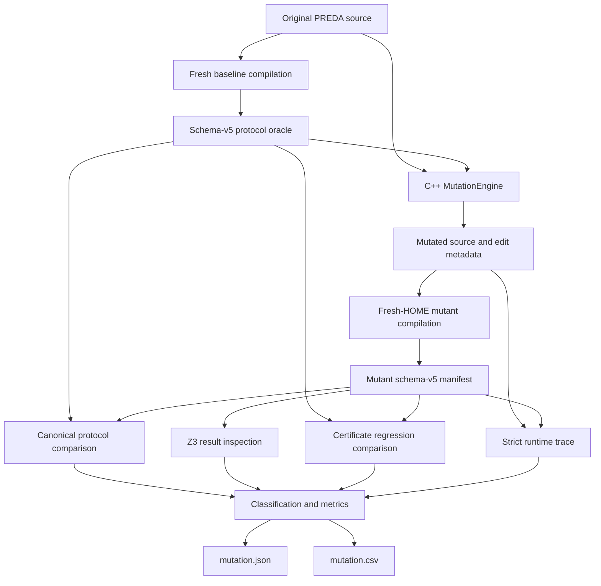

# R-PREDA Mutation Study Framework Implementation

## 1. Scope and soundness boundary

This change adds a source-level mutation-study framework for R-PREDA relay
protocols. It consumes the persistent schema-v5 relay manifest and evaluates
mutants through compilation, protocol comparison, Z3-result inspection,
parallel-certificate comparison, and strict runtime-trace validation.

It does **not** change PREDA relay lowering, generated C++, `SimuTxn`, relay
serialization, routing, shard queues, workers, scheduling, or execution
semantics.

The freshly compiled original manifest is an explicit baseline oracle. A mutant
is also compiled against its own source so later compiler, solver, certificate,
and trace stages can run normally. Therefore:

- baseline-versus-mutant comparison detects a protocol change relative to the
  original source;
- strict trace validation with the mutant manifest checks compiler/runtime
  self-consistency;
- passing that self-consistency check does not prove equivalence to the
  original program;
- compiler-generated site IDs, opcodes, and listener order are never treated as
  semantic equality.

## 2. Architecture



The C++ layer owns typed candidate discovery and source rewriting. The Python
layer owns process isolation, diagnostics, semantic projections, coverage
gates, classification, reporting, and result publication.

## 3. Changed files

| File | Purpose |
|---|---|
| `oxd_preda/CMakeLists.txt` | Adds `tools/rpreda_mutation`. |
| `oxd_preda/tools/rpreda_mutation/CMakeLists.txt` | Builds the engine and CLI and registers C++/Python tests. |
| `oxd_preda/tools/rpreda_mutation/MutationKind.h` | Defines and parses all 13 mutation kinds. |
| `oxd_preda/tools/rpreda_mutation/MutationEngine.h` | Owns mutation records, locations, edits, options, and generation results. |
| `oxd_preda/tools/rpreda_mutation/MutationEngine.cpp` | Reads schema-v5 manifests, discovers candidates, applies checked UTF-8-safe edits, and assigns stable IDs. |
| `oxd_preda/tools/rpreda_mutation/MutationMain.cpp` | Implements the `rpreda_mutation` CLI and source/metadata persistence. |
| `oxd_preda/tools/rpreda_mutation/MutationRunner.py` | Runs baseline and mutant compilation, Z3/certificate analysis, trace validation, coverage gates, and classification. |
| `oxd_preda/tools/rpreda_mutation/MutationReport.py` | Atomically emits JSON/CSV and denominator-aware metrics. |
| `oxd_preda/tools/rpreda_mutation/MutationEngineTests.cpp` | Tests edits, operators, Unicode mapping, stable IDs, seeds, and certificate preconditions. |
| `oxd_preda/tools/rpreda_mutation/test_mutation_runner.py` | Tests projections, classification, coverage, compile failures, runtime termination, and metrics. |
| `oxd_preda/tools/rpreda_mutation/fixtures/MutationStudy.prd` | Compileable fixture with valid candidates for all required operators. |
| `oxd_preda/tools/rpreda_mutation/fixtures/MutationStudy.prdts.in` | Runtime script covering both guard arms, scoped relays, broadcast, and nested handlers. |
| `results/mutation/` | Reproducible representative JSON/CSV, baseline oracle, and generated sources. |

No PREDA runtime implementation file is modified by this task.

## 4. Mutation representation and determinism

Every `MutationRecord` contains:

- a unique stable mutation ID and mutation kind;
- contract and source-function identities;
- affected relay-site references for diagnostics and coverage binding;
- source line/column, compiler code-point offsets, and UTF-8 byte offsets;
- a human-readable description and explicit unsupported/failure reason;
- original and mutated fragments;
- complete original and mutated sources;
- validated, non-overlapping `SourceEdit` objects.

ANTLR/PREDA offsets are Unicode code-point offsets with an inclusive stop
offset, while `std::string` uses UTF-8 bytes. `Utf8SourceMap` converts between
them before any edit. Each edit also carries its expected original text; a
stale or mismatched range is rejected.

The ID is a 128-bit hexadecimal digest derived from a length-prefixed canonical
form containing:

```text
source digest + contract + mutation kind + sorted edit spans/text
```

It excludes generated relay-site ordinals, lambda names, opcodes, and listener
discovery order. A collision between distinct canonical records is reported as
an error. The fixed seed chooses among sorted candidates with a deterministic
hash modulo operation, avoiding implementation-dependent random-distribution
behavior.

## 5. Mutation operators

| Operator | Transformation | Conservative applicability rule |
|---|---|---|
| `RelayTargetReplace` | Replaces a custom-scope target. | Same-type source parameter or type-correct default and a complete target span. |
| `RelayTargetSwap` | Exchanges two target expressions. | Same source function/direct brace parent, custom scope, equal target type, and parameter targets. |
| `RelayArgumentReplace` | Replaces one relay argument. | Same-type parameter/default; caret captures are restricted to valid same-type identifiers. |
| `RelayDelete` | Blanks a relay statement while retaining newlines. | Complete relay-statement span. |
| `RelayDuplicate` | Inserts an indented copy of a relay statement. | Complete relay-statement span. |
| `RelayOrderSwap` | Exchanges two whole relay statements. | Adjacent direct statements in the same function/block and a direction-correct `Proved` `MustPrecedeAB/BA` certificate in that source-function context. |
| `GuardNegate` | Rewrites a branch predicate to `!(predicate)`. | Complete enclosing branch-fact span; a shared guard is emitted once. |
| `HandlerReplace` | Replaces a named handler. | Alternative named handler with equal scope and parameter-type signature. |
| `RelayKindChange` | Changes a keyed relay to `relay@next`. | Source and target scope match and are non-shard. |
| `BroadcastToSingle` | Changes `relay@shards` to one `relay@next`. | Global source; lambda or compatible global named handler. |
| `SingleToBroadcast` | Changes a global single relay to `relay@shards`. | Global source; lambda or compatible shard named handler. |
| `IntroduceAlias` | Replaces the second target with the first. | Same function/block and type, distinct targets, stable parameter expression, and a context-bound `Proved CoEmissionIndependent` certificate. |
| `IntroduceRelayRecursion` | Inserts a self-relay at a named handler body entry. | Resolved named handler, compatible scope/arguments, and constructible target; the insertion precedes early returns. |

Comment/string-aware scanners locate relay-kind and handler tokens and detect
adjacency, so text that merely looks like PREDA syntax is not edited. If an
operator has no sound candidate, `--include-inapplicable` emits an explicit
`generation_status=Unsupported` record instead of fabricating ill-typed code.

## 6. Detection pipeline

### 6.1 Baseline and compilation

Every compile and runtime process gets a fresh `HOME`. A caller-supplied oracle
must match a freshly compiled canonical baseline, or the run stops as an
infrastructure failure. The original source is executed as the negative
control.

PREDA may print a compile failure while returning zero, so the runner checks
diagnostics such as `[PRD]: Compile failed` and the required manifest in
addition to the process exit code. Compile failures are retained as
`CompilerRejected`; they are never discarded.

### 6.2 Static protocol comparison

The canonical projection removes unstable IDs, names/opcodes generated by the
compiler, hashes, timings, and source coordinates. It retains:

- source function and scope;
- relay kind and target expression/type/scope;
- handler kind/name/scope/signature;
- argument expressions and types;
- enclosing branch predicate and polarity;
- bounded-loop facts;
- structural sequence inside a function.

This is an explicit original-program oracle comparison, not a comparison of a
mutant against its own manifest.

### 6.3 Z3 results

The runner inspects only non-circular solver goals. A disproved
`RelayCountUpperBound` is a `Z3Disproved` detection. A disproved candidate
non-alias or mutual-exclusion goal is evidence for certificate analysis, not by
itself a safety violation. `NotRun` when Z3 is required, encoding errors, and
inconsistent assumptions are infrastructure failures. Unknown and unsupported
obligations remain visible as unsupported.

### 6.4 Parallel-certificate comparison

The runner maps baseline and mutant sites through source-edit anchors,
function context, and semantic fingerprints. It does not align certificates by
listener ordinal. A deleted site is not by itself a certificate violation.

It reports:

- loss of a proved mutual-exclusion, co-emission-independence, or directional
  precedence guarantee between surviving sites;
- reversal of a proved precedence relation;
- loss of a finite direct/transitive/physical-work or relay-depth bound;
- an increase in a finite constant or affine active-shard-count bound.

### 6.5 Runtime and coverage

The runtime stage distinguishes:

- certificate check failure: `CertificateViolation`;
- other strict semantic mismatch or `GasUsedUp`: `RuntimeStrictMismatch`;
- binding/instrumentation failure, missing report, launch failure, or actual
  timeout: `InfrastructureFailure`.

The baseline must execute every relay-source function and every static relay
site in the study fixture. Each mutant then has an edit-aware coverage gate:
surviving affected sites must execute, deleted sites require their source
function, and inserted duplicate/recursive sites must themselves execute. A
runtime result without this evidence cannot count as a valid pass.

### 6.6 Final classification

All stage hits are stored in `detected_by`. The single final classification
uses the earliest valid pipeline layer:

```text
CompilerRejected
  -> StaticProtocolMismatch
  -> Z3Disproved
  -> CertificateViolation
  -> RuntimeStrictMismatch
```

If no layer detects the mutant, `InfrastructureFailure` takes priority over
`Unsupported` and `Survived`. A later-stage failure never erases an earlier
valid detection; it is kept in `stage_failures`, with
`analysis_complete=false`.

## 7. Results format and metrics

The report writes atomically:

- `results/mutation/mutation.json`;
- `results/mutation/mutation.csv`.

The required CSV fields are present:

```text
mutation_id, mutation_type, contract, location,
detection_method, final_classification
```

JSON keeps edit metadata, source artifact paths, per-stage evidence, coverage,
unsupported checks, and the negative control. Example:

```json
{
  "mutation_id": "mut_RelayTargetReplace_08ca9e1a186c133bb13ebdeaccfae16c",
  "mutation_type": "RelayTargetReplace",
  "contract": "MutationStudy",
  "location": {
    "line": 25,
    "column": 18,
    "byte_start_offset": 514,
    "byte_end_offset": 518
  },
  "description": "replace relay target 'first' with '0u32'",
  "original_fragment": "first",
  "mutated_fragment": "0u32",
  "detection_method": "StaticProtocolMismatch",
  "final_classification": "StaticProtocolMismatch",
  "compile_status": "Compiled",
  "runtime_status": "Passed"
}
```

Reported metrics include overall/per-kind detection rates, unsupported and
survival rates, strict false-positive and original-control flag rates,
per-stage detections, unique kills, deeper-stage score excluding
compiler/static comparison, infrastructure-free completion, and fully
analyzable coverage. Every denominator is emitted in JSON.

## 8. Build and commands

Configure one Z3/trace-enabled toolchain:

```bash
cmake -S . -B build-mutation -G Ninja \
  -DCMAKE_BUILD_TYPE=Release \
  -DDOWNLOAD_3RDPARTY=OFF \
  -DDOWNLOAD_IPP=OFF \
  -DRPREDA_ENABLE_Z3=ON \
  -DZ3_ROOT=/path/to/z3 \
  -DRPREDA_ENABLE_RUNTIME_TRACE=ON \
  -DRPREDA_ENABLE_RUNTIME_OPTIMIZATION=OFF \
  -DBUILD_TESTING=ON

cmake --build build-mutation --target \
  transpiler rpreda_mutation rpreda_mutation_tests -j1
```

Generate source mutants only:

```bash
bin/bin_release/rpreda_mutation \
  --source contract.prd \
  --manifest contract.relay_protocol.json \
  --output results/mutation/generation \
  --seed 88 \
  --max-per-kind 32
```

Run the complete study:

```bash
python3 oxd_preda/tools/rpreda_mutation/MutationRunner.py \
  --source oxd_preda/tools/rpreda_mutation/fixtures/MutationStudy.prd \
  --output results/mutation \
  --engine bin/bin_release/rpreda_mutation \
  --chsimu bin/bin_release/chsimu \
  --runtime-template \
    oxd_preda/tools/rpreda_mutation/fixtures/MutationStudy.prdts.in \
  --seed 88 \
  --max-per-kind 1 \
  --library-path /path/to/z3/lib \
  --timeout 20
```

Run tests:

```bash
ctest --test-dir build-mutation \
  -R 'relay_protocol_ir|rpreda_mutation' \
  --output-on-failure
```

`--allow-z3-disabled` exists for generation/runner development. It should not
be used for a paper-facing Z3 mutation study.

## 9. Representative validation result

The published smoke run uses seed `88` and exactly one valid mutant per
required operator.

| Measure | Result |
|---|---:|
| Generated / compiled / evaluable | 13 / 13 / 13 |
| Baseline-oracle static detections | 13 / 13 (100%) |
| Certificate detections | 4 / 13 (30.77%) |
| Runtime strict detections | 1 / 13 (7.69%) |
| Z3 safety-goal detections | 0 / 13 |
| Deeper-stage detections, excluding compiler/static | 4 / 13 (30.77%) |
| Infrastructure-free deeper-stage detections | 3 / 12 (25%) |
| Final unsupported / survived | 0 / 0 |
| Full infrastructure-free completion | 12 / 13 (92.31%) |
| Fully analyzable mutants | 0 / 13 |
| Z3 unsupported obligations | 157 across 13 / 13 mutants |
| Runtime skipped-unsupported checks | 15,743 across 13 / 13 mutants |
| Original-control flags | 0 / 1 |
| Strict false-positive rate | unavailable (`0` usable controls) |

The static 13/13 result means every selected source mutant changed the explicit
baseline protocol oracle. It is not the independent detection rate of the Z3,
certificate, or runtime layers.

Certificate regressions were found for `RelayDuplicate`, `RelayOrderSwap`,
`IntroduceAlias`, and `IntroduceRelayRecursion`. The recursive mutant executed
the inserted site and stopped with `GasUsedUp`, producing the only runtime
strict mismatch. Its five trace instrumentation errors are retained as a
later-stage infrastructure failure; this is why only 12 mutants completed the
full pipeline without infrastructure failure.

The baseline covers all five relay-source functions and all 11 static sites,
using four source transactions and observing 13 logical relay emissions. Every
mutant-specific coverage gate passed.

The original control was not flagged, but its unsupported solver/runtime checks
make it ineligible for the strict false-positive denominator. The report thus
emits `false_positive_rate: null` and separately
`original_control_flag_rate: 0.0`. All mutants also have at least one
unsupported obligation/check, so the fully analyzable rate is reported as
zero, not silently rounded up.

## 10. Limitations

1. The 13-mutant fixture validates the framework and operator coverage; it is
   not a statistically representative paper benchmark. Paper claims need more
   candidates per kind across TokenTransfer, AirDrop, Voting, CryptoKitties,
   MillionPixel, and other workloads.
2. An explicit baseline manifest is a strong change oracle. Results must keep
   its 100% smoke score separate from the independent Z3/certificate/runtime
   score.
3. Current Z3 obligations do not directly disprove any selected sample mutant;
   guard equivalence and some non-alias goals remain unsupported.
4. Strict trace validation skips target/argument/guard formula evaluation when
   runtime symbol decoding is unavailable. Unsupported checks remain visible in
   the report.
5. A self-manifest strict run checks consistency, not original-versus-mutant
   behavioral equivalence. A future study can add baseline semantic trace
   differencing or controlled runtime fault injection.
6. Pair operators are limited to one direct block. Cross-block transformations
   require CFG-aware source rewriting.
7. Broadcast/single changes are emitted only when handler typing is preserved;
   the engine does not create knowingly ill-typed code to inflate counts.
8. Recursive mutants may intentionally exhaust execution resources. `GasUsedUp`
   is separated from an actual runner timeout, while instrumentation failures
   remain recorded.
9. Published results retain source mutants and the oracle but omit large
   compiler homes and raw traces. `not-retained/` paths identify recreatable
   live-run artifacts.
10. The representative run records its base commit and tracked dirty-worktree
    state, but its Git snapshot does not include untracked files. For an
    archival paper artifact, commit the framework and rerun from a clean tagged
    revision.
