# R-PREDA Protocol-Guided Runtime Optimization

## 1. Scope and implementation status

This change implements the first runtime-optimization phase for PREDA Native
relay execution:

```text
bound schema-v5 Relay Manifest
  -> shared verified Relay Plan
  -> direct relay-buffer capacity planning
  -> global/broadcast routing capacity planning
  -> order-preserving destination-batch insertion
  -> lightweight metrics
  -> optional deterministic optimization audit
```

The optimization is allocation- and queue-submission-oriented. It does not
evaluate Formula IR at runtime, decode source arguments, invoke Z3 at runtime,
precompute a target or shard, alter a route, reorder/fuse relays, or change
worker scheduling.

At the time this document was written:

- the shared plan, reserve, routing, batch, metrics, report, and audit code is
  implemented;
- the final four-configuration build/CTest matrix passes, and the benchmark
  artifacts have been restored to the trace-disabled, optimization-enabled
  configuration;
- a small MillionPixel functional smoke passes in baseline, optimize, and
  optimize-audit modes;
- the reproducible five-workload A/B harness and deterministic fixtures are
  present;
- the five-workload correctness matrix passes for all 20 workload/variant
  combinations;
- the repeated Native A/B campaign completed with 100/100 accepted measured
  samples after 20 excluded warmups. The full anonymized evidence bundle is
  stored under
  `oxd_preda/simulator/relay_optimization/benchmarks/results/20260731-native-ab/`.
- correctness and optimization-path activation are established, but the
  campaign does not establish a general end-to-end speedup. Reserve removes
  initial capacity growth where a trusted bound exists; batching does not
  reduce the legacy bulk path's lock count. Section 17.5 gives the detailed
  bottleneck and causal analysis for every workload.

## 2. Safety boundary

The implementation preserves the existing PREDA execution path:

- relay target and argument expressions are still evaluated by generated
  contract code, exactly where they were before;
- generated `prlrt::relay*` calls remain stock calls in
  `TRACE=OFF, OPTIMIZATION=ON` builds;
- relay argument serialization is unchanged;
- `SimuTxn` layout and serialization are unchanged;
- transaction hash preimages are unchanged;
- scope-key hashing and `ChainSimulator::GetShardIndex()` remain authoritative;
- `RelayEmission::Collect()` still performs the real route classification;
- no relay is dropped because a plan, reserve, audit, or batch fast path fails;
- no static target or shard is substituted for an actually evaluated value;
- each destination queue keeps its old prefix before the newly appended batch;
- batch input order is preserved;
- intra-shard and deferred execution timing remains on the original path;
- block construction, confirmation accounting, and success/failure handling
  remain unchanged.

All protocol guidance is optional. Missing, stale, untrusted, unsupported, or
unknown information falls back to the original runtime path.

## 3. Architecture

```mermaid
flowchart LR
    T[PREDA transpiler] -->|schema v5 protocol and proof metadata| U[Unbound manifest]
    U --> B[FinalizeAndPublishRelayManifest]
    DB[CContractDatabase module metadata] --> B
    B -->|by_module manifest| M[Bound relay manifest]
    B -->|trusted manifest hash| DB

    DB -->|IRelayManifestModuleMetadataProvider| C[ChainSimulator]
    M --> L[RelayPlanLoader]
    C --> R[Shared RelayPlanRegistry]
    L --> R
    R -->|module ID and opcode| P[FunctionRelayPlan]

    P --> E[SimuShard::_Execute]
    E -->|trusted count or proved bound| D[_RelayEmitted reserve]
    E -->|global or all-shards capability| F[RelayEmission reserve]
    E --> I[Unchanged Native invocation]
    I --> G[Actual relay emission]
    G --> H[Unchanged RelayEmission::Collect]
    H --> Q[Per-destination buffers]
    Q --> X[PendingTxns::PushBatch]
    X --> W[Existing shard workers]

    A[optimize_audit side metadata] -. observes .-> E
    A -. observes .-> H
    A -. observes .-> X
    A --> S[Safe-point failure latch]
```



When full runtime tracing and optimization are both enabled,
`ChainSimulator::_InitRelayTrace()` reuses the same `RelayPlanRegistry` already
created by `_InitRelayOptimization()`. The trace compatibility header aliases
its former trace-local manifest types and loader to the shared runtime module.
An optimization-only build does not compile or link the full trace collector,
validator, event model, or trace report.

## 4. Changed files and real integration points

### 4.1 Build, compiler, and bound-manifest ABI

| File | Main changes and functions |
| --- | --- |
| `oxd_preda/CMakeLists.txt` | Adds default-off `RPREDA_ENABLE_RUNTIME_OPTIMIZATION`; derives the internal `RPREDA_ENABLE_BOUND_RELAY_MANIFEST` when trace or optimization is enabled. |
| `oxd_preda/native/abi/relay_manifest_abi.h` | Defines `RelayManifestArtifactBinding` and `IRelayManifestModuleMetadataProvider`, independently of the full trace execution ABI. |
| `oxd_preda/native/abi/relay_trace_abi.h` | Keeps trace source compatibility by aliasing its artifact-binding names to the common manifest ABI. |
| `oxd_preda/transpiler/CMakeLists.txt` | Enables schema-v5 bound-manifest metadata for trace or optimization builds. |
| `oxd_preda/transpiler/PredaRealListener.cpp` | `enterRelayStatement()`, `DefinePendingRelayLambdas()`, and `enterFunctionDefinition()` record ordinals/opcodes under the common bound-manifest gate. The actual traced relay wrappers remain gated only by `RPREDA_ENABLE_RUNTIME_TRACE`. |
| `oxd_preda/transpiler/relay_protocol/RelayProtocolIR.h` | Emits schema v5 whenever a bound runtime manifest is required. |
| `oxd_preda/transpiler/relay_protocol/RelayProtocolCollector.cpp` | Retains proof roles in bound-manifest builds. With Z3 disabled, `RelayProofRunner(nullptr)` records compiler-established definitions and leaves solver goals `NotRun`. |
| `oxd_preda/transpiler/relay_protocol/RelayManifestEmitter.cpp` | Emits site `ordinal` and function `exported_opcode` for the shared runtime manifest. |
| `oxd_preda/transpiler/relay_protocol/refinement/RelayRefinementEmitter.cpp` | Emits constraint roles, proof roles, and solver-result status required by the trust gate. |
| `oxd_preda/transpiler/test/RelayProtocolIRTests.cpp` | Extends schema-v5, proof-metadata, opcode, ordinal, and generated-C++ golden coverage to optimization-only builds. |

### 4.2 Native Engine artifact binding

| File | Main changes and functions |
| --- | --- |
| `oxd_preda/engine/CMakeLists.txt` | Builds bound-manifest support when trace or optimization is enabled. |
| `oxd_preda/engine/preda_engine/ContractData.h` | Stores the trusted manifest version/hash and binding-complete flag in `ContractCompileData`. |
| `oxd_preda/engine/preda_engine/RelayManifestBinding.h/.cpp` | `rpreda::FinalizeAndPublishRelayManifest()` completes the artifact identity, computes the self-hash, and atomically publishes logical-name and `by_module` copies. |
| `oxd_preda/engine/preda_engine/ContractDatabase.h/.cpp` | `CContractDatabase::_Compile()` finalizes the manifest after module identity exists; `GetRelayManifestArtifactBinding()` exposes independently persisted metadata; database load/save and same-module refresh preserve the trusted hash. |

The runtime-trusted manifest path is:

```text
<native repository>/relay_protocol/by_module/
  <module-id>.relay_protocol.json
```

The human-facing `<dapp>.<contract>.relay_protocol.json` alias is not used as
the runtime trust anchor.

### 4.3 Shared verified Relay Plan

The shared module is `oxd_preda/runtime/relay_plan/`.

| File | Main types/functions |
| --- | --- |
| `BoundRelayManifest.h` | `ExpectedArtifactBinding`, `BoundRelayManifest`, `BoundRelaySite`, `RelayPlanLoadResult`, load statuses, relay/scope kinds. |
| `RelayPlan.h` | `CountPlanKind`, `CountPlan`, `PropertyEvidence`, `FunctionRelayPlan`, conservative routing capabilities. |
| `RelayPlanLoader.h/.cpp` | `Load()`, `ComputeManifestSelfHash()`, schema parsing, binding verification, evidence extraction, and `BuildFunctionPlans()`. |
| `RelayPlanRegistry.h/.cpp` | Thread-safe `Load()`, `Lookup(expected, opcode)`, `Lookup(module, opcode)`, `Invalidate()`, and `Clear()`. |
| `RelayPlanMetrics.h` | Atomic plan load/cache/binding/reload counters. |
| `RelayPlanTests.cpp` | Binding, evidence, opcode lookup, invalidation/reload, and concurrent-single-load tests. |

Trace compatibility is updated in:

| File | Main change |
| --- | --- |
| `oxd_preda/simulator/relay_trace/RelayManifestLoader.h/.cpp` | Replaces the former trace-local parser implementation with source-compatible aliases/a compatibility translation unit backed by `runtime/relay_plan`. |
| `oxd_preda/simulator/relay_trace/RelayTraceTypes.h` | Aliases manifest relay/scope/load types to the common owning plan types while retaining trace event and validation data. |

### 4.4 Runtime optimization

The optimization module is
`oxd_preda/simulator/relay_optimization/`.

| File | Main types/functions |
| --- | --- |
| `RelayOptimizationTypes.h/.cpp` | Modes, ablations, strict CLI parsing, sample-rate parsing, and `ValidateOptimizationConfig()`. |
| `RelayReservePlanner.h/.cpp` | `SelectDirectRelayReserve()`, `CheckedRequiredCapacity()`, and `CheckedAggregateBroadcastReserve()`. |
| `RelayOptimizationMetrics.h` | Low-overhead atomic counters/timing accumulators plus stopwatch-aligned start/end snapshots and window deltas. |
| `RelayOptimizationAudit.h/.cpp` | Deterministic sampling, pointer-keyed lineage, direct-count/routing/batch/broadcast checks, first-failure latch, and test-only injection. |
| `RelayOptimizationReport.h/.cpp` | Additive schema-v2 JSON with lifetime and measurement-window scopes, schema-v1-compatible root aliases, and atomic replacement via `WriteAtomically()`. |
| `RelayOptimizationTests.cpp` | Configuration, reserve, overflow, audit, latch/injection, and report tests. |
| `PendingTxnsBatchTests.cpp` | Empty/single/multiple batches, rollback, order, multiple producers, and concurrent consumer tests. |

Runtime integration is located in:

| File | Main integration points |
| --- | --- |
| `oxd_preda/simulator/CMakeLists.txt` | Selectively builds shared plans, trace code, optimization code, and standalone tests. |
| `oxd_preda/simulator/chain_simu.h/.cpp` | `_InitRelayOptimization()`, `LookupRelayPlan()`, shared registry ownership, report writing, audit finalization, and trace/optimizer registry reuse. |
| `oxd_preda/simulator/simu_shard.h/.cpp` | `_Execute()`, `_AppendRelayEmission()`, `RelayEmission::ReserveForPlan()`, `Collect()`, `Dispatch()`, `PushRelayTxn()`, and audit lineage. |
| `oxd_preda/simulator/shard_data.h/.cpp` | Transactional `PendingTxns::PushBatch()` and its audit observation/result records. |
| `oxd_preda/simulator/simu_script.cpp` | Optimizer option detection, stopwatch measurement-window boundaries, and deterministic safe-point exit status. |

## 5. Build configuration

The public build options are both default-off:

```cmake
RPREDA_ENABLE_RUNTIME_TRACE=OFF
RPREDA_ENABLE_RUNTIME_OPTIMIZATION=OFF
```

The required configurations are:

| Trace | Optimization | Purpose |
| --- | --- | --- |
| OFF | OFF | Stock build; no bound-manifest runtime consumer. |
| ON | OFF | Existing observe/strict runtime trace validation. |
| OFF | ON | Production optimization build; no full trace subsystem. |
| ON | ON | Debug/regression build; shared plan plus trace and lightweight audit. |

Example optimization-only build:

```bash
cmake -S . -B build-opt -G Ninja \
  -DDOWNLOAD_3RDPARTY=OFF \
  -DDOWNLOAD_IPP=OFF \
  -DRPREDA_ENABLE_Z3=OFF \
  -DRPREDA_ENABLE_RUNTIME_TRACE=OFF \
  -DRPREDA_ENABLE_RUNTIME_OPTIMIZATION=ON \
  -DBUILD_TESTING=ON

cmake --build build-opt --target \
  chain_simulator preda_engine transpiler \
  relay_plan_tests relay_optimization_tests pending_txns_batch_tests
```

`RPREDA_ENABLE_BOUND_RELAY_MANIFEST` is an internal common switch. It does not
enable trace collection. In an optimization-only build:

- schema-v5 manifest identity and proof-status metadata are present;
- `prlrt::relay`, `relay_global`, `relay_shards`, and `relay_next` lowering
  remains the stock non-traced lowering;
- `RelayTraceCollector`, `RelayTraceValidator`, and the full trace report are
  not linked.

No dependency is downloaded by this feature during a normal build. Z3 remains
optional and is never linked or invoked by the runtime optimization path.

## 6. Runtime configuration and combinations

Supported optimizer flags:

```text
-rpreda_opt:baseline
-rpreda_opt:optimize
-rpreda_opt:optimize_audit

-rpreda_opt_ablation:baseline
-rpreda_opt_ablation:generic_batch_only
-rpreda_opt_ablation:verified_reserve_only
-rpreda_opt_ablation:verified_reserve_plus_batch

-rpreda_opt_report:./rpreda-opt.json
-rpreda_audit_sample_rate:1/1000
-rpreda_max_relay_reserve:1000000
```

`optimize+audit` is accepted as an input alias; reports use the canonical
`optimize_audit` spelling.

Mode behavior:

| Mode | Plan reserve | Batch fast path | Audit |
| --- | --- | --- | --- |
| `baseline` | no | no | no |
| `optimize` | selected by ablation | selected by ablation | no |
| `optimize_audit` | selected by ablation | selected by ablation | deterministic sample |

If no ablation is supplied for an optimize mode, the default is
`verified_reserve_plus_batch`. Baseline rejects a non-baseline ablation, and
an optimize mode rejects the baseline ablation. The default maximum reserve is
1,000,000 elements and the default audit sample rate is 1/1000.

Non-baseline modes are Native-only. A binary built with optimization disabled
accepts only `-rpreda_opt:baseline`; optimizer-only options are rejected.

When trace support is also compiled, these modes may be combined with:

```text
-rpreda_trace:off
-rpreda_trace:observe
-rpreda_trace:strict
```

Peak performance runs must use a trace-disabled binary, `optimize`, and no
audit. `observe`, `strict`, and `optimize_audit` are validation/debug modes.

## 7. Shared Relay Plan and trust model

### 7.1 Binding flow

1. The transpiler emits an unbound schema-v5 manifest.
2. `CContractDatabase::_Compile()` computes the real intermediate hash and
   module ID.
3. `FinalizeAndPublishRelayManifest()` inserts:
   `dapp`, `contract`, transpiler version, intermediate hash, module ID,
   module-hash kind/value, manifest-hash algorithm, and binding completeness.
4. It hashes compact ordered JSON with
   `artifact_binding.manifest_hash` absent.
5. The bound manifest is atomically published by module ID.
6. The resulting manifest hash is independently persisted with the module
   database entry.
7. At runtime, `ChainSimulator::LookupRelayPlan()` asks the Native Engine for
   that persisted binding; values from the sidecar alone are not trusted.

### 7.2 Loader trust checks

`RelayPlanLoader` requires:

- schema version 5;
- a complete artifact-binding object;
- exact dapp and contract identity;
- transpiler version match;
- intermediate hash match;
- module ID match;
- `module_hash_kind == "preda_module_id"`;
- module hash equal to the deployed module ID;
- `manifest_hash_algorithm == "sha256"`;
- recomputed manifest self-hash match;
- expected manifest hash match;
- independently persisted trusted manifest hash match.

The function identity must also have a unique, resolved
`source_function_id <-> exported_opcode` mapping.

### 7.3 Property eligibility

Only these values can guide reserve:

| Property | Required evidence | Runtime plan |
| --- | --- | --- |
| Exact constant direct count | Obligation `Generated`; proof role `EstablishedByConstruction`; backend `compiler`; solver status `EstablishedByConstruction` | `ExactConstant(N)` |
| Constant direct-count upper bound | Obligation `Generated`; proof role `SolverGoal`; solver status `Proved` | `ProvedConstantUpperBound(N)` |

The plan rejects duplicated/missing evidence and functions with an unmodeled
relay-reachable call. The following statuses never guide reserve:

```text
Generated-only
NotRun
Disproved
Unknown
Unsupported
EncodingError
InconsistentAssumptions
binding mismatch
hash mismatch
missing or ambiguous opcode
```

An exact constant is preferred over an upper bound. A symbolic exact count may
fall back to an independently `Proved` constant upper bound. With Z3 disabled
at compile time, solver goals are emitted as `NotRun`, not silently promoted
to proofs.

### 7.4 Registry and reload behavior

`RelayPlanRegistry` caches by the complete expected binding, not by an
untrusted filename. A placeholder entry ensures concurrent callers share one
parse; file I/O, JSON parsing, canonicalization, and hashing occur outside the
global mutex. Lookup is by deployed module ID plus actual opcode.

`Invalidate(moduleId)` removes module-local cache entries and the latest
module view. A later load is counted as a reload. The loaded manifest and
function plans are immutable shared objects.

## 8. Direct relay-buffer reserve

The real transaction-local logical relay container is:

```cpp
SimuShard::_RelayEmitted  // rt::BufferEx<SimuTxn*>
```

At the beginning of `SimuShard::_Execute()`:

1. system and non-Native transactions are excluded;
2. `LookupRelayPlan(deployed->Module, _pTxn->Op)` resolves the real function;
3. `SelectDirectRelayReserve()` selects exact count first, then proved upper
   bound;
4. the checked required capacity is `current_size + N`;
5. `_RelayEmitted.reserve(requiredCapacity)` is attempted;
6. contract invocation and every standard `push_back` continue normally.

Decision rules:

| Input | Action |
| --- | --- |
| Trusted exact `N > 0` | Reserve `current_size + N`. |
| Trusted proved upper bound `N > 0` | Reserve `current_size + N`. |
| Trusted `N == 0` | Eligible no-op; no allocation. |
| `N > rpreda_max_relay_reserve` | Skip and fall back. |
| `uint64 -> size_t` or addition overflow | Skip and fall back. |
| Missing/untrusted/symbolic/unknown plan | Skip and fall back. |
| Reserve failure | Record failure and continue standard growth. |
| Actual count exceeds planned capacity | Record a capacity miss and continue standard growth. |

`_AppendRelayEmission()` still calls the real `push_back`; it only measures
logical emission time and observes capacity changes. `_RelayEmitted` is empty
at invocation entry and is cleared after routing. `BufferEx` may retain
capacity for reuse, but no plan identity or semantic transaction data leaks
into the next invocation.

## 9. Routing and broadcast planning

`FunctionRelayPlan` conservatively aggregates relay-site capabilities:

```text
mayGlobal
mayBroadcast
mayCustom
mayDeferred
mayIntra
hasUnknownRelayKind
```

`RelayEmission::ReserveForPlan()` uses only a trusted logical count/bound,
known capability, and current active shard count:

| Path | Capacity planning | Real routing behavior |
| --- | --- | --- |
| Global | Reserve `_ToGlobal` by logical bound when `mayGlobal`. | Original global classification and destination remain unchanged. |
| `relay@shards` | Checked multiplication `logical_bound * active_shards`; reserve each `_ToShards[i]` by the logical bound. | `Collect()` still creates one physical transaction per active shard. |
| Custom scope, cross-shard | Only `_RelayEmitted` is pre-sized. | Target is evaluated normally; `GetShardIndex(t->Target)` selects the destination. |
| Custom scope, intra-shard | No queue fast path or special bucket plan. | Original `PushIntraRelay()` and execution phase remain unchanged. |
| Deferred/next | No `_ToNextBlock` plan in this phase. | Original deferred buffer and next-block timing remain unchanged. |
| Unknown capability | No guessed routing capacity. | Original path only. |

For broadcast, multiplication and all per-buffer additions are checked.
Partial successful capacity changes followed by a later reserve failure are
safe: capacity is non-semantic and `Collect()` still performs the complete
clone operation.

The logical/physical distinction is preserved:

```text
one relay@shards emission
  = 1 logical relay
  = active_shard_count physical routes
  = active_shard_count - 1 Clone() calls plus the original transaction
```

No target Formula IR is evaluated and no custom-scope shard bucket is guessed.

## 10. Order-preserving batch queue insertion

### 10.1 API

`PendingTxns` adds:

```cpp
PendingPushResult PushBatch(
    SimuTxn* const* txns,
    uint32_t count,
    PendingBatchAuditObservation* audit = nullptr) noexcept;
```

`PendingPushResult` reports:

```text
committed
wasEmpty
inserted
```

### 10.2 Transactional semantics

- An empty batch returns success without locking or observing queue state.
- A non-empty batch takes `_Mutex` once.
- Every pointer is checked as a non-null relay transaction.
- `_Queue.insert(_Queue.end(), txns, txns + count)` preserves input order.
- The old queue prefix remains before the inserted range.
- `wasEmpty` is captured under the same lock.
- If insertion or audit-observation allocation throws, all elements appended
  after `oldSize` are popped before returning `committed=false`.
- Ownership transfers only when the complete batch commits.
- On failure, the caller retains every input pointer and immediately retries
  through the original `PendingTxns::Push(SimuTxn**, count)` path.
- The method is `noexcept`; failure is a normal fallback result.

Multiple producers serialize complete batches under the same mutex. This
guarantees that a producer's batch is contiguous and internally ordered. It
does not invent a global order between different destination queues.

### 10.3 Dispatch, accounting, and notification

`RelayEmission::Dispatch()` keeps the existing per-destination traversal:

```text
_ToGlobal    -> global shard PushRelayTxn()
_ToShards[i] -> shard i PushRelayTxn()
```

`SimuShard::PushRelayTxn()` selects:

- legacy bulk `Push()` in baseline and `verified_reserve_only`;
- `PushBatch()` in `generic_batch_only` and
  `verified_reserve_plus_batch`;
- legacy bulk `Push()` after any uncommitted fast-path result.

Only after one path commits:

1. `OnTxnPushed(count)` updates the existing pending accounting exactly once;
2. if the queue was empty and async execution is active and unpaused, the
   existing `_GoNextBlock.Set()` notification is issued exactly once.

Intra-shard `PushIntraRelay()` and deferred handling retain their original
paths.

### 10.4 Important stock-runtime observation

Stock PREDA already had `PendingTxns::Push(SimuTxn**, count)`, which takes one
lock per destination vector and loops over `push_back` while holding it. The
new generic path therefore does **not** claim a reduction from N locks to one
lock for a destination batch. Its concrete change is a transactional deque
range insertion with explicit rollback/audit metadata. Any performance claim
must come from measured allocation/container behavior, not an assumed lock
reduction.

## 11. Optimize-audit mode

### 11.1 Deterministic sampling

`RelayAuditRootIdentity()` builds canonical bytes from the real transaction:

- invocation type;
- contract invoke ID;
- opcode;
- scope target size and bytes;
- serialized argument size and bytes;
- actor/initiator bytes.

It deliberately excludes wall-clock timestamp, block height, and transaction
hash. `RelayOptimizationAudit::StableRootIdentity()` first applies a
domain-separated FNV-1a canonical identity (`rpreda-audit-v1`). On the serial
admission path, `ChainSimulator::IssueTxn()` assigns each source pointer a
monotonic audit-only issuance ordinal before queue ownership is transferred.
The worker consumes that ordinal and derives a second domain-separated root
identity (`rpreda-audit-root-occurrence-v1`) from the canonical identity plus
issuance ordinal. Identical source transactions therefore remain distinct
without using worker lock-acquisition order. Consumption erases the
pointer-to-ordinal entry, so later allocator pointer reuse cannot inherit an
older source occurrence. Allocation/lookup failures latch an audit diagnostic
but never prevent the stock queue from receiving or executing the
transaction. Sampling is:

```text
root_identity % denominator < numerator
```

There is no wall-clock randomness. A pointer-keyed side table propagates the
sampled root from parent to relay and broadcast clone. Pointer values are used
only for process-local source-issuance metadata, lineage, and batch identity
comparison; they are never serialized.

### 11.2 Checks

The lightweight audit checks:

- after a successful invocation, actual direct relay count equals a trusted
  exact count;
- after a successful invocation, actual direct count does not exceed a trusted
  upper bound;
- `_RelayEmitted` input count equals the logical count handed through
  `RelayEmission::Collect()`;
- each visited `Collect()` input reaches the single original classification
  switch;
- custom-scope destination equals the original `GetShardIndex()` result;
- a committed batch's queue-size delta equals its input count;
- committed pointer identity and order equal the input sequence;
- broadcast physical clone count equals active shard count;
- broadcast destination set is exactly `[0, active_shard_count)`.

It does not replay formulas, run Z3, validate state refinements, or collect a
full trace.

Sampled root IDs for a destination batch are snapshotted before enqueue. After
queue commit, pending-work accounting, and notification, the batch checks use
only that immutable snapshot. A destination worker may therefore execute and
forget its transaction-lineage entry immediately after wakeup without silently
suppressing the producer-side batch check. If the pre-enqueue snapshot itself
cannot be allocated, the audit latches a failure before ownership transfer and
the normal queue path still proceeds.

### 11.3 Failure behavior

Workers never throw or stop scheduling because of an audit mismatch.
`FailSample()` atomically latches failure and preserves the first diagnostic.
After all workers stop, `ChainSimulator::Term()` finalizes sampled roots and
writes the report before the normal plan-registry shutdown clear.
`SimulatorMain()` then returns status 2 at the deterministic safe point if the
audit latch is set.

Test-only failure injection is compiled only with
`RPREDA_RUNTIME_OPTIMIZATION_TESTING`.

## 12. Fallback behavior

| Condition | Fallback |
| --- | --- |
| Manifest absent or unreadable | No plan-guided reserve; actual runtime continues. |
| Unsupported schema | No plan-guided reserve. |
| Binding/hash/module mismatch | No plan-guided reserve. |
| Missing/ambiguous function opcode | No plan-guided reserve. |
| Generated/NotRun/Disproved/Unknown/Unsupported solver result | Do not use the property. |
| Symbolic exact count without proved constant upper bound | No reserve. |
| Count above configured limit or overflow | No reserve. |
| Direct/routing reserve failure | Standard container growth. |
| Actual count exceeds planned capacity | Standard growth plus capacity-miss metric. |
| `PushBatch()` failure | Exact legacy bulk insertion using caller-owned pointers. |
| Unknown target or fanout | Original runtime evaluation and routing. |
| Intra/deferred path | Original queue/timing behavior. |
| Audit metadata allocation/check mismatch | Execution continues; audit failure is surfaced at the safe point. |
| Optimization report write failure | Warning only; execution result is unchanged. |

`generic_batch_only` does not require or load a manifest. Thus a plan failure
cannot disable its generic destination-vector path. The two verified-reserve
ablations require a trusted plan for reserve but always retain the runtime
fallback.

## 13. Metrics and report

`OptimizationMetrics` uses atomic counters and steady-clock nanosecond
accumulators. `stopwatch.restart` freezes the measurement-window start
snapshot, and `stopwatch.report` freezes its endpoint. All additive window
values are endpoint-minus-start deltas. `maximum_batch_size` is tracked with a
separate window-local maximum because a lifetime maximum is a gauge and cannot
be subtracted correctly.

`RelayOptimizationReport` writes additive report schema version 2 atomically
to the path supplied by `-rpreda_opt_report`. The existing root
`counters`, `timings_ns`, and `derived` objects remain process-lifetime aliases
for schema-v1 readers, plan-load checks, and whole-process failure gates. The
same values are also named explicitly under `lifetime`. Performance statistics
and timed-path activation checks use:

```text
measurement_window:
  status: not_started | active | completed | report_without_restart
  restart_count
  report_count
  metrics_available
  counters
  timings_ns
  derived
```

Only `status == completed` and `metrics_available == true` publishes a usable
window. This prevents a missing or unmatched stopwatch boundary from being
silently treated as a valid zero-valued measurement.

Plan/cache counters:

```text
plan_loads
plan_load_failures
plan_binding_failures
plan_cache_hits
plan_cache_misses
plan_invalidations
plan_reloads
```

Reserve counters:

```text
optimization_eligible_invocations
optimization_fallback_invocations
relay_buffer_reserve_calls
relay_buffer_reserved_elements
relay_buffer_reserve_skipped_unknown
relay_buffer_reserve_skipped_limit
relay_buffer_reserve_failures
relay_buffer_capacity_misses
relay_buffer_capacity_growth_events
broadcast_clone_reserve_calls
```

Queue counters:

```text
queue_single_push_calls
queue_legacy_bulk_push_calls
queue_batch_push_calls
queue_batch_elements
queue_lock_acquisitions
queue_notifications
maximum_batch_size
queue_batch_fallbacks
```

Semantic counters:

```text
logical_relay_emissions
physical_relay_routes
relay_executions
broadcast_physical_clones
```

Timings:

```text
plan_lookup_time_ns
reserve_time_ns
relay_generation_time_ns
routing_time_ns
dispatch_time_ns
queue_push_time_ns
```

Audit counters:

```text
audit_samples
audit_passed
audit_failed
audit_pending
audit_accounting_consistent
```

The report also emits exact average-batch-size numerator/denominator and a
floating-point convenience value. If audit fails, it includes the first check
kind, root identity, expected/actual values, and reason.

`audit_passed` is finalized only after the sampled relay forest is quiescent.
Consequently, a stopwatch endpoint may contain sampled roots that are not yet
classified as passed or failed. Both lifetime and measurement-window counter
objects therefore expose:

```text
audit_pending = audit_samples - audit_passed - audit_failed
audit_accounting_consistent
```

with checked arithmetic. Pending samples are never prematurely reported as
passed; the process-lifetime snapshot taken after `FinalizeSamples()` normally
has `audit_pending == 0`.

Interpretation limits:

- `queue_lock_acquisitions` counts instrumented queue-operation lock attempts;
  it is not a mutex-contention or wait-time profiler;
- root and `lifetime` timings/counters are process-wide; benchmark performance
  statistics and relay/reserve/batch activation gates use the frozen
  `measurement_window`, while plan-load and whole-process failure gates
  deliberately use lifetime values;
- metric collection itself has nonzero cost and is present in all modes of an
  optimization-enabled binary, including baseline;
- the `skipped_limit` counter also includes checked-overflow skips, while
  `skipped_unknown` includes missing/ineligible/symbolic cases.

## 14. Ablation design

All A/B modes use the same optimization-enabled, trace-disabled binary:

| Ablation | Manifest count | Direct/routing reserve | New batch path |
| --- | --- | --- | --- |
| `baseline` | no | no | no |
| `generic_batch_only` | no | no | yes |
| `verified_reserve_only` | yes | yes | no; legacy bulk |
| `verified_reserve_plus_batch` | yes | yes | yes |

This separates:

```text
generic container/batch effect
  from
protocol-guided reserve effect
  from
their combined effect
```

Because stock PREDA already performs one-lock legacy bulk submission per
destination, the generic ablation must be interpreted as range-insertion
behavior rather than a presumed batching-vs-single-push comparison.

## 15. Correctness and compatibility invariants

### 15.1 Generated contract code

In an optimization-only build, `RPREDA_ENABLE_RUNTIME_TRACE` remains undefined.
`PredaRealListener::enterRelayStatement()` therefore emits the same stock
`prlrt::relay*` calls as the baseline build. The protocol IR tests retain
generated-C++ size and FNV-1a golden checks; these pass in the current
optimization-only build.

Schema-v5 ordinal/opcode/proof metadata is emitted into the sidecar, not into a
stock relay call or serialized argument.

### 15.2 Transaction layout, serialization, and hashes

- No member was added to `SimuTxn`.
- `ScopeTarget`, flags, argument sizes, and `SerializedData` are unchanged.
- `_CreateRelayTxn()` still hashes the same packed transaction bytes after the
  real relay fields and serialized arguments are populated.
- Audit lineage registration occurs after the existing relay hash calculation.
- The manifest hash is separate module metadata and is not a transaction
  field.
- `PushBatch()` moves the same `SimuTxn*` values; it does not clone, serialize,
  or mutate a transaction.

Raw transaction hashes from independent simulator processes are not a sound
equality test because existing PREDA timestamps/time bases participate in
preimages. Hash invariance is therefore checked at the implementation boundary
and with generated-code goldens, not by claiming timestamp-dependent hashes
must match across processes.

### 15.3 Routing and order

- Custom-target routing still assigns
  `si = ChainSimulator::GetShardIndex(t->Target)`.
- The optimizer never writes `t->Target` or its arguments.
- Global and broadcast classification remains in `RelayEmission::Collect()`.
- Each destination batch has the same pointer sequence as its input vector.
- Existing queue elements precede the new range.
- Multi-producer batches do not interleave internally.
- No cross-destination or cross-process total order is introduced or claimed.
- Deferred relays remain in `_ToNextBlock`; intra relays remain in
  `_IntraRelayTxns` and execute in the original phase.

The Native A/B correctness gate uses normalization policy v3. It preserves
causal delivery classes and the semantic transaction order inside each real
producer-to-destination dispatch batch, while comparing independent batches as
a multiset. It therefore checks the ordering guarantee implemented by
`PushBatch()` without inventing an async cross-worker or cross-destination total
order that stock PREDA does not provide. Kitty's stock
`registerNewBorns` aggregation is the sole documented unordered-batch
exception.

## 16. Tests and current validation evidence

### 16.1 Unit coverage

`RelayPlanTests.cpp` covers:

- complete binding and exact constant eligibility;
- solver-proved constant upper bound;
- Generated-only, Disproved, Unknown, Unsupported, EncodingError, and
  InconsistentAssumptions rejection;
- unknown opcode fallback and module/opcode lookup;
- stale binding and content/self-hash mismatch;
- explicit cache invalidation and reload;
- 16 concurrent callers sharing one physical manifest load;
- invalidation during an in-flight load, including both the loading thread and
  a waiter retrying against the fresh generation;
- a throwing loader publishing one conservative failure result and waking all
  eight concurrent callers without deadlock.

`RelayOptimizationTests.cpp` covers:

- strict mode/ablation/rate/uint64 parsing;
- default/rejected configuration combinations;
- counts 0, 1, and 100;
- proved upper bound and unknown/symbolic fallback;
- limit, checked addition, conversion, and broadcast multiplication overflow;
- changed active shard count;
- serial source-issuance identities that remain stable under reordered worker
  consumption, deterministic sampling, and relay lineage;
- correct count, upper bound, classification, destination, batch, and
  broadcast checks;
- injected drop, duplicate, reorder, destination mismatch, and missing or
  duplicate broadcast clone;
- pre-enqueue batch-root snapshots that still diagnose a mismatch after
  worker-side lineage cleanup;
- first-failure safe-point latch and test-only one-shot injection;
- pending/resolved audit accounting in measurement windows, JSON contents, and
  atomic report replacement.

`PendingTxnsBatchTests.cpp` covers:

- empty no-lock fast return;
- single and multiple element order;
- old prefix plus `Push_Front()` behavior;
- injected allocation failure rollback and caller-owned retry;
- eight simultaneous producers with contiguous ordered batches;
- concurrent producers/consumer with no missing or duplicate pointers.

The production queue destructor and existing relay allocator ownership rules
are not redesigned by this phase.

### 16.2 Optimization-only CTest result

The following was rerun against the current optimization-only build:

```bash
ctest --test-dir build-gcc12 --output-on-failure
```

| Test | Result |
| --- | --- |
| `relay_protocol_ir` | Passed |
| `relay_plan_tests` | Passed |
| `relay_optimization_tests` | Passed |
| `pending_txns_batch_tests` | Passed |

The final four-configuration rebuild/CTest matrix covers every code path
reachable in the current source. All configurations used Release, Ninja,
`DOWNLOAD_3RDPARTY=OFF`, `DOWNLOAD_IPP=OFF`, `RPREDA_ENABLE_Z3=OFF`, and
`BUILD_TESTING=ON`:

| Trace | Optimization | Final matrix status |
| --- | --- | --- |
| OFF | OFF | Build passed; `relay_protocol_ir` 1/1 passed |
| ON | OFF | Build passed; protocol/trace/plan 3/3 passed |
| OFF | ON | Build passed; protocol/plan/optimization/batch 4/4 passed |
| ON | ON | Build passed; all five relevant tests 5/5 passed |

OFF/OFF and TRACE-only were completed before the final patch, whose changed
code is entirely inside the optimization compile gate. Both configurations
therefore exclude that code. The affected OPT-only and TRACE+OPT combinations
were rebuilt and rerun after the patch, passing 4/4 and 5/5 respectively.

The OPT-only build graph contains the optimization objects but no
`RelayTraceCollector.cpp` object. The TRACE+OPT build also verified that both
features share one `RelayPlanRegistry`; concurrent registry tests cover
single-load sharing, invalidation-generation retry, and exception-safe waiter
wakeup. The current `chsimu`, `preda_engine.so`, and `transpiler.so` benchmark
artifacts were rebuilt together and left in the required
TRACE=OFF, OPT=ON configuration.

### 16.3 Functional smoke, not a performance result

A deterministic MillionPixel smoke with eight source transactions showed:

| Mode | Logical | Physical | Relay executions | Reserve | Batch | Audit |
| --- | ---: | ---: | ---: | --- | --- | --- |
| baseline | 8 | 8 | 8 | disabled | legacy bulk | disabled |
| optimize/full | 8 | 8 | 8 | 8 calls, no miss/failure | 4 committed destination batches | disabled |
| optimize-audit/full, sample 1/1 | 8 | 8 | 8 | 8 calls, no miss/failure | 4 committed destination batches | 8 passed, 0 failed |

This run validates integration only. Its very small elapsed/TPS values are
dominated by startup, compilation, first manifest load, and timer granularity,
and are intentionally excluded from the performance section.

## 17. Native workload A/B harness

The reproducible harness is:

```text
oxd_preda/simulator/relay_optimization/benchmarks/
  README.md
  run_native_ab.py
  workloads.json
  viz_template.html
  fixtures/
    TokenDeterministic.prdts
    BallotDeterministic.prdts
    MillionPixelDeterministic.prdts
    KittyDeterministic.prdts
    AirDropDeterministic.prdts
```

The fixtures set `random.reseed` from a fixed parameter. Each child process
uses a fresh `HOME`, while seed, shard order, fixture, and workload parameters
remain identical across variants. Correctness visualization is collected
separately from performance sampling.

Accepted workload parameters:

| Workload | Correctness count / addresses | Performance count / addresses | Seed | Shard order |
| --- | --- | --- | ---: | ---: |
| Token | 128 / 128 | 10,000 / 1,024 | 88 | 2 |
| Ballot | 64 / 64 | 10,000 / 10,000 | 88 | 2 |
| MillionPixel | 128 / 128 | 10,000 / 10,000 | 88 | 2 |
| Kitty | 32 / 32 | 500 / 500 | 88 | 2 |
| AirDrop | 16 / 128 | 1,000 / 1,024 | 88 | 2 |

Kitty deliberately uses `count=addresses=500`. A stock-baseline diagnostic at
1,000 reaches contract `GasUsedUp` while registering newborns, whereas two
clean 500-count probes each execute 1,500 logical relays without an invocation
error. The smaller value keeps the measured workload inside the contract's
valid operating range; it is not an optimization-specific reduction. For
Kitty, `addresses` must equal `count`.

Accepted run protocol:

```bash
python3 \
  oxd_preda/simulator/relay_optimization/benchmarks/run_native_ab.py \
  --phase all \
  --warmups 1 \
  --repetitions 5 \
  --seed 88 \
  --order 2 \
  --schedule-seed 20260730 \
  --cpu-list 0-7 \
  --output ./rpreda-native-ab
```

This used a `TRACE=OFF, OPTIMIZATION=ON, Z3=OFF` binary. The matrix was:

```text
5 workloads x 4 variants x 5 measured repetitions = 100 samples
```

Each workload/variant pair also had one warmup, excluded from statistics.
Every measured process passed the schema-v2 measurement-window and
feature-activation gates. The accepted binary SHA256 is
`f9d670886135682c3a53ab78fe1b28fc55025d3f437b9ef2295f96f565d437c1`;
the workload configuration SHA256 is
`190bc4113e29f5d5441f4682dab528b3370e94e56d26af4f1b800fcb0f3fe224`.

The harness writes:

```text
session.json
correctness.json
samples.csv
summary.json
summary.csv
raw/<workload>/<variant>/...
```

Measured variant order is deterministically shuffled to reduce fixed-order
bias. Warmups are retained but excluded from statistics.

### 17.1 Correctness gate

Baseline is compared with all three optimization variants using:

- final contract state;
- non-system source transaction count;
- logical relay count;
- physical route count;
- relay execution count;
- destination-shard multiset;
- confirmed semantic transaction multiset;
- per-block dependency shape;
- broadcast clone count;
- invocation-result and diagnostic multisets.

The harness records correctness normalization policy version 3 in
`session.json`. Its semantic transaction projection removes only runtime
placement/accounting fields:

```text
Timestamp
PrevBlock
Height
OriginateHeight
GasBurnt
```

The remaining confirmed semantic transactions are compared as a multiset.
Dependency shape is checked separately and retains more structure:

- every transaction keeps its invocation type, contract, function, origin
  shard, destination shard, result, and causal delivery class;
- relay tuples
  `(OriginateShardIndex, OriginateHeight, OriginateShardOrder, ShardIndex)`
  recover each real producer-to-destination dispatch batch within a run;
- absolute heights are omitted only after those causal groups are recovered;
- the full semantic transaction sequence inside a destination batch remains
  ordered;
- independently scheduled producer/destination batches are compared as a
  multiset, because stock PREDA does not guarantee their relative order.

The delivery classes distinguish source transactions, same-shard same-block
delivery, same-shard later-block delivery, invalid same-shard backedges,
unknown same-shard placement, and cross-shard/scope delivery.

Kitty has an explicit workload-specific exception for scheduling-derived
newborn aggregation. `birth_time`/`birthTime`, `lastBreed`, and
`newBornIndex` are ignored; `myKitties` values and
`new_borns`/`newBorns`/`allKitties` are canonicalized as documented
multisets; scheduling-assigned high-bit newborn IDs and the paired
`registerNewBorns` relay argument ID are removed. Only
`registerNewBorns` producer batches are unordered because their input is the
same stock unordered aggregation. All other producer batches remain
order-sensitive, stable initial/mint IDs remain strict, and other nested
contract arrays remain ordered.

All 20 workload/variant invariant sets passed:

| Workload | Baseline | Generic batch | Verified reserve | Reserve + batch |
| --- | --- | --- | --- | --- |
| Token | `PASS` | `PASS` | `PASS` | `PASS` |
| Ballot | `PASS` | `PASS` | `PASS` | `PASS` |
| MillionPixel | `PASS` | `PASS` | `PASS` | `PASS` |
| Kitty | `PASS` | `PASS` | `PASS` | `PASS` |
| AirDrop | `PASS` | `PASS` | `PASS` | `PASS` |

For every optimization variant, the mismatch object is empty. The accepted
normalized invariant values and hashes are retained in
[`correctness.json`](oxd_preda/simulator/relay_optimization/benchmarks/results/20260731-native-ab/correctness.json).

### 17.2 Performance methodology

For every workload and variant, collect at least five measured samples after
warmup and report:

```text
raw samples
median
mean
minimum
maximum
range
population standard deviation
```

Metrics:

```text
stopwatch elapsed
Source TPS
uTPS
wall elapsed
relay generation time
routing time
dispatch time
queue insertion time
plan lookup time
reserve time
queue lock acquisitions
batch calls/elements/average size
capacity growth/misses
logical/physical/execution counts
broadcast clones
peak RSS
```

The fixture stopwatch covers its marked transaction window. Every performance
sample must provide report schema version 2 with:

```text
measurement_window.status == completed
measurement_window.metrics_available == true
```

Schema-v1 lifetime-only reports and incomplete stopwatch windows are rejected.
All performance counters and timings, including relay, reserve, and batch-path
activation, are taken from that completed `measurement_window`; setup activity
cannot make an idle timed ablation appear active. Plan loading and
load/binding/reserve/batch failure gates deliberately use process-lifetime
counters so failures outside the window are not hidden. Peak RSS still covers
the complete simulator process, including setup for workloads such as Ballot
and Kitty. Reports and aggregate files retain the selected metric scope.

The component timers are accumulated work across worker threads, not mutually
exclusive critical-path intervals. They cannot be summed to reconstruct the
stopwatch or subtracted from elapsed time. Wall elapsed and peak RSS cover the
complete child process. Disabling visualization also does not disable contract
diagnostics: Token, Ballot, Kitty, and AirDrop execute `__debug.print` calls
whose captured output is not separately timed or normalized. MillionPixel has
no corresponding per-transaction debug output. The campaign therefore treats
output I/O as an uncontrolled workload cost and does not attribute elapsed
differences to it without a dedicated no-debug build.

### 17.3 Performance results

All 100 measured samples completed successfully. `ACCEPTED` means that the
process, measurement-window, and requested feature-activation gates passed; it
does not mean that a variant was faster. Elapsed statistics are shown as
`median / mean / range / population standard deviation`.

| Workload | Variant | Raw elapsed samples (ms) | Elapsed statistics (ms) | Median Source TPS | Median uTPS | Median wall (s) | Max RSS (KiB) | Status |
| --- | --- | --- | --- | ---: | ---: | ---: | ---: | --- |
| Token | `baseline` | `[659, 368, 715, 616, 391]` | 616 / 549.8 / 347 / 142.7 | 16233 | 32467 | 8.196 | 36820 | `ACCEPTED` |
| Token | `generic_batch_only` | `[412, 408, 362, 524, 227]` | 408 / 386.6 / 297 / 96.0 | 24509 | 49019 | 7.658 | 36756 | `ACCEPTED` |
| Token | `verified_reserve_only` | `[481, 428, 417, 615, 242]` | 428 / 436.6 / 373 / 120.1 | 23364 | 46728 | 7.826 | 37016 | `ACCEPTED` |
| Token | `verified_reserve_plus_batch` | `[536, 495, 545, 630, 214]` | 536 / 484.0 / 416 / 142.0 | 18656 | 37313 | 7.920 | 37000 | `ACCEPTED` |
| Ballot | `baseline` | `[190, 222, 184, 185, 175]` | 185 / 191.2 / 47 / 16.1 | 54059 | 54108 | 5.748 | 35112 | `ACCEPTED` |
| Ballot | `generic_batch_only` | `[203, 208, 179, 186, 177]` | 186 / 190.6 / 31 / 12.6 | 53768 | 53817 | 5.712 | 35092 | `ACCEPTED` |
| Ballot | `verified_reserve_only` | `[187, 233, 166, 180, 194]` | 187 / 192.0 / 67 / 22.5 | 53481 | 53529 | 5.689 | 37588 | `ACCEPTED` |
| Ballot | `verified_reserve_plus_batch` | `[174, 230, 213, 183, 208]` | 208 / 201.6 / 56 / 20.4 | 48081 | 48125 | 5.771 | 37348 | `ACCEPTED` |
| MillionPixel | `baseline` | `[126, 128, 144, 153, 133]` | 133 / 136.8 / 27 / 10.2 | 75187 | 150375 | 3.140 | 36900 | `ACCEPTED` |
| MillionPixel | `generic_batch_only` | `[118, 132, 122, 141, 118]` | 122 / 126.2 / 23 / 9.0 | 81967 | 163934 | 3.164 | 36652 | `ACCEPTED` |
| MillionPixel | `verified_reserve_only` | `[144, 133, 153, 149, 135]` | 144 / 142.8 / 20 / 7.8 | 69444 | 138888 | 3.143 | 37200 | `ACCEPTED` |
| MillionPixel | `verified_reserve_plus_batch` | `[196, 131, 137, 154, 144]` | 144 / 152.4 / 65 / 23.1 | 69444 | 138888 | 3.161 | 37344 | `ACCEPTED` |
| Kitty | `baseline` | `[2989, 2921, 2999, 2900, 2949]` | 2949 / 2951.6 / 99 / 38.1 | 169 | 678 | 8.969 | 30644 | `ACCEPTED` |
| Kitty | `generic_batch_only` | `[3043, 3010, 2898, 3100, 2921]` | 3010 / 2994.4 / 202 / 75.4 | 166 | 664 | 9.098 | 30388 | `ACCEPTED` |
| Kitty | `verified_reserve_only` | `[3077, 2966, 3068, 2926, 2912]` | 2966 / 2989.8 / 165 / 69.9 | 168 | 674 | 9.018 | 31676 | `ACCEPTED` |
| Kitty | `verified_reserve_plus_batch` | `[2928, 2976, 3262, 2880, 2904]` | 2928 / 2990.0 / 382 / 139.7 | 170 | 683 | 9.183 | 31568 | `ACCEPTED` |
| AirDrop | `baseline` | `[1663, 1662, 1669, 1715, 1638]` | 1663 / 1669.4 / 77 / 25.1 | 601 | 60733 | 8.025 | 76616 | `ACCEPTED` |
| AirDrop | `generic_batch_only` | `[1696, 1676, 1676, 1595, 3556]` | 1676 / 2039.8 / 1961 / 758.9 | 596 | 60262 | 8.002 | 76872 | `ACCEPTED` |
| AirDrop | `verified_reserve_only` | `[1719, 1802, 1710, 1801, 3084]` | 1801 / 2023.2 / 1374 / 531.8 | 555 | 56079 | 7.977 | 76924 | `ACCEPTED` |
| AirDrop | `verified_reserve_plus_batch` | `[1654, 1766, 1881, 1872, 3264]` | 1872 / 2087.4 / 1610 / 594.1 | 534 | 53952 | 8.057 | 77012 | `ACCEPTED` |

The canonical aggregate statistics, all raw metric vectors, and one accepted
row per measured process are stored in the
[`20260731-native-ab` evidence bundle](oxd_preda/simulator/relay_optimization/benchmarks/results/20260731-native-ab/README.md).
In particular,
[`performance_summary.json`](oxd_preda/simulator/relay_optimization/benchmarks/results/20260731-native-ab/performance_summary.json)
is the source of record for this table.

### 17.4 Mechanism attribution

The median timed-window counters confirm that the requested paths ran:

| Workload | Logical relays | Generic batch calls / elements / average | Queue locks, baseline -> batch | Reserve calls; growth events, baseline -> reserve | Plan lookup, reserve / full (ms) |
| --- | ---: | --- | --- | --- | --- |
| Token | 10,000 | 7,442 / 7,442 / 1.00 | 10,000 -> 10,000 | 0; 4 -> 4 | 127.2 / 160.7 |
| Ballot | 6 | 9 / 9 / 1.00 | 9 -> 9 | 6; 4 -> 0 | 21.1 / 22.0 |
| MillionPixel | 10,000 | 7,475 / 7,475 / 1.00 | 10,000 -> 10,000 | 10,000; 4 -> 0 | 61.1 / 58.3 |
| Kitty | 1,500 | 1,133 / 1,133 / 1.00 | 1,500 -> 1,500 | 1,500; 4 -> 0 | 17.8 / 17.3 |
| AirDrop | 100,000 | 3,000 / 74,777 / 24.93 | 28,223 -> 28,223 | 0; 24 -> 24 | 191.7 / 197.9 |

Kitty's full variant observed 1,132 batch calls/elements rather than the
generic variant's 1,133. This small single/intra-versus-bulk classification
split can vary between independent simulator processes; the normalized
semantics and all 1,500 relay routes remain invariant, and it is not treated as
optimizer reordering. Token and AirDrop made no direct
reserve calls: their emitting source invocations did not have an eligible
positive constant count, so the plan path conservatively fell back. The
verified variants nevertheless performed median plan lookup work of
127-161 ms for Token and 192-198 ms for AirDrop.

The median stopwatch-elapsed changes relative to each workload's baseline are
shown below; negative values are lower elapsed time:

| Workload | Generic batch | Verified reserve | Reserve + batch |
| --- | ---: | ---: | ---: |
| Token | -33.8% | -30.5% | -13.0% |
| Ballot | +0.5% | +1.1% | +12.4% |
| MillionPixel | -8.3% | +8.3% | +8.3% |
| Kitty | +2.1% | +0.6% | -0.7% |
| AirDrop | +0.8% | +8.3% | +12.6% |

These results support the following conservative interpretation:

- Correctness, fallback safety, and feature activation are demonstrated, but
  there is no workload-independent performance improvement.
- Stock bulk insertion already takes one lock per destination vector. The
  measured queue-lock counts are therefore unchanged. Token, Ballot,
  MillionPixel, and Kitty also have median optimized batch size 1.00.
- MillionPixel's generic variant is the clearest end-to-end positive candidate
  in this run: median elapsed is 8.3% lower and mean elapsed is 7.7% lower.
  This is not yet attributable to range insertion: its batches have size one,
  queue locks are unchanged, and median queue-push time is 0.6% higher. Five
  repetitions are insufficient for a causal or broad throughput claim.
- Token's large apparent reduction cannot be attributed to reserve: no reserve
  call occurred, and all four Token variants have high dispersion
  (population standard deviation 96.0-142.7 ms). It is reported as observed
  variation, not as a protocol-guided speedup.
- Verified reserve removes the four observed initial capacity-growth events in
  Ballot, MillionPixel, and Kitty, but those few avoided events do not amortize
  per-invocation plan lookup and reserve checks in this matrix. The reserve
  variants are neutral or slower on those workloads.
- AirDrop exercises real multi-element batches (median size 24.93), but its
  lock count is still unchanged and every optimized variant is slower by
  median. Each optimized series also contains one 3.1-3.6 second sample,
  producing population standard deviations of 532-759 ms and mean slowdowns
  of 21-25%; more repetitions on a dedicated host are required to separate
  sustained cost from system noise.
- Kitty is effectively neutral at the median, while its full variant has the
  widest Kitty range. The process-wide RSS figures show no consistent memory
  reduction; the largest increase is Ballot reserve at 2,476 KiB over its
  baseline maximum. RSS includes setup and is not a stopwatch-window metric.

The performance evidence therefore validates the optimization plumbing and
exposes its current cost boundary. It does not justify claiming a general TPS
gain. A subsequent performance phase should first reduce repeated plan-lookup
overhead, avoid redundant reserve work when retained capacity is already
sufficient, and use larger/dedicated measurement campaigns before changing
execution semantics.

### 17.5 Workload-by-workload bottleneck and blocker analysis

The following analysis distinguishes three different observations that must
not be conflated:

1. **Mechanism activation** means that a requested code path ran.
2. **Mechanism-local improvement** means that its target counter improved, for
   example fewer queue locks or fewer capacity-growth events.
3. **End-to-end improvement** means that stopwatch elapsed and throughput
   improved consistently enough to survive run-to-run variation.

An optimization is causally supported only when the local counter moves in the
expected direction and the end-to-end result is consistent with that movement.
In this campaign, verified reserve has a real local effect in three workloads
but does not produce an end-to-end win. The generic variant has positive total
elapsed observations for Token and MillionPixel, but its queue-local counters
do not establish batching as their cause.

The relay timers below are accumulated instrumentation across shard workers.
They identify where measured relay-path work occurred, but they are not
exclusive critical-path intervals and must not be added to, or subtracted from,
wall time. The bottleneck classifications are therefore conservative rather
than a substitute for a sampling profiler.

| Workload | Relay shape in timed window | Baseline bottleneck indicated by this campaign | Batch outcome and blocker | Reserve outcome and blocker | Attribution verdict |
| --- | --- | --- | --- | --- | --- |
| Token | 10,000 source -> 10,000 one-hop relays | Contract/state execution, routing, and sync scheduling; queue push is only 5.03 ms of a 616 ms stopwatch median | 7,442 batches, all size 1; locks remain 10,000 and queue push rises 3.2% | No reserve call; 20,000 plan decisions cost 127-161 ms and growth remains 4 | Positive total observation, but neither Batch nor Reserve has a mechanism-aligned causal win |
| Ballot | 10,000 voting calls; finalization emits 6 logical / 9 physical relays | Address-state voting and global/shard synchronization; the whole relay queue path is negligible | Only 9 single-element batches; no lock reduction | 6 reserve calls remove 4 growth events, but 10,010 lookups cost about 21-22 ms | Local reserve mechanism works; end-to-end neutral/slower because benefit is too rare |
| MillionPixel | 10,000 source -> 10,000 one-hop keyed-scope relays | Short execution window with routing the largest measured relay component; queue push is 3.26 ms of 133 ms | 7,475 size-1 batches; locks remain 10,000 and queue push rises 0.6% | 10,000 reserve calls remove only 4 retained-buffer growth events; lookup costs 58-61 ms | Generic total result is a candidate only; reserve is blocked by per-invocation overhead |
| Kitty | 500 sources -> 1,500 nested relays | Big-integer square-root work, nested handlers, and state mutation dominate; relay queue push is 0.53 ms of 2,949 ms | 1,133 size-1 batches; queue push rises 70.7% | 1,500 reserves remove 4 growth events, while lookup costs 17-18 ms and RSS rises | Queue/allocation savings are too small relative to contract computation |
| AirDrop | 1,000 sources -> 100,000 relays | Recipient-loop processing, serialization, target execution, generation, and routing dominate | Real batches average 24.93, but stock bulk push already takes one lock; locks remain 28,223 and queue push rises 1.3% | Dynamic loop cardinality yields no direct reserve; 101,000 decisions cost 192-198 ms and growth remains 24 | Neither optimization removes the active bottleneck; reserve/full show a negative trend |

#### 17.5.1 Token

Each `Token.transfer` performs a balance test and update and then emits one
address relay. The timed window contains 10,000 source transactions and
10,000 logical, physical, and executed relays. Baseline median relay-generation,
routing, dispatch, and queue-push instrumentation is respectively 26.26,
38.92, 9.57, and 5.03 ms. Queue insertion is therefore not the dominant
measured component.

The generic variant reports 7,442 optimized batch calls containing 7,442
elements, with both average and maximum batch size equal to one. The remaining
relay insertions use unchanged single/intra paths. Total queue-lock acquisitions
remain exactly 10,000. More importantly, median queue-push time changes from
5.03 to 5.19 ms, so the optimized queue path itself is 3.2% slower rather than
faster. The lower generic stopwatch median, 408 versus 616 ms, occurs alongside
lower generation and routing timers, which this queue-only transformation does
not modify. The full-process wall median improves by only 6.6%, versus the
33.8% stopwatch reduction, and the raw stopwatch ranges overlap substantially.
The reported `+50.98%` Source-TPS median is consequently an observation, not a
causal Batch speedup.

Verified reserve is not applicable to the emitting transfer path in this
fixture: the state-dependent branch does not provide the runtime planner with
an eligible positive constant direct count. The 10,000 relay handlers have a
trusted zero direct count and are eligible no-ops, while the 10,000 emitting
source invocations conservatively fall back. No buffer reserve occurs and the
four capacity-growth events remain. Nevertheless, plan selection is performed
for all 20,000 invocations, costing a median 127.15 ms in reserve-only and
160.75 ms in the combined variant. The reserve-only total improvement cannot
be attributed to reserve, and the combined result is best explained as the
generic path plus lookup/fallback overhead and measurement variation.

**Token verdict:** no mechanism-aligned end-to-end improvement has been
established. The next implementation should bypass plan lookup for functions
known to have no usable positive bound and bypass `PushBatch` when `count == 1`.

#### 17.5.2 Ballot

Ballot is primarily a many-to-one aggregation workload. The timed window
executes approximately 10,000 address-scope votes, but only finalization emits
relays: 6 logical emissions, 9 physical routes/executions, and 3 broadcast
clones. Baseline median generation, routing, dispatch, and queue-push times are
only 0.044, 0.018, 0.837, and 0.003 ms. Its 185 ms stopwatch median is therefore
dominated by voting-state execution and synchronized global/shard phases, not
relay queue insertion.

Generic batching replaces all 9 legacy bulk calls with 9 single-element
batches. Locks remain 9 and queue-push time rises from 3.4 to 8.4 microseconds.
There is too little relay traffic for this optimization to affect end-to-end
time.

The static plan is usable here. Six reserve calls reserve six elements and
reduce capacity-growth events from four to zero. This is a genuine
mechanism-local success. It is outweighed by plan lookup on 10,010 invocations:
median lookup is 21.06 ms in reserve-only and 22.02 ms in the combined variant,
while total reserve work itself is only 8 microseconds. Reserve-only remains
near neutral at +1.1% elapsed, and combined is 12.4% slower at the median.
Reserve also raises median RSS from 34,892 to 37,268 KiB.

**Ballot verdict:** static reserve proves it can remove allocation growth, but
the workload has too few relays per many source invocations to amortize plan
lookup. Cache or attach the resolved plan to the invocation descriptor, and
apply reserve only when the required capacity exceeds retained capacity.

#### 17.5.3 MillionPixel

Every `MillionPixel.occupy` computes a keyed-scope target and emits one relay.
The timed window has 10,000 sources and 10,000 logical/physical/executed relays.
It is the shortest measured workload: baseline stopwatch is 133 ms. Baseline
generation, routing, dispatch, and queue-push medians are 12.45, 19.17, 6.18,
and 3.26 ms, making routing the largest instrumented relay component.

Generic batching performs 7,475 optimized calls containing 7,475 elements;
average and maximum batch size are one. Locks remain 10,000 and queue-push time
is essentially flat/slightly worse at 3.28 ms. The generic variant's stopwatch
median is 8.3% lower and four of five paired elapsed samples improve, so this is
the cleanest positive end-to-end candidate in the campaign. However, its wall
median is 0.8% higher and the measured reductions occur mainly in routing
(-13.5%) and generation (-4.7%), outside the transformed queue operation. The
present counters therefore do not prove range insertion as the cause.

The reserve path is activated on all 10,000 emitting invocations and eliminates
the four baseline capacity-growth events. Because `BufferEx` retains capacity,
baseline pays those growth events only once per active shard, whereas reserve
still performs 10,000 decisions/calls. Median plan lookup costs 61.05 ms and
reserve work costs 1.26 ms. Reserve-only and combined are both 8.3% slower by
stopwatch median, and median RSS rises by approximately 0.4-0.5 MiB.

**MillionPixel verdict:** reserve has the intended local allocation effect but
the granularity is wrong: 10,000 hot-path lookups are used to avoid four cold
growth events. The generic end-to-end signal warrants a longer controlled run
and profiling, but must not yet be described as a batching-caused speedup.

#### 17.5.4 Kitty

The measured breeding window contains 500 source calls and a three-level
address-relay chain, producing 1,500 logical/physical/executed relays. The inner
handler repeatedly executes big-integer square-root/multiplication operations
and mutates nested kitty state. The later `registerNewBorns` aggregation runs
after `stopwatch.report` and is not part of these performance numbers. Baseline
stopwatch is 2,949 ms, while all four
instrumented relay-path medians together are approximately 11 ms and queue
push alone is only 0.53 ms. Contract computation and nested execution dominate.

Generic batching uses approximately 1,133 single-element batches, leaves all
1,500 queue locks in place, and raises median queue-push time from 0.53 to
0.91 ms. It cannot materially improve a multi-second compute-dominated path.
Reserve is trusted and invoked 1,500 times, reducing growth events from four to
zero, but adds 17.81 ms of plan lookup for only 0.24 ms of reserve work. Median
RSS increases from 30,256 to 31,432 KiB in reserve-only. Stopwatch differences
between variants are within the observed spread; the combined -0.7% median is
not supported by wall time, which is 2.4% higher.

**Kitty verdict:** the method optimizes a sub-millisecond allocation/queue
component while the workload is dominated by contract arithmetic and nested
state execution. Neither more batching bookkeeping nor per-invocation reserve
lookup can move the dominant cost.

#### 17.5.5 AirDrop

Each of 1,000 `Token.transfer_n` sources loops over 100 recipients, yielding
100,000 logical, physical, and executed relays. This is the only workload with
substantial within-dispatch grouping: 3,000 optimized destination batches
contain 74,777 elements, with average size 24.93 and maximum size 41. The other
25,223 insertions use single/intra paths.

The apparent opportunity does not translate into fewer locks. Stock
`PendingTxns::Push(txns, count)` already acquires one mutex per destination
vector, and optimized `PushBatch` also acquires one mutex. Consequently both
baseline and generic variants record 28,223 queue-lock acquisitions. Queue-push
time rises from 3.58 to 3.63 ms. Baseline generation and routing are much larger
at 67.57 and 56.66 ms, and the full recipient loop, serialization, target
execution, and state mutation dominate the 1,663 ms stopwatch median.

The loop trip count depends on the input array length and does not produce a
usable positive constant direct count for the runtime reserve planner. As in
Token, relay handlers are eligible trusted-zero no-ops while emitting source
calls fall back. No reserve call occurs and all 24 growth events remain, but
101,000 plan decisions cost 191.65 ms in reserve-only and 197.94 ms in the
combined variant. Median elapsed is 0.8%, 8.3%, and 12.6% slower for generic,
reserve-only, and combined respectively. Each optimized series also contains
one 3.1-3.6 second sample, so means are even less favorable and noisier.

**AirDrop verdict:** larger batches alone are insufficient because the legacy
path already batches under one lock. A useful next design must transfer a whole
segment with less per-element work or coalesce across source invocations while
preserving producer/destination order. Static reserve needs a safe symbolic or
admission-time array-length bound before it can help this workload.

### 17.6 Cross-workload blockers and scaling boundary

The campaign exposes five recurring blockers:

1. **Batch granularity.** Batching is limited to a single producer dispatch and
   destination. Four workloads consequently have size-one batches. There is no
   cross-source coalescing.
2. **No lock-count reduction.** The legacy bulk API already holds one mutex for
   all transactions in a destination vector. `PushBatch` changes insertion
   mechanics but not the number of acquisitions.
3. **Reserve frequency mismatch.** Retained buffers grow only four times in
   Ballot, MillionPixel, and Kitty, while plan lookup/reserve decisions occur
   per invocation.
4. **Dynamic cardinality fallback.** State-dependent branches in Token and the
   input-length loop in AirDrop are conservatively ineligible for a positive
   constant reserve, but still pay lookup/fallback bookkeeping.
5. **Optimizing a non-dominant phase.** Queue insertion is a small fraction of
   every stopwatch window; Kitty and Ballot are especially dominated by
   contract/state or synchronization work.

The accepted run uses `order=2`, which creates four normal shard workers plus
one global worker in synchronous sharding mode. CPU affinity `0-7` makes eight
logical CPUs available to the process, but does not create eight normal shard
workers. Merely granting more CPUs at fixed `order=2` therefore cannot expose
additional shard parallelism. Increasing order would also change shard
mapping, batch fragmentation, barriers, and broadcast fanout, so the present
single four-shard point cannot be extrapolated to 16 or 32 cores. In particular,
the per-invocation shared plan-registry lookup can become a contention point as
worker count rises. Core scaling requires a separate co-scaled
`(shard order, physical cores)` experiment.

## 18. Known limitations and next-phase boundary

1. Optimization is implemented for PREDA Native execution, not WASM or EVM.
2. Only an established exact constant or solver-proved constant upper bound
   guides reserve. Symbolic counts are not evaluated at runtime.
3. A normal Z3-off compiler emits solver goals as `NotRun`; it cannot produce
   a new proved upper-bound plan by assertion or guess.
4. Target/argument Formula IR is not replayed. There is no source ABI decoder,
   target precomputation, pre-routing, or exact per-shard custom bucket plan.
5. Custom target scope always reaches the original `GetShardIndex()` call.
6. Intra-shard and deferred paths retain their old queue/timing behavior.
7. There is no relay reorder, fusion, cross-transaction batching,
   non-alias-guided scheduling, speculative execution, or parallel
   serialization.
8. Stock PREDA already performs legacy one-lock bulk insertion per destination.
   Generic range insertion may have workload-dependent or negligible benefit.
9. `BufferEx` retains capacity after clearing. For common `N=1` functions,
   explicit reserve may save no allocation after warmup while still paying
   plan-lookup overhead.
10. Reserve failure is intentionally non-fatal; partial capacity-only changes
    may remain even though semantic insertion follows the standard path.
11. Lightweight metrics are useful for attribution but are not a replacement
    for system-level profiling. The queue lock counter does not measure
    contention.
12. Audit sampling uses a deterministic non-cryptographic hash. It is intended
    for reproducible regression sampling, not adversarial selection.
13. The production audit does not maintain a second independent per-relay
    routing ledger. Exact counts, batch tail observation, and broadcast
    destination sets detect the failure classes they cover; an upper bound
    alone cannot prove that a relay was not dropped, and the classification
    hook is tied to the existing `Collect()` traversal. Fault-injection tests
    validate mismatch handling and the safe-point latch.
14. This phase preserves the stock queue destructor and relay allocator
    lifecycle; it does not attempt an unrelated shutdown/allocator redesign.
15. Independent simulator processes need not produce the same global total
    transaction order, even though the accepted campaign uses synchronous
    sharding. Correctness is based on state, semantic
    multisets, route destinations, and dependency shape.
16. The accepted campaign has five measured repetitions per workload/variant.
    It is sufficient to expose mechanism costs and variability, but not to
    establish statistical significance or a universal throughput improvement.
    The sanitized evidence bundle intentionally omits raw process logs and
    machine-local run directories while retaining all accepted sample rows,
    raw metric vectors, hashes, and aggregate statistics.

## 19. Acceptance checklist

| Requirement | Status |
| --- | --- |
| Optimization-only code does not depend on full trace collector | Implemented |
| Shared trace/optimizer plan parser and registry | Implemented |
| Independent binding, self-hash, module/hash/opcode checks | Implemented |
| Exact/compiler-established count reserve | Implemented |
| Constant/Z3-Proved upper-bound reserve | Implemented |
| Unknown/untrusted evidence fallback | Implemented |
| Direct, global, and broadcast capacity planning | Implemented |
| Actual custom target routing remains authoritative | Implemented |
| Order-preserving transactional `PushBatch()` | Implemented |
| Legacy fallback after batch failure | Implemented |
| Intra/deferred original path | Implemented |
| Deterministic lightweight audit and safe-point failure | Implemented |
| Lightweight atomic JSON metrics report | Implemented |
| New unit tests | Passing in optimization-only build |
| Generated C++ golden invariance with trace off | Passing in optimization-only build |
| Four build combinations | Passed: 1/1, 3/3, 4/4, and 5/5 relevant tests |
| Five-workload correctness invariance | Passed: 20/20 workload/variant invariant sets |
| Repeated performance and ablation results | Completed: 100/100 measured samples accepted; no general speedup claimed |
