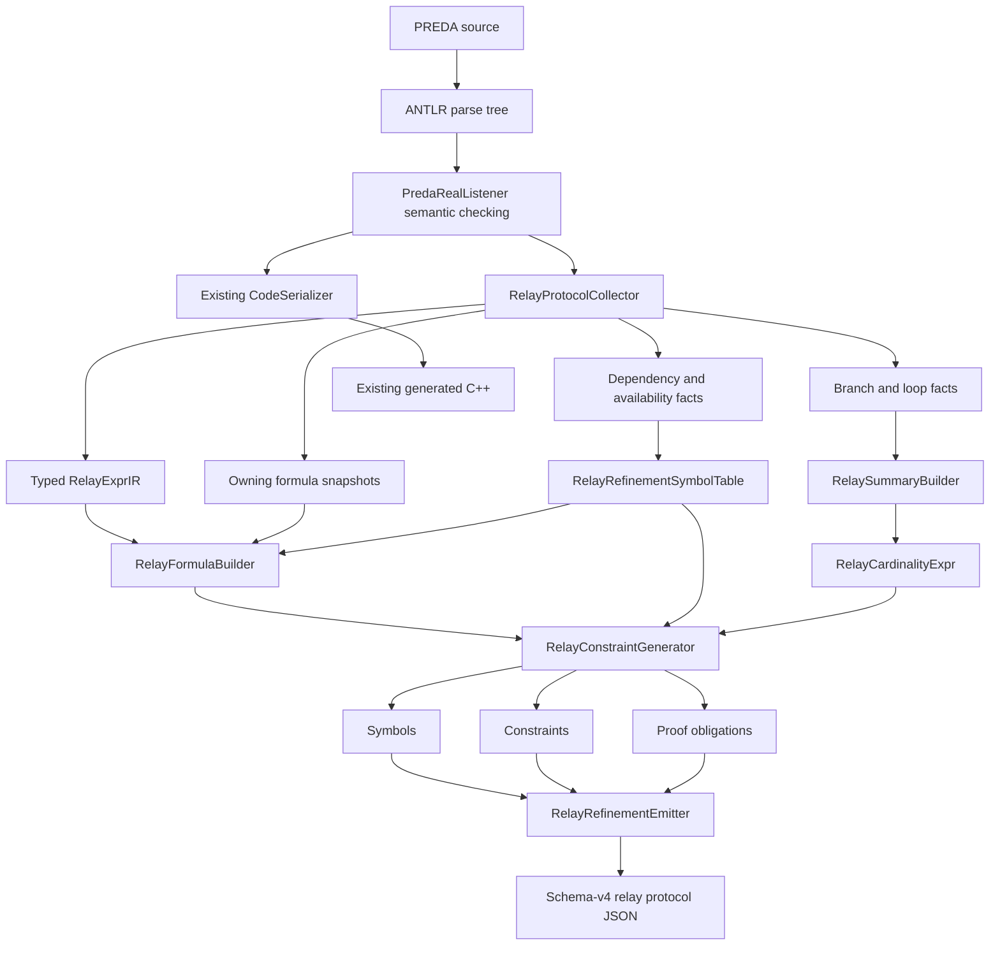

# R-PREDA Refinement Formula IR and Constraint Generation

## 1. Scope and result

This change extends the persistent relay protocol analysis with an owning,
solver-independent refinement formula IR, stable symbolic variables, explicit
constraints, and machine-readable proof obligations.

The new pass consumes facts that already exist in the transpiler:

- typed `RelayExprIR` expressions;
- source-function parameters, current scope keys, and contract state;
- branch predicates and their polarity;
- relay target and argument dependency metadata;
- per-function `RelayCardinalityExpr` summaries.

It does not invoke Z3 or any other solver. A generated obligation is a proof
goal, not a proof result. Schema version 4 therefore emits only the statuses
`Generated` and `Unsupported`; it never emits `Proved`.

The implementation is observational. It does not change:

- generated `prlrt::relay*` calls;
- relay serialization;
- `SimuTxn`;
- scope-key hashing or shard routing;
- relay queues;
- per-shard workers, batching, scheduling, or execution.

The runtime path documented in
[`ARCHITECTURE_MAP.md`](ARCHITECTURE_MAP.md) remains unchanged.

## 2. Analysis architecture



`PredaRealListener::exitContractDefinition()` runs the analysis after lambda
handlers and static summaries have been completed:

```text
DefinePendingRelayLambdas()
-> RelayProtocolCollector::Finalize()
-> relay-reachability propagation
-> RelayProtocolCollector::BuildSummaries()
-> RelayProtocolCollector::BuildRefinement()
```

The formula and constraint passes never write to `CodeSerializer`.

## 3. New files

All new implementation files are under
`oxd_preda/transpiler/relay_protocol/refinement/`.

| File | Responsibility |
|---|---|
| `RelayFormulaIR.h` | Owning formula sorts and expression nodes |
| `RelayFormulaBuilder.h/.cpp` | Type-preserving translation from `RelayExprIR` to `FormulaExpr` |
| `RelayRefinementSymbol.h` | Stable symbol kinds and symbol metadata |
| `RelayRefinementSymbolTable.h/.cpp` | Symbol interning, lexical current-value scopes, local formula bindings, and conservative invalidation |
| `RelayConstraint.h` | Asserted compiler-analysis constraint representation |
| `RelayConstraintGenerator.h/.cpp` | Target, argument, guard, cardinality, bound, and non-alias proof-goal generation |
| `RelayProofObligation.h` | Proof-obligation kinds and phase-one statuses |
| `RelayRefinementEmitter.h/.cpp` | Deterministic schema-v4 JSON serialization |

## 4. Updated files

| File | Change |
|---|---|
| `oxd_preda/transpiler/relay_protocol/RelayProtocolIR.h` | Adds owning formula snapshots to targets, arguments, and branch facts; adds the three refinement collections; advances the manifest to schema version 4 |
| `oxd_preda/transpiler/relay_protocol/RelayProtocolCollector.h/.cpp` | Creates entry symbols, mirrors lexical scopes, freezes local and branch formulas, applies conservative invalidation, and invokes constraint generation |
| `oxd_preda/transpiler/PredaRealListener.h/.cpp` | Supplies semantic PREDA types and source locations for parameters, state, locals, and loop variables; runs the refinement pass after summaries |
| `oxd_preda/transpiler/relay_protocol/RelayManifestEmitter.cpp` | Adds the top-level `refinement` object while retaining every schema-v3 field |
| `oxd_preda/transpiler/CMakeLists.txt` | Builds all refinement sources |
| `oxd_preda/transpiler/test/RelayProtocolIRTests.cpp` | Adds schema-v4 integrity, formula, constraint, obligation, MillionPixel, and generated-code invariance checks |

New focused fixtures are:

```text
oxd_preda/transpiler/testcase/relay_protocol/refinement_uint32_wrap.prd
oxd_preda/transpiler/testcase/relay_protocol/refinement_boolean_guard.prd
oxd_preda/transpiler/testcase/relay_protocol/refinement_array_length.prd
```

The tests also reuse the existing protocol, summary, and dependency fixtures,
and compile the real
`oxd_preda/simulator/contracts/MillionPixel.prd`.

## 5. Owning formula IR

### 5.1 Sorts

`FormulaSort` separates mathematical integers from PREDA unsigned
fixed-width values:

| PREDA source type | Formula sort |
|---|---|
| `bool` | `Bool` |
| `int8` through other supported signed integer types | mathematical `Int` |
| `bigint` | mathematical `Int` |
| `uint32`, `uint64`, `uint96`, `uint128`, `uint160`, `uint256`, `uint512` | `UnsignedBitVector(width)` |
| `address` | `Address` |
| unsupported or unresolved type | `Unknown` |

The required unsigned widths are all supported. The implementation also
supports `uint8` and `uint16`. This is a sound, additive extension needed to
preserve real PREDA operand types such as the `uint16` coordinates in
MillionPixel before their explicit `uint32` casts.

An unsigned expression is never silently translated to mathematical `Int`.
The width is retained on literals, symbols, casts, unary operations, and
binary operations. Incompatible widths or an unresolved result width produce
`FormulaExpr::Unknown` rather than an implicit widening.

This phase records the bit-vector semantics but does not evaluate them. A
future solver backend can therefore interpret `uint32` addition and
multiplication modulo \(2^{32}\), including overflow, without recovering type
information from source text.

### 5.2 Formula nodes

`FormulaExprKind` contains:

```text
BoolLiteral
IntLiteral
BitVectorLiteral
AddressLiteral
Symbol
Group
Unary
Binary
Nary
Cast
Ite
ArrayLength
Unknown
```

Every node owns:

- its formula sort;
- normalized source text;
- source location;
- operator;
- child formulas;
- symbol ID or literal value when applicable;
- an unsupported reason when it is `Unknown`.

Integer literal spelling is preserved exactly, including radix and PREDA
suffix. For example, `65536u32` remains the literal string `65536u32`; it is
not first converted through a host integer type.

### 5.3 Supported translation

`RelayFormulaBuilder` translates:

- Boolean, integer, bit-vector, and address literals;
- identifiers resolved through the refinement symbol table;
- parenthesized groups;
- Boolean negation and supported numeric unary operators;
- arithmetic and bitwise binary operators;
- comparisons;
- Boolean conjunction and disjunction;
- supported integer casts such as `uint32(x)`;
- structurally represented if-then-else expressions;
- array `length()` expressions represented by `RelayExprIR`.

The result sort is taken from PREDA semantic type information whenever it is
available. Comparisons produce `Bool`; structural cardinality expressions
produce mathematical `Int`.

Ordinary calls have no refinement formula unless they are a supported cast or
array length. Member access is not translated independently except as the
receiver of array `length()`, and index expressions currently remain
unsupported at the formula layer. Unsupported nodes become:

```text
FormulaExpr::Unknown {
  source text,
  source location,
  reason
}
```

The current persistent expression collector deliberately keeps source ternary
targets as `RelayExprIR::Opaque`. The formula builder can represent an `Ite`
when one is already available structurally, but it does not reconstruct a
formula from opaque text.

## 6. Stable refinement symbols

`RelayRefinementSymbol` records:

```text
stable ID
symbol kind
source function ID
source name
PREDA source type
formula sort
dependency set
availability stage
source location
relay site ID, when applicable
argument index, when applicable
```

The symbol kinds are:

| Kind | Meaning |
|---|---|
| `SourceFunctionParameter` | Entry value of a source or generated-lambda parameter |
| `CurrentScopeKey` | Scope target already attached to the admitted invocation |
| `PreStateVariable` | Function-entry value of contract state |
| `LoopVariable` | Symbolic loop induction value |
| `RelayEmission` | Boolean `emitted(site)` |
| `ActualRelayTarget` | Runtime target selected by one static relay site |
| `ActualRelayArgument` | Runtime argument at one relay site and index |
| `DirectRelayCount` | Mathematical integer count for one source function |

IDs are deterministic strings with the following shape:

```text
rpreda.symbol.<kind>.fn.<escaped-function-id>
    [.name.<escaped-source-name>]
    [.site.<escaped-relay-site-id>]
    [.arg.<argument-index>]
```

Characters outside the stable ID alphabet are percent-escaped. Loop-variable
IDs include a source offset when available, so two lexical loops that reuse
the same display name do not alias.

Dependency classes and availability stages are copied into symbols as
metadata. They are not used to reconstruct formula syntax. Formula
construction always reads the owning `RelayExprIR`, a frozen `FormulaExpr`, or
an entry symbol.

## 7. Current-value environments and formula snapshots

### 7.1 Entry environment

At function entry, the collector creates:

- one `SourceFunctionParameter` symbol per parameter;
- one `PreStateVariable` symbol per registered contract state variable;
- one `CurrentScopeKey` symbol for keyed-scope functions.

Generated relay lambdas receive the same treatment when
`DefinePendingRelayLambdas()` walks their bodies.

The refinement symbol table mirrors the lexical scopes already observed by
the dependency analyzer. Entry symbols and mutable current-value bindings are
kept separate: entry facts remain stable even when the current value becomes
unavailable later.

### 7.2 Frozen local formulas

An analyzable local initializer is translated at the declaration point and
stored as an owning formula:

```preda
uint32 index = uint32(x) * 65536u32 + uint32(y);
relay@index receive(...);
```

The relay target `index` resolves to the frozen arithmetic formula, not to a
dependency-class guess and not merely to a `LocalDerived` label.

Expression and branch snapshots are keyed by stable function identity,
source offsets, and normalized source text. A branch guard used later during
cardinality translation therefore refers to the formula visible at the
predicate's source point.

### 7.3 Conservative invalidation

The implementation does not pretend to be a complete SSA or path-sensitive
value analysis. It invalidates current formulas when later writes or calls
make substitution unsafe:

- assignment invalidates the destination's current formula;
- increment or decrement invalidates the operand's current formula;
- an unsummarized call invalidates state-derived bindings and relevant
  receiver/argument roots;
- an opaque effect invalidates all mutable current-value bindings.

An invalidated use becomes `FormulaExpr::Unknown` with a reason and source
location. The original entry symbol remains in the symbol list for
diagnostics, but it is not silently substituted for a changed value.

This formula invalidation complements dependency analysis. Dependency unions
remain availability metadata; they are never treated as enough information
to invent an arithmetic expression.

## 8. Constraints

`RelayConstraint` represents a formula that the compiler analysis is prepared
to assert. Unsupported relations are omitted from `constraints`; the
corresponding proof obligation remains visible with status `Unsupported`.

### 8.1 Per-site relations

For each relay site \(s\), the generator attempts to emit:

```text
emitted(s) -> actual_target(s) = target_expression(s)
```

and, for every argument \(i\):

```text
emitted(s) -> actual_arg(s, i) = argument_expression(s, i)
```

These become `RelayTargetRelation` and `RelayArgumentRelation`.

The target or argument relation is not asserted if:

- its formula contains an `Unknown` node;
- either side has an unknown sort;
- the formula sorts are incompatible; or
- one static site occurs inside a loop, where one unindexed
  `actual_target(site)` or `actual_arg(site,i)` symbol cannot soundly denote
  all dynamic iterations.

The relay site itself is still present in the protocol and summary.

### 8.2 Guards

The necessary guard is the conjunction of the enclosing branch facts. A
negative branch is represented by explicit Boolean negation:

```text
emitted(s) -> condition
emitted(s) -> !condition
emitted(s) -> outer_condition && inner_condition
```

An unconditional site uses `true` as its necessary guard.

The current protocol IR is not a complete control-flow graph. It cannot
exclude early return, execution failure, opaque control, unmodeled
relay-reachable calls, or unknown loop behavior. Consequently,
`RelayGuardEquivalence` is retained as an explicit `Unsupported` proof
obligation; no unsound equivalence constraint is emitted merely because a
site is nested under an `if`.

### 8.3 Cardinality and bounds

The existing `RelayCardinalityExpr` is translated directly:

| Cardinality node | Formula |
|---|---|
| `Constant(n)` | mathematical integer literal `n` |
| `Sum(children)` | `Nary("+", children)` |
| `Product(children)` | `Nary("*", children)` |
| `Ite(predicate, then, else)` | `Ite(predicate, then, else)` of sort `Int` |
| `Unknown(reason)` | `FormulaExpr::Unknown(reason)` |

When the exact formula is supported, the generator emits:

```text
direct_relay_count(function) = translated_cardinality
```

It always emits the required non-negative bound:

```text
direct_relay_count(function) >= 0
```

When the static summary has a finite upper bound, it also emits:

```text
direct_relay_count(function) <= translated_upper_bound
```

An unknown exact count produces no false `RelayCountEquality` constraint. An
unknown upper bound produces no finite `RelayCountUpperBound` constraint.

Target-expression opacity does not by itself erase a known count. For
example, an opaque ternary target still has direct relay count `1`. A genuine
opaque control node or an unknown loop can make the cardinality formula
unknown.

Maximum relay depth is not converted into a finite refinement formula.
Recursive handler depth therefore remains the tagged static-summary result
and is not approximated by an unrelated local bound.

## 9. Proof obligations

`RelayProofObligation` records:

```text
stable obligation ID
kind
status
source function and relay site
related relay site for pairwise goals
argument index
supporting constraint IDs
owning goal FormulaExpr
source location
reason
```

The phase-one kinds are:

```text
RelayTargetEquality
RelayArgumentEquality
RelayGuardNecessity
RelayGuardEquivalence
RelayCountEquality
RelayCountUpperBound
TargetNonAliasCandidate
Unknown
```

The required `direct_relay_count >= 0` fact is emitted as a
`RelayCountNonNegative` constraint. It does not introduce a proof-obligation
kind beyond the explicit list above.

Status has only two values:

| Status | Meaning |
|---|---|
| `Generated` | The goal is represented completely enough to pass to a future solver |
| `Unsupported` | A sound goal cannot currently be represented; `reason` explains why |

`Generated` does not mean true, valid, or proved.

For two static relay sites in the same source function, the generator may
emit a `TargetNonAliasCandidate` goal:

```text
emitted(a) && emitted(b) -> actual_target(a) != actual_target(b)
```

This is a proof candidate only. It is not inserted as an asserted non-alias
constraint. If either target relation is unsupported or the target sorts
differ, the candidate remains present with `Unsupported`.

No ordering constraint is created from listener discovery order.

## 10. Schema-v4 manifest

Schema version 4 retains all schema-v3 fields and adds:

```json
{
  "schema_version": 4,
  "relay_sites": [],
  "handlers": [],
  "edges": [],
  "functions": [],
  "refinement": {
    "symbols": [],
    "constraints": [],
    "proof_obligations": []
  }
}
```

The three arrays are sorted by stable ID before serialization. Each formula
node carries a sort object, source text, operator, location, and recursively
owned children.

### 10.1 Address-parameter target excerpt

The following abbreviated example shows the important schema fields:

```json
{
  "refinement": {
    "symbols": [
      {
        "id": "rpreda.symbol.parameter.fn.F.name.target",
        "kind": "SourceFunctionParameter",
        "source_function_id": "F",
        "source_name": "target",
        "preda_type": "address",
        "sort": { "kind": "Address" },
        "dependencies": ["TransactionArgument"],
        "availability": "AdmissionTime",
        "admission_time_evaluable": true,
        "relay_site_id": "",
        "argument_index": -1
      },
      {
        "id": "rpreda.symbol.actual_target.fn.F.site.relay_site_0",
        "kind": "ActualRelayTarget",
        "source_function_id": "F",
        "source_name": "actual_target",
        "preda_type": "address",
        "sort": { "kind": "Address" },
        "dependencies": ["TransactionArgument"],
        "availability": "AdmissionTime",
        "admission_time_evaluable": true,
        "relay_site_id": "relay_site_0",
        "argument_index": -1
      }
    ],
    "constraints": [
      {
        "id": "rpreda.constraint.target_relation.site.relay_site_0",
        "kind": "RelayTargetRelation",
        "source_function_id": "F",
        "relay_site_id": "relay_site_0",
        "argument_index": -1,
        "formula": {
          "kind": "Binary",
          "sort": { "kind": "Bool" },
          "source_text": "",
          "operator": "implies",
          "children": [
            {
              "kind": "Symbol",
              "sort": { "kind": "Bool" },
              "source_text": "emitted",
              "operator": "",
              "symbol_id": "rpreda.symbol.relay_emitted.fn.F.site.relay_site_0",
              "children": []
            },
            {
              "kind": "Binary",
              "sort": { "kind": "Bool" },
              "source_text": "",
              "operator": "==",
              "children": [
                {
                  "kind": "Symbol",
                  "sort": { "kind": "Address" },
                  "source_text": "actual_target",
                  "operator": "",
                  "symbol_id": "rpreda.symbol.actual_target.fn.F.site.relay_site_0",
                  "children": []
                },
                {
                  "kind": "Symbol",
                  "sort": { "kind": "Address" },
                  "source_text": "target",
                  "operator": "",
                  "symbol_id": "rpreda.symbol.parameter.fn.F.name.target",
                  "children": []
                }
              ]
            }
          ]
        }
      }
    ],
    "proof_obligations": [
      {
        "id": "rpreda.obligation.target_equality.site.relay_site_0",
        "kind": "RelayTargetEquality",
        "status": "Generated",
        "source_function_id": "F",
        "relay_site_id": "relay_site_0",
        "related_relay_site_id": "",
        "argument_index": -1,
        "constraint_ids": [
          "rpreda.constraint.target_relation.site.relay_site_0"
        ],
        "reason": ""
      }
    ]
  }
}
```

Locations and repeated goal subtrees are omitted from this excerpt only for
readability; the emitted manifest includes them.

### 10.2 Conditional count excerpt

For:

```preda
if (enabled) {
    relay@target receive(value);
}
```

the exact direct count is represented structurally:

```json
{
  "kind": "Binary",
  "sort": { "kind": "Bool" },
  "operator": "==",
  "children": [
    {
      "kind": "Symbol",
      "sort": { "kind": "Int" },
      "symbol_id": "rpreda.symbol.direct_relay_count.fn.F"
    },
    {
      "kind": "Ite",
      "sort": { "kind": "Int" },
      "operator": "ite",
      "children": [
        {
          "kind": "Symbol",
          "sort": { "kind": "Bool" },
          "source_text": "enabled"
        },
        {
          "kind": "IntLiteral",
          "sort": { "kind": "Int" },
          "literal_value": "1"
        },
        {
          "kind": "IntLiteral",
          "sort": { "kind": "Int" },
          "literal_value": "0"
        }
      ]
    }
  ]
}
```

### 10.3 Unsupported opaque target excerpt

An opaque target keeps the emission site and count while withholding the
unsound equality:

```json
{
  "kind": "RelayTargetEquality",
  "status": "Unsupported",
  "relay_site_id": "relay_site_0",
  "constraint_ids": [],
  "goal": {
    "kind": "Unknown",
    "sort": { "kind": "Unknown" },
    "source_text": "use_first?first:second",
    "reason": "ternary expression is not structurally modeled by the current relay protocol expression IR",
    "children": []
  },
  "reason": "ternary expression is not structurally modeled by the current relay protocol expression IR"
}
```

The same function can still contain:

```text
direct_relay_count = 1
direct_relay_count >= 0
direct_relay_count <= 1
```

## 11. Conservative boundaries

| Situation | Result |
|---|---|
| Known typed target or argument | Equality relation and `Generated` obligation |
| Opaque or unsupported target | No asserted target equality; `Unsupported` target obligation; `Emit` remains |
| Opaque target with known control | Direct count remains known |
| Unknown loop trip count | No exact count equality and no false finite upper bound |
| Statically bounded loop with count 3 | Direct count formula is mathematical integer `3` |
| Target or argument at a repeated static site | Per-occurrence equality is `Unsupported` until occurrence-indexed symbols or quantifiers exist |
| Branch guard at a repeated static site | Guard necessity is `Unsupported` until per-iteration emission and guard symbols exist |
| Negative branch | Guard necessity contains explicit `!predicate` |
| Guard equivalence without complete CFG proof | `Unsupported`; no equivalence constraint |
| Recursive relay handler depth | Not converted into a finite formula |
| Multiple listener-discovered sites | No source-order or must-precede formula |
| Pairwise target non-alias | Proof candidate only, never an assumed constraint |

Availability metadata does not control whether a count is known. In
particular, an opaque dependency on a target does not automatically make a
known direct relay count unknown.

## 12. MillionPixel preservation

The real MillionPixel contract computes:

```preda
uint32 index = uint32(x) * 65536u32 + uint32(y);
relay@index ...
```

The collector freezes the local definition and resolves the relay target to
the following structure:

```text
Binary "+" : UnsignedBitVector(32)
├── Binary "*" : UnsignedBitVector(32)
│   ├── Cast "uint32" : UnsignedBitVector(32)
│   │   └── Symbol x : UnsignedBitVector(16)
│   └── BitVectorLiteral "65536u32" : UnsignedBitVector(32)
└── Cast "uint32" : UnsignedBitVector(32)
    └── Symbol y : UnsignedBitVector(16)
```

This structure preserves both explicit casts and fixed-width arithmetic. It
does not replace the expression with dependency classes and does not convert
the multiplication or addition to mathematical `Int`.

## 13. Tests

`RelayProtocolIRTests.cpp` includes the following refinement coverage:

| Required behavior | Fixture/check |
|---|---|
| Literal target equality | `dependency_literal.prd` |
| Address-parameter target equality | `named_address.prd` |
| Arithmetic and cast target | `dependency_arithmetic_cast.prd` |
| Pre-state target symbol | `dependency_state_owner.prd` |
| Relay argument equality | `summary_conditional.prd` |
| Positive conditional guard and `ite(cond,1,0)` count | `summary_conditional.prd` |
| Negative branch guard | `if_else.prd` |
| Bounded loop count `3` | `bounded_for.prd` |
| Opaque target equality unsupported while count stays `1` | `opaque_fallback.prd` |
| Unknown loop has no false exact or finite-upper-bound constraint | existing rejected bounded-loop fixtures |
| Fixed-width overflow and cast preservation | `refinement_uint32_wrap.prd` |
| Real coordinate target structure | `MillionPixel.prd` |
| Boolean conjunction/disjunction/negation | `refinement_boolean_guard.prd` |
| Array length formula | `refinement_array_length.prd` |

Manifest-wide integrity checks validate:

- schema version 4 and all three refinement arrays;
- unique IDs across symbols, constraints, and proof obligations;
- every formula symbol reference resolves to an emitted symbol;
- every obligation constraint reference resolves;
- statuses are only `Generated` or `Unsupported`;
- no status is `Proved`;
- no ordering relation is synthesized;
- unsupported obligations carry non-empty reasons.

The existing exact generated-C++ byte-count and FNV-1a goldens remain enabled
for:

```text
named_address.prd
lambda_address.prd
global.prd
shards.prd
if_else.prd
else_if_chain.prd
bounded_for.prd
nested_lambda.prd
opaque_fallback.prd
```

These checks are the byte-for-byte regression boundary for relay lowering.

### 13.1 Build and run

Using the existing configured build:

```bash
cmake --build build-gcc12 --target relay_protocol_ir_tests -j2

LD_LIBRARY_PATH="$PWD/bin/bin_release:${LD_LIBRARY_PATH:-}" \
  ./build-gcc12/oxd_preda/transpiler/relay_protocol_ir_tests \
  ./oxd_preda/transpiler/testcase/relay_protocol

ctest --test-dir build-gcc12 \
  -R '^relay_protocol_ir$' \
  --output-on-failure
```

### 13.2 Validation status

Validation completed on 2026-07-29 with the configured `build-gcc12` tree.

```text
transpiler + relay_protocol_ir_tests build: passed
logical protocol/refinement tests: 25 passed, 0 failed
CTest relay_protocol_ir: 1/1 passed
generated-C++ golden invariance: all 9 retained size/FNV-1a checks passed
```

The direct test run includes the real simulator `MillionPixel.prd` contract,
the three refinement-specific fixtures, the prior protocol/dependency/summary
suite, and every existing generated-C++ golden.

## 14. Runtime and compatibility invariants

Schema version 4 is additive:

- schema-v3 target and argument dependencies remain;
- schema-v2 static summaries remain;
- schema-v1 protocol sites, handlers, edges, and function trees remain.

No refinement result is consumed by lowering or runtime code. In particular,
no changes are made to:

```text
oxd_preda/bin/compile_env/include/relay.h
oxd_preda/engine/preda_engine/RuntimeInterfaceImpl.cpp
oxd_preda/simulator/shard_data.h
oxd_preda/simulator/simu_shard.cpp
```

The existing sidecar path remains:

```text
<db_path>/relay_protocol/<dapp>.<contract>.relay_protocol.json
```

Only its additive manifest schema advances to version 4.

## 15. Solver boundary and current limitations

This phase intentionally stops before solver integration:

1. No SMT terms or Z3 objects are stored in the persistent IR.
2. No obligation can be marked `Proved`.
3. `Generated` goals still require a future solver and checked result-import
   path.
4. Fixed-width unsigned sorts are preserved, but their satisfiability and
   overflow properties are not evaluated in this phase.
5. Source ternaries remain opaque until the persistent expression IR models
   them structurally.
6. Mutable local substitution is conservative and not path-sensitive SSA.
7. Dynamic loop occurrences need indexed or quantified emission and
   actual-value symbols before per-iteration guard, target, or argument
   relations can be asserted.
8. Guard equivalence needs a complete control-flow analysis.
9. Target non-alias goals are candidates, not assumed protocol facts.

These boundaries keep the formula layer sound enough to become the input to a
future solver without changing PREDA execution semantics.
