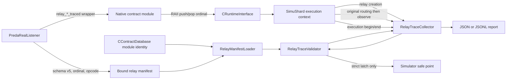

# R-PREDA Native Runtime Relay Trace Validation

## 1. Implementation status

This change adds an optional, read-only relay observation and validation layer
to the PREDA Native Engine and simulator.

The feature has three runtime modes:

| Mode | Manifest loading | Trace collection | Validation failure |
| --- | --- | --- | --- |
| `off` | no | no | not applicable |
| `observe` | yes | yes | report only; execution continues |
| `strict` | yes | yes | latch failure and fail at the simulator safe point |

The build-time option is:

```cmake
-DRPREDA_ENABLE_RUNTIME_TRACE=OFF  # default
-DRPREDA_ENABLE_RUNTIME_TRACE=ON
```

This implementation does not change relay scheduling and does not perform a
runtime optimization. It does not call Z3 at runtime.

## 2. Safety boundary

Trace metadata is kept outside consensus and contract data:

- no field was added to `SimuTxn`;
- no trace value is serialized into relay arguments;
- no ordinal is included in source or relay transaction hashes;
- no trace value participates in scope-key hashing or shard selection;
- no trace result is fed back into the compiler, manifest, state, scheduler,
  or queue;
- route observation happens after the original queue or relay buffer insertion;
- observer calls are wrapped by a non-throwing boundary;
- `observe` mode never changes the contract result;
- `strict` mode only exposes a latched validation failure at a simulator safe
  point, after normal execution handling.

The implementation uses the live `SimuTxn *` only as a process-local side-table
key. It owns all copied targets, arguments, identities, and report strings.
Entries are erased before transaction destruction and are never serialized.

## 3. Architecture



The observed execution path is:

```text
source SimuTxn
  -> SimuShard::_Execute()
  -> contract generated relay_*_traced()
  -> RelayTraceSiteGuard
  -> CRuntimeInterface::PushRelayTraceSite()
  -> original prlrt::relay*()
  -> SimuShard::_CreateRelayTxn()
  -> original relay hash calculation
  -> trace-only child metadata registration
  -> original RelayEmission::Collect()
  -> original queue/buffer insertion
  -> physical route observation
  -> destination SimuShard::_Execute()
  -> restore root / parent / depth
  -> handler execution and possible nested relay
  -> per-microtransaction validation
  -> execution end and side-table erase
```

## 4. Changed files and functions

### 4.1 Build and generated contract support

| File | Main change |
| --- | --- |
| `oxd_preda/CMakeLists.txt` | Defines default-off `RPREDA_ENABLE_RUNTIME_TRACE`. |
| `oxd_preda/transpiler/CMakeLists.txt` | Propagates the option to the transpiler and golden tests. |
| `oxd_preda/engine/CMakeLists.txt` | Compiles the manifest binder only in trace builds. |
| `oxd_preda/simulator/CMakeLists.txt` | Compiles the trace subsystem and its standalone tests only in trace builds. |
| `oxd_preda/bin/compile_env/include/relay_trace.h` | Contract-side ABI v1 and `RelayTraceSiteGuard`. |
| `oxd_preda/bin/compile_env/include/relay.h` | `relay_traced`, `relay_global_traced`, `relay_shards_traced`, and `relay_next_traced`. |
| `oxd_preda/bin/compile_env/contract_template.h` | Trace interface storage for Native contract modules. |
| `oxd_preda/native/abi/relay_trace_abi.h` | Optional engine-side metadata and execution-context interfaces. |

### 4.2 Transpiler and manifest

| File | Main functions/data |
| --- | --- |
| `oxd_preda/transpiler/relay_protocol/RelayProtocolIR.h` | `RelaySiteOrdinal`, `RelaySite::ordinal`, `FunctionProtocol::exportedOpcode`, schema v5 in trace builds. |
| `oxd_preda/transpiler/relay_protocol/RelayProtocolCollector.h/.cpp` | Ordinal allocation, function opcode recording, resolved lambda opcode propagation. |
| `oxd_preda/transpiler/relay_protocol/RelayManifestEmitter.cpp` | Emits relay-site `ordinal` and function `exported_opcode`. |
| `oxd_preda/transpiler/PredaRealListener.cpp` | Instruments `enterRelayStatement()`, records named/lambda opcodes, and emits the trace-v1 Native factory. |
| `oxd_preda/transpiler/test/RelayProtocolIRTests.cpp` | Trace ABI, ordinal, wrapper, schema, and trace-disabled golden checks. |

### 4.3 Artifact binding and Native module ABI

| File | Main functions/data |
| --- | --- |
| `oxd_preda/engine/preda_engine/RelayManifestBinding.h/.cpp` | `FinalizeAndPublishRelayManifest()` and atomic sidecar publishing. |
| `oxd_preda/engine/preda_engine/ContractData.h` | Trusted manifest hash/version stored with compiled module metadata. |
| `oxd_preda/engine/preda_engine/ContractDatabase.h/.cpp` | Finalizes schema-v5 binding, persists trusted identity, exposes `GetRelayTraceArtifactBinding()`. |
| `oxd_preda/engine/preda_engine/ContractRuntimeInstance.cpp` | Loads and checks the trace-v1 factory and version symbol. |
| `oxd_preda/engine/preda_engine/RuntimeInterfaceImpl.h/.cpp` | Bridges contract RAII marker push/pop to the active execution context. |

### 4.4 Simulator trace and validation

The new directory is `oxd_preda/simulator/relay_trace/`.

| File | Main classes/functions |
| --- | --- |
| `RelayTraceTypes.h/.cpp` | Owning transaction, emission, route, execution, mismatch, counter, and timing records. |
| `RelayTraceContext.h/.cpp` | Marker stack and parent-local occurrence counters. |
| `RelayTraceCollector.h/.cpp` | Side table, root/parent/depth, logical/physical events, strict latch, indexed execution slices. |
| `RelayManifestLoader.h/.cpp` | Cached schema-v5 parser, self-hash verification, module binding verification, cache invalidation. |
| `RelayTraceValidator.h/.cpp` | Binding, identity, count, depth, fanout, routing, and co-emission validation. |
| `RelayTraceReport.h/.cpp` | Atomic JSON/JSONL output, events, diagnostics, counters, and timings. |
| `RelayRuntimeTraceTests.cpp` | Marker, tree, occurrence, fanout, validation, binding, report, side-table, and concurrency tests. |

Runtime integration is in:

| File | Main integration points |
| --- | --- |
| `oxd_preda/simulator/chain_simu.cpp/.h` | `_InitRelayTrace()`, manifest lookup, per-execution validation, final depth validation, report writing. |
| `oxd_preda/simulator/simu_shard.cpp/.h` | `_CreateRelayTxn()`, relay finalization, `RelayEmission::Collect()`, `_Execute()`, marker stack. |
| `oxd_preda/simulator/simu_script.cpp` | CLI option forwarding and strict-mode safe-point failure. |
| `oxd_preda/simulator/contracts/MillionPixelTraceInvariance.prdts` | Deterministic state/order/overhead fixture. |

## 5. Runtime configuration

Build with trace support:

```bash
cmake \
  -S . -B build-gcc12 -G Ninja \
  -DDOWNLOAD_3RDPARTY=OFF \
  -DDOWNLOAD_IPP=OFF \
  -DRPREDA_ENABLE_Z3=OFF \
  -DRPREDA_ENABLE_RUNTIME_TRACE=ON

cmake \
  --build build-gcc12 -j2
```

Run from `bin/bin_release`:

```bash
# Trace feature compiled in, observation disabled.
./chsimu CONTRACT.prdts -rpreda_trace:off

# Observe and write JSON.
./chsimu CONTRACT.prdts \
  -rpreda_trace:observe \
  -rpreda_trace_report:/tmp/relay-trace.json

# Strict validation.
./chsimu CONTRACT.prdts \
  -rpreda_trace:strict \
  -rpreda_trace_report:/tmp/relay-trace.json

# A .jsonl report extension selects JSONL output.
./chsimu CONTRACT.prdts \
  -rpreda_trace:observe \
  -rpreda_trace_report:/tmp/relay-trace.jsonl
```

On this machine, runtime compilation of generated Native modules must use the
Conda GCC toolchain:

```bash
env \
  PATH="$PREDA_BUILD_BIN:$PATH" \
  HOME=/tmp/rpreda-run \
  ./chsimu ...
```

## 6. ABI and compatibility

Trace builds use ABI version 1:

```cpp
prlrt::RPREDA_RUNTIME_TRACE_ABI_VERSION == 1
rvm::RPredaRuntimeTraceAbiVersion == 1
```

A trace-enabled Native contract module exports:

```text
Contract_<id>_RPredaRuntimeTraceAbiVersion
Contract_<id>_CreateInstance_RPredaTraceV1
```

`ContractModule::FromLibrary()` rejects a missing or incompatible version
instead of calling through an incompatible factory.

The trace interfaces are additive side interfaces. Existing RVM vtables are
not extended. Trace-disabled builds continue to export and use the original
`Contract_<id>_CreateInstance`.

WASM keeps its existing relay ABI and uses a no-op trace guard. Runtime
validation in this implementation is Native-only.

## 7. Artifact binding and schema v5

Trace-disabled manifests remain schema v4. A trace build emits schema v5 while
preserving the schema-v4 protocol, summary, dependency, refinement, and solver
fields.

Schema v5 adds:

```json
{
  "schema_version": 5,
  "artifact_binding": {
    "dapp": "chsimu",
    "contract": "MillionPixel",
    "transpiler_version": "0.0.2",
    "intermediate_hash": "...",
    "module_id": "...",
    "module_hash_kind": "preda_module_id",
    "module_hash": "...",
    "manifest_hash_algorithm": "sha256",
    "manifest_hash": "...",
    "binding_complete": true
  },
  "relay_sites": [
    {
      "id": "relay_site_0",
      "ordinal": 0
    }
  ],
  "functions": [
    {
      "source_function_id": "...",
      "exported_opcode": 0
    }
  ]
}
```

The manifest self-hash is SHA-256 over deterministic ordered JSON after
removing `artifact_binding.manifest_hash`, avoiding a self-referential digest.

`CContractDatabase::_Compile()` has the real intermediate hash and module ID.
It finalizes the binding and atomically publishes:

```text
<db>/relay_protocol/<dapp>.<contract>.relay_protocol.json
<db>/relay_protocol/by_module/<module_id>.relay_protocol.json
```

Runtime trust uses the module-addressed path only. The logical-name alias is
not trusted for validation.

The module database independently persists the expected transpiler version and
manifest hash. `RelayManifestLoader` compares the deployed module identity,
intermediate hash, module ID, module hash, trusted manifest hash, and
recomputed self-hash before exposing protocol data.

Load outcomes are typed:

```text
ManifestNotFound
ManifestParseError
ManifestSchemaUnsupported
ManifestBindingMissing
ManifestBindingMismatch
ManifestHashMismatch
Loaded
```

Binding failures report expected identity, observed identity, source sidecar
path, module identity, manifest identity, and a diagnostic reason.

## 8. Relay site ordinal and generated instrumentation

`RelayProtocolCollector::CollectRelay()` assigns an ordinal from the module's
relay-site vector:

```text
relay_site_0 -> ordinal 0
relay_site_1 -> ordinal 1
...
```

The ordinal is module-local. Runtime lookup always uses:

```text
(emitting module ID, relay site ordinal)
```

It is never interpreted across unrelated modules.

Only trace builds replace generated calls:

```cpp
prlrt::relay(...)         -> prlrt::relay_traced(ordinal, ...)
prlrt::relay_global(...)  -> prlrt::relay_global_traced(ordinal, ...)
prlrt::relay_shards(...)  -> prlrt::relay_shards_traced(ordinal, ...)
prlrt::relay_next(...)    -> prlrt::relay_next_traced(ordinal, ...)
```

Each wrapper creates one `RelayTraceSiteGuard` and calls the original relay
function exactly once. Normal C++ argument evaluation evaluates target and
argument expressions once before entering the wrapper; the wrapper forwards
those values once to the original implementation.

Lambda relay sites are created unresolved during listener collection. After
the generated lambda is defined, the existing `ResolveLambdaHandler()` path
records its generated function identity and exported opcode. Named and lambda
handlers therefore use the same runtime opcode lookup.

## 9. Marker lifecycle

The contract-side guard calls:

```text
CRuntimeInterface::PushRelayTraceSite(ordinal)
CRuntimeInterface::PopRelayTraceSite(ordinal)
```

`CRuntimeInterface` uses the current contract stack to add the emitting module
ID and forwards the marker to `SimuShard`, which is the actual execution
context. The marker stack is therefore execution-context-local, not a global
collector marker.

Each marker has a monotonically allocated generation. The collector detects:

- missing marker;
- duplicate consume;
- stale or out-of-order restore;
- module/ordinal mismatch;
- unconsumed marker;
- marker frames left at execution end.

RAII restores the previous marker on normal and exceptional exits. Nested
relay creation gets its own frame. Instrumentation failures become explicit
`TraceInstrumentationError` results; observer exceptions cannot escape into
contract execution.

The contract module stores only a thread-local pointer to the active trace
interface. Actual marker frames and occurrences are held by the `SimuShard`
execution context and collector side table.

## 10. Trace data and lifecycle

The owning trace records are:

- `RuntimeTxnTraceContext`;
- `RelayEmitTraceEvent`;
- `RelayRouteTraceEvent`;
- `RelayExecutionTraceEvent`;
- `RelayValidationResult`;
- `RelayTraceSnapshot`.

Source transaction:

```text
trace_tx_id        = new ID
root_trace_tx_id   = trace_tx_id
parent_trace_tx_id = 0
depth              = 0
```

Relay transaction:

```text
trace_tx_id        = new ID
root_trace_tx_id   = parent.root_trace_tx_id
parent_trace_tx_id = currently executing transaction
depth              = parent.depth + 1
```

The side table is keyed by a live local `SimuTxn *`. It is erased by
`EndExecution()` and cleared during shutdown. Pointer reuse receives a new
trace transaction ID. A byte-snapshot unit test verifies that the collector's
full lifecycle does not write into the transaction object used as the key.

Occurrence is maintained per:

```text
(parent trace transaction ID, emitting module ID, relay site ordinal)
```

For a bounded loop, one static site can therefore produce occurrences
`0, 1, 2` without sharing the counter with another parent transaction.

`relay@shards` produces:

```text
1 logical RelayEmitTraceEvent
N physical RelayRouteTraceEvent records
```

The logical report record includes `physical_clone_count`. Each physical
route records `target_shard`, `route_kind`, and `active_shard_count`.

## 11. Runtime integration

### 11.1 Invocation begin and end

`SimuShard::_Execute()`:

1. ignores system and non-Native transactions;
2. resolves the deployed module and function ID from the bound manifest;
3. begins or restores the side-table execution context;
4. records execution start;
5. runs the unchanged contract invocation;
6. validates the current execution's direct emissions;
7. records completion/success using the real invoke result;
8. erases the live side-table entry.

After workers stop, `ChainSimulator::_FinalizeRelayTraceDepthValidation()`
performs final maximum-depth checks over the complete trace tree.

### 11.2 Relay creation

`SimuShard::_CreateRelayTxn()` retains the original allocation, serialization,
metadata initialization, and hash calculation. The SHA-256 relay hash is
calculated before the trace observer at `simu_shard.cpp:322`.

The observer then:

- consumes exactly one marker;
- allocates parent-local occurrence;
- copies serialized arguments;
- creates child root/parent/depth metadata;
- keeps the child metadata only in the side table.

After the original `EmitRelay*` code sets target, flags, initiator, and kind,
`_FinalizeRelayTraceEmission()` publishes one owning logical event.

### 11.3 Routing and queue insertion

`RelayEmission::Collect()` continues to use the original routing result.
Tracing does not independently choose a destination.

For all paths, observation is after the original operation:

```text
deferred:  _ToNextBlock.push_back(t)  -> RecordRoute()
global:    _ToGlobal.push_back(t)     -> RecordRoute()
broadcast: _ToShards[i].push_back(t)  -> RecordRoute()
intra:     PushIntraRelay(t)          -> RecordRoute()
cross:     _ToShards[si].push_back(t) -> RecordRoute()
```

Recorded route kinds are:

```text
IntraShard
CrossShard
Global
AllShardsBroadcast
DeferredNext
```

The recorded `target_shard` is the result already produced by the original
runtime's `GetShardIndex()` path.

## 12. Validation rules

Validation is ordered conservatively.

### 12.1 Implemented checks

- trusted artifact binding before protocol access;
- module-local ordinal exists;
- site belongs to the executing source function;
- expected handler opcode equals the actual opcode;
- relay API kind matches the manifest kind;
- target scope kind matches the manifest;
- exact constant direct logical relay count;
- finite direct-count upper bound;
- zero-relay functions;
- finite maximum depth;
- `single_target`, `all_shards`, `global`, and `next/deferred` fanout;
- physical route kind and destination coverage;
- `relay@shards` logical count separately from physical clone count;
- Z3-`Proved` co-emission non-alias, but only when both sites are actually
  emitted by the same parent microtransaction.

Mutually exclusive sites that are not co-emitted are not treated as failures.

### 12.2 Conservative skips

The runtime does not invent an ABI decoder or reconstruct local/state values.
It emits `SkippedUnsupported` with a non-empty reason for:

- symbolic exact direct counts whose variables cannot be safely bound;
- target formula replay;
- argument formula replay;
- guard formula replay;
- unknown/recursive depth;
- unsupported or `Unknown` formulas;
- occurrence-indexed loop formulas not represented by the current runtime ABI.

An unsupported target formula does not erase the observed relay site. A known
logical count remains independently checkable.

## 13. Report

`RelayTraceReport` writes atomically to JSON or JSONL.

Counters include:

```text
source_transactions_observed
microtransactions_observed
logical_relay_emissions
physical_relay_routes
relay_executions
intra_shard_relays
cross_shard_relays
global_relays
broadcast_logical_emissions
broadcast_physical_clones
deferred_relays
maximum_observed_depth
checks_passed
checks_mismatched
checks_skipped
manifest_load_failures
manifest_binding_failures
instrumentation_failures
```

`checks_by_kind` is retained. The additive
`checks_by_kind_and_status` object makes every check/status combination
machine-readable.

Every mismatch includes the root, parent, and current trace transaction IDs,
contract, function, opcode, site ID/ordinal, occurrence, check kind,
expected/actual value, source location, manifest identity, module identity,
and diagnostic reason.

Detailed mismatches and instrumentation failures are never sampled away.

Timings include:

```text
manifest_load_time_ms
trace_recording_time_ms
validation_time_ms
report_serialization_time_ms
```

## 14. Thread safety and scaling

- collector state, side table, events, counters, and timings are mutex
  protected;
- strict failure and emergency observer failures use atomics;
- marker stacks belong to the current `SimuShard` execution context;
- occurrence maps belong to the parent transaction context;
- manifest parsing is cached by trusted module/binding identity under a mutex;
- cache entries can be invalidated on module reload;
- report writing is serialized and atomically renamed;
- shutdown clears live pointer-keyed state before simulator destruction.

The initial implementation copied and scanned the complete run-wide trace after
every microtransaction. That made a 10,000-relay MillionPixel run quadratic.
`RelayTraceCollector::ExecutionSlice(parentTraceTxId)` now uses parent-indexed
emission and route vectors so per-execution validation only copies that
microtransaction's direct events. This changes observer complexity only; it
does not change routing or runtime semantics.

## 15. Tests

### 15.1 Unit coverage

`RelayRuntimeTraceTests.cpp` covers:

- named relay identity and opcode;
- pointer reuse;
- side-table transaction-byte immutability;
- loop occurrence `0, 1, 2`;
- cross-module ordinal separation;
- missing, stale, duplicate, nested, and unconsumed markers;
- exception-path RAII restoration;
- nested root/parent/depth;
- one logical broadcast and N physical routes;
- active shard count and physical clone count in reports;
- direct count, upper bound, depth, fanout, routing, unsupported reasons;
- co-emission non-alias pass, injected same-target mismatch, and
  not-applicable behavior;
- correct, stale, incomplete, missing, malformed, content-tampered, and
  hash-tampered manifests;
- expected/observed binding diagnostics;
- JSON and JSONL reports;
- strict mismatch latch;
- multi-worker marker and occurrence isolation.

### 15.2 Build matrix

| Configuration | Result |
| --- | --- |
| trace ON, Z3 OFF | build passed; CTest 2/2; 26 protocol tests plus runtime trace tests passed |
| trace ON, Z3 ON | build passed; CTest 2/2; 35 protocol/refinement/Z3 tests plus runtime trace tests passed |
| trace OFF, Z3 OFF | full build passed; CTest 1/1; 25 protocol tests passed |

Trace-off binary audit:

```text
TRACE_STRING_ABSENT
TRACE_SYMBOL_ABSENT
TRACE_OBJECT_ABSENT
Z3_DEPENDENCY_ABSENT
```

The trace-off `build.ninja` does not contain
`relay_trace/RelayTraceCollector.cpp`. The stock `chsimu`,
`preda_engine.so`, and `transpiler.so` contain no Runtime Trace string or
dynamic symbol. Existing generated-C++ size/FNV golden checks pass in the
trace-off test suite.

### 15.3 Real Native workloads

All runs used real `chsimu`, Native contract compilation, module loading,
relay creation, routing, queueing, and execution.

| Workload | Source tx | Microtx | Logical | Physical | Relay exec | Max depth | Passed | Skipped | Mismatch |
| --- | ---: | ---: | ---: | ---: | ---: | ---: | ---: | ---: | ---: |
| Token (`count=16`, `order=2`) | 16 | 32 | 16 | 16 | 16 | 1 | 177 | 64 | 0 |
| Ballot (`count=16`, `order=2`) | 18 | 28 | 7 | 10 | 10 | 3 | 127 | 21 | 0 |
| MillionPixel (`10,000`, `order=2`) | 10,000 | 20,000 | 10,000 | 10,000 | 10,000 | 1 | 120,001 | 30,000 | 0 |
| Kitty (`count=8`, `order=2`) | 28 | 78 | 50 | 50 | 50 | 3 | 527 | 158 | 0 |

Additional observations:

- Token: 2 intra-shard and 14 cross-shard routes.
- Ballot: 6 global routes, one logical `relay@shards`, and four physical
  broadcast routes. The final report records `active_shard_count=4` and
  `physical_clone_count=4`.
- MillionPixel: 2,525 intra-shard and 7,475 cross-shard routes. Actual uint32
  targets were recorded, and the bound manifest retained the structural
  `uint32(x) * 65536 + uint32(y)` formula.
- Kitty: 6 intra-shard, 42 cross-shard, and 2 global routes. Nested execution
  restored a common root and correct parent chain through depth 3.

MillionPixel completed in 1,475 ms in the full observe run:

```text
TPS  = 6,779
uTPS = 13,559
```

Its 247 MB detailed JSON report recorded approximately:

```text
manifest load      7.13 ms
trace recording  704.95 ms
validation       2569.41 ms
serialization    8225.54 ms
```

Report serialization occurs after the script stopwatch.

### 15.4 Strict mode

Ballot was repeated three times with:

```text
count=64
order=3
async
strict
```

All three known-good runs exited successfully with identical structural
counters:

```text
source=66
microtransactions=84
logical=11
physical=18
broadcast logical=1
broadcast clones=8
maximum depth=3
mismatch=0
instrumentation failure=0
```

The test-only same-target/mismatch cases verify that a strict collector latches
failure deterministically without throwing from a worker. `simu_script.cpp`
turns that latch into a nonzero simulator result at the safe point.

## 16. Semantic, hash, and queue invariance

### 16.1 Same-binary off/observe A/B

The deterministic fixture uses seed 88 and a trace-enabled Release binary.
`off` and `observe` therefore differ only in runtime mode.

For `count=64`, `order=0`:

- normalized final `Uint_scope` state was exactly equal;
- both sides had 43 final land entries;
- common state SHA-256:
  `2655e27dc0d08b690d5dc64bf5cfc245c8d57807afc2c57ab7186364b9c51c06`;
- normalized confirmed transaction order was exactly equal;
- both sides had 129 transactions: 1 system, 64 normal, 64 relay inbound;
- common sequence SHA-256:
  `b3e924a7bee69db792e804fd556ad62adbd6f51be00ef4e8f9a3e17c2dd94574`;
- all 64 non-empty shard blocks had the exact shape
  `[Normal, RelayInbound]`;
- every relay's `OriginateHeight` matched the corresponding normal
  transaction block;
- observe recorded 64 source transactions, 128 microtransactions, 64 logical
  emissions, 64 physical routes, 64 relay executions, 769 passed checks,
  192 conservative skips, and zero mismatch/binding/instrumentation failure;
- all 64 physical routes were the same intra-shard destination, shard 0.

For the repeated `count=1000` runs:

- all available off and observe final states had SHA-256
  `00710be110895232d57967d6f49b12e553d1e5234a766b60a84a87b813c5e9bc`;
- normalized confirmed semantic multisets had SHA-256
  `72599d30f349af4ef74624acf6dad2ea32269d026d53d64697513acc94cedeb0`.

### 16.2 Hash invariance

Raw hashes from two independent simulator processes are not a sound A/B
comparison because transaction timestamps/time bases participate in the
preimage.

Hash invariance is instead established at the implementation boundary:

- the `SimuTxn` layout and serialization code are unchanged;
- normal transaction SHA-256 remains at `chain_simu.cpp:1714`;
- relay SHA-256 remains at `simu_shard.cpp:322`;
- both hashes are calculated before the first trace observation for that
  transaction;
- ordinal/trace metadata is not in arguments or `SimuTxn`;
- collector APIs receive `const SimuTxn *` keys and own copied values;
- the side-table byte-snapshot test confirms no transaction bytes are
  modified by a complete trace lifecycle;
- trace-off generated-C++ golden and binary audits pass.

This is stronger than comparing timestamp-dependent hashes across separate
runs, while avoiding any test-only field in the production transaction type.

### 16.3 Queue-order invariance

Static inspection confirms every route observation is after the original
queue/buffer insertion. The deterministic 64-transaction A/B also produced the
same exact normalized execution sequence and block shape.

For 1,000 transactions, exact sequence order differed even between two
trace-`off` processes. PREDA's existing parallel compose/enqueue scheduling
therefore does not define a stable cross-process total order at this size.
The robust invariants are:

- equal final state;
- equal confirmed semantic transaction multiset;
- correct per-block normal-to-relay dependency;
- unchanged original queue insertion code and route destination.

The implementation does not claim deterministic equality of an async
cross-worker total order that stock PREDA itself does not guarantee.

## 17. Observe overhead

The deterministic Native fixture was run with `count=1000`, `order=0`, Release,
using one trace-enabled binary. The script stopwatch surrounds `chain.run`;
report serialization is outside it.

| Run | Off elapsed | Off TPS | Observe elapsed | Observe TPS | Elapsed ratio |
| --- | ---: | ---: | ---: | ---: | ---: |
| 1 | 45 ms | 22,222 | 217 ms | 4,608 | 4.822x |
| 2 | 41 ms | 24,390 | 265 ms | 3,773 | 6.463x |
| 3 | 101 ms | 9,900 | 376 ms | 2,659 | 3.723x |

Summary:

```text
median off              45 ms
median observe         265 ms
median elapsed ratio  5.889x
median TPS change      -83.0%

mean off              62.3 ms
mean observe         286.0 ms
mean elapsed ratio   4.588x
```

The environment showed visible run-to-run noise, so all raw samples are
reported.

Each observe run recorded:

```text
source transactions  1,000
microtransactions    2,000
logical emissions    1,000
checks passed       12,001
checks skipped       3,000
checks mismatched        0
```

Trace recording was 9.99/12.04/18.09 ms and validation was
175.23/186.60/309.16 ms. Serializing each approximately 25 MB JSON report took
958.98/919.83/1304.95 ms after the stopwatch.

This feature is a validation/debugging mode, not a performance optimization.
For large traces, JSONL or a smaller workload is preferable when a complete
event dump is not required.

## 18. Reproduction commands

Trace tests:

```bash
ctest \
  --test-dir build-gcc12 --output-on-failure
```

Real workload example:

```bash
cd "$PREDA_REPO_ROOT/bin/bin_release"
mkdir -p /tmp/rpreda-ballot

env \
  HOME=/tmp/rpreda-ballot \
  PATH="$PREDA_BUILD_BIN:$PATH" \
  ./chsimu \
  "$PREDA_REPO_ROOT/oxd_preda/simulator/contracts/Ballot.prdts" \
  -count:16 \
  -order:2 \
  -rpreda_trace:observe \
  -rpreda_trace_report:/tmp/ballot-trace.json \
  -stdout
```

Deterministic A/B:

```bash
cd "$PREDA_REPO_ROOT/bin/bin_release"

env HOME=/tmp/rpreda-ab/off PATH="$PREDA_GCC_PATH" \
  ./chsimu \
  "$PREDA_REPO_ROOT/oxd_preda/simulator/contracts/MillionPixelTraceInvariance.prdts" \
  -count:64 -order:0 -rpreda_trace:off \
  -viz:/tmp/rpreda-ab/off/viz.html \
  -viz_templ:/tmp/rpreda-viz-template.html

env HOME=/tmp/rpreda-ab/observe PATH="$PREDA_GCC_PATH" \
  ./chsimu \
  "$PREDA_REPO_ROOT/oxd_preda/simulator/contracts/MillionPixelTraceInvariance.prdts" \
  -count:64 -order:0 -rpreda_trace:observe \
  -rpreda_trace_report:/tmp/rpreda-ab/observe/trace.json \
  -viz:/tmp/rpreda-ab/observe/viz.html \
  -viz_templ:/tmp/rpreda-viz-template.html
```

The state comparison extracts the embedded visualization JSON, selects
`type == "Uint_scope"`, and sorts numerically by `Scope_Target`. The execution
comparison selects `type == "Block"` confirmed transactions and removes only
wall-clock `Timestamp`.

## 19. Known limitations

1. Runtime validation is implemented for PREDA Native modules. WASM retains
   original behavior with a no-op trace guard.
2. Exact symbolic direct-count replay is skipped when runtime symbols cannot
   be bound safely. Finite upper bounds remain checkable.
3. Target, argument, and guard formula replay currently report
   `SkippedUnsupported`; no incompatible ABI decoder was introduced.
4. Recursive or unknown maximum depth is not converted into a false finite
   check.
5. `EstablishedByConstruction` solver results are not presented as independent
   runtime proofs.
6. Detailed JSON is intentionally large: the 10,000-relay MillionPixel report
   was approximately 247 MB.
7. Observer mode has substantial validation overhead in the current
   implementation; it is intended for audit and testing.
8. Independent-process raw transaction hashes cannot be compared directly
   because PREDA timestamps/time bases affect their preimages. Hash invariance
   is supported by unchanged preimage/layout code, observer placement, binary
   golden checks, and transaction-byte immutability testing.
9. Stock PREDA does not guarantee an identical async cross-worker total order
   across independent processes. The validator records the real route and
   preserves the original queue insertion; it does not impose a new order.
10. The production CLI does not expose a manifest-tampering or same-target
    injection switch. Intentional failure injection remains confined to the
    standalone test build.
