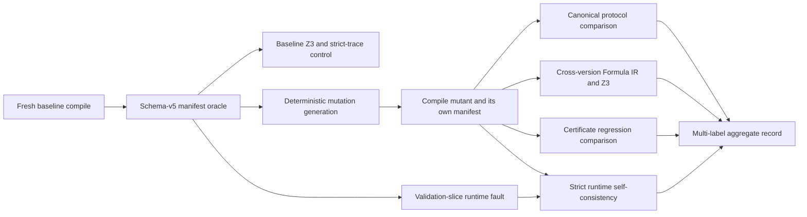

# R-PREDA Semantic Mutation Study: Implementation and Results

## 1. Scope

This deliverable extends the existing R-PREDA mutation framework from protocol-shape mutation to semantic validation of:

- relay target and argument refinements;
- branch/path conditions;
- parallel-safety certificates;
- strict runtime trace validation.

The implementation is additive. It does not change PREDA relay lowering, generated `prlrt::relay*` calls, `SimuTxn`, relay serialization, shard routing, queue insertion, worker scheduling, or contract execution semantics. Runtime fault injection is test-only, disabled by default, and operates exclusively on an owning copy of a completed trace slice immediately before validation.

The study uses the schema-v5 relay protocol manifest as the baseline oracle and records evidence from multiple layers independently. A mutation may therefore be detected by more than one layer.

## 2. Delivered components

### 2.1 Mutation engine and CLI

The following files define or extend source-level mutation generation:

| File | Responsibility |
|---|---|
| `oxd_preda/tools/rpreda_mutation/MutationKind.h` | Adds four opt-in semantic mutation kinds while retaining the original 13-kind default set. |
| `oxd_preda/tools/rpreda_mutation/MutationEngine.h` | Mutation engine interfaces and mutation record types. |
| `oxd_preda/tools/rpreda_mutation/MutationEngine.cpp` | Formula-backed semantic operators, structural/certificate operators, UTF-8-safe source edits, stable IDs, and applicability checks. |
| `oxd_preda/tools/rpreda_mutation/MutationMain.cpp` | CLI parsing, explicit `--kinds` selection, deterministic generation, and mutation index emission. |
| `oxd_preda/tools/rpreda_mutation/MutationEngineTests.cpp` | C++ tests for all operators, stable IDs, source-location safety, lambda captures, and default compatibility. |
| `oxd_preda/tools/rpreda_mutation/CMakeLists.txt` | Builds the mutation engine/CLI and registers C++ and Python tests. |

`AllMutationKinds` still contains the original 13 operators. The four new semantic operators are in `AllSemanticMutationKinds` and are generated only when explicitly requested. This preserves the previous default experiment and its stable mutation IDs.

### 2.2 Semantic comparison and experiment orchestration

| File | Responsibility |
|---|---|
| `oxd_preda/tools/rpreda_mutation/SemanticFormulaComparator.py` | Normalizes baseline/mutant Formula IR, encodes supported formulas as SMT-LIB, and runs non-circular Z3 preservation checks. |
| `oxd_preda/tools/rpreda_mutation/SemanticMutationRunner.py` | Runs fresh baselines, deterministic mutation selection, compilation, four-layer analysis, strict runtime validation, runtime-only faults, and aggregate reporting across benchmarks. |
| `oxd_preda/tools/rpreda_mutation/SemanticMutationReport.py` | Produces the multi-label layer breakdown by mutation category and benchmark. |
| `oxd_preda/tools/rpreda_mutation/MutationRunner.py` | Extended with fault-aware strict execution, independent mismatch categories, coverage gates, portable paths, and infrastructure/unsupported handling. |
| `oxd_preda/tools/rpreda_mutation/MutationReport.py` | Extended CSV fields and per-stage evidence metrics without removing the original final-classification metrics. |
| `oxd_preda/tools/rpreda_mutation/test_semantic_formula.py` | Z3, bit-vector, circularity, Unknown, and breakdown tests. |
| `oxd_preda/tools/rpreda_mutation/test_semantic_mutation.py` | Multi-benchmark configuration, selection, coverage, runtime-fault provenance, and classification tests. |
| `oxd_preda/tools/rpreda_mutation/test_mutation_runner.py` | Existing runner tests plus controlled-fault and independent-layer cases. |

### 2.3 Benchmark corpus

| File or directory | Responsibility |
|---|---|
| `oxd_preda/tools/rpreda_mutation/semantic_benchmarks/benchmarks.json` | Deterministic six-workload matrix, mutation filters, coverage allowlists, runtime faults, seed, and timeout. |
| `oxd_preda/tools/rpreda_mutation/semantic_benchmarks/fixtures/` | Native Engine scripts for Token, Ballot, MillionPixel, Kitty, AirDrop, and Synthetic. |
| `oxd_preda/tools/rpreda_mutation/fixtures/SemanticMutationStudy.prd` | Synthetic contract for target arithmetic, bounded loops, ordering, independence, nested relay depth, and broadcast. |
| `oxd_preda/tools/rpreda_mutation/fixtures/SemanticMutationStudy.prdts.in` | Standalone synthetic runtime template. |
| `oxd_preda/tools/rpreda_mutation/semantic_benchmarks/README.md` | Workload mapping and fixture notes. |
| `oxd_preda/tools/rpreda_mutation/semantic_benchmarks/smoke_results.json` | Machine-readable strict-baseline smoke evidence for all six workloads. |

The Token and Synthetic fixtures contain both equality-boundary transactions and strictly true transactions. Consequently, a `>=` to `>` guard mutation is semantically exercised without making relay-site coverage disappear.

### 2.4 Test-only runtime fault injector

| File | Responsibility |
|---|---|
| `oxd_preda/CMakeLists.txt` | Adds `RPREDA_ENABLE_TRACE_FAULT_INJECTION`, default `OFF`; the option requires runtime tracing. |
| `oxd_preda/simulator/CMakeLists.txt` | Includes fault-injector code and tests only when explicitly enabled. |
| `oxd_preda/simulator/relay_trace/RelayTraceFaultInjector.h` | Defines strict fault schema, selectors, application status, and injector API. |
| `oxd_preda/simulator/relay_trace/RelayTraceFaultInjector.cpp` | Parses fault specifications and mutates an owning validation slice at most once. |
| `oxd_preda/simulator/relay_trace/RelayTraceFaultInjectorTests.cpp` | Parser, selector, ambiguity, concurrency, target-scope, duplication, and no-op tests. |
| `oxd_preda/simulator/relay_trace/RelayRuntimeTraceTests.cpp` | Runs injector tests with the existing runtime trace suite. |
| `oxd_preda/simulator/chain_simu.h` | Holds the optional injector only under the test-only compile definition. |
| `oxd_preda/simulator/chain_simu.cpp` | Loads `-rpreda_trace_fault:<file>`, applies it before validation, and records provenance. |

### 2.5 Published aggregate results

The publication-facing result directory is:

```text
results/mutation_semantic/
  mutation.json
  mutation.csv
  detection_breakdown.json
  detection_breakdown.csv
```

Raw compiler homes, rendered scripts, traces, and generated mutant directories are intentionally not required for the aggregate artifact. Paths to omitted large artifacts are represented as `not-retained/...`; external tools are represented by a portable basename such as `external/z3`.

## 3. Mutation operators

### 3.1 New refinement mutations

| Operator | Transformation | Safety/applicability rule | Expected evidence |
|---|---|---|---|
| `TargetArithmeticPerturb` | `target` becomes `(target + 1<typed>)`. | Requires a known Formula IR target, valid source range, custom-key scope, and a supported numeric sort. The unit literal preserves the unsigned width or PREDA integer type. | Formula IR change and, when non-equivalent, `Z3Disproved`. |
| `TargetVariableSwap` | Replaces one target parameter leaf with another same-typed parameter leaf. | Both leaves must be source-function parameters in the same function with identical PREDA type and Formula IR sort. Only the mapped target occurrence is edited. | Target refinement violation and `Z3Disproved`. |
| `ArgumentArithmeticPerturb` | `arg` becomes `(arg + 1<typed>)`. | Requires a known numeric argument formula and valid source mapping. A `^name` lambda capture is rewritten as an equivalent typed binding before perturbation. | Argument preservation violation and `Z3Disproved`. |
| `GuardBoundaryChange` | `>=`/`<=` become `>`/`<`, and vice versa. | Edits only comparison nodes present in the known guard Formula IR and locates the operator between its two mapped operands. | Guard/path-formula preservation violation and `Z3Disproved`. |

Unsupported sorts, missing Formula IR, invalid locations, or unavailable alternatives do not produce an unsafe guessed edit. Generation either omits the candidate and reports a missing configured kind at selection time, or emits an explicit `Unsupported` record when requested by the lower-level engine.

The current `TargetVariableSwap` scope is deliberately narrower than arbitrary program substitution: it handles same-typed source-parameter leaves, not arbitrary state variables, locals, or loop indices.

### 3.2 Parallel-certificate mutations used by this study

| Operator | Certificate property exercised |
|---|---|
| `RelayOrderSwap` | Reverses a source pair for which the baseline certificate proves `MustPrecede`. |
| `IntroduceAlias` | Rewrites a proved-independent target to alias another co-emitted target. |
| `RelayDuplicate` | Increases direct, transitive, and/or physical relay work. |
| `IntroduceRelayRecursion` | Introduces a handler cycle, invalidating finite transitive-work and depth bounds. |
| `BroadcastToSingle` | Changes all-shards broadcast to one target; in the selected Ballot case the compiler rejects the resulting ill-typed program. |

Certificate comparison aligns surviving sites by edit anchors and semantic fingerprints. It compares only proved pair relations and finite bounds. Listener discovery order is not treated as a proof of execution order.

### 3.3 Runtime-only mutations

| Operator | Validation-slice change | Expected checks |
|---|---|---|
| `RuntimeTargetScopeCorruption` | Changes `actualTargetScope` for one selected emission. | `target_scope_kind`. |
| `RuntimeRelayDuplicate` | Clones one logical emission and its matching route observations using validation-only synthetic identities. | `direct_count`, `count_upper_bound`, and, where finite, certificate work bounds. |

## 4. Analysis pipeline



For every workload, the runner performs the following:

1. Compile the unmodified source in a fresh `HOME` and retain its manifest as the oracle.
2. Inspect baseline solver goals and execute the baseline in strict trace mode.
3. Require configured functions and relay sites to be covered. A missing baseline or candidate kind fails closed.
4. Ask the mutation engine for the complete deterministic candidate set for explicitly configured kinds, then apply function filters and the configured per-kind cap.
5. Compile each source mutant with its own manifest.
6. Compare the baseline and mutant canonical protocol projections.
7. For refinement mutations, compare aligned Formula IR expressions with Z3.
8. Compare baseline and mutant proved certificate relations and finite bounds.
9. Execute the mutant against its own manifest in strict mode. This checks runtime self-consistency; it is not used as proof that the mutant is equivalent to the baseline.
10. Run configured runtime-only faults against the unchanged baseline source.
11. Preserve all detection evidence in `detected_by` and `detection_layers`, then derive one compatibility `final_classification` using first-detection priority.

All subprocesses have fresh state directories and explicit timeouts. Gas exhaustion, timeout, missing traces, instrumentation failures, and unexplained process failures are recorded as infrastructure evidence, never as semantic runtime kills.

## 5. Non-circular Z3 preservation method

The semantic study asks a cross-version preservation question. It does not prove a compiler definition by asserting the same definition as an assumption.

For an aligned property, let:

- `B(x)` be the baseline target, argument, or guard Formula IR;
- `M(x)` be the mutant Formula IR after stable symbol normalization;
- `A(x)` be independently established assumptions. The current differential checks use `true`, not either compiler definition.

The goal is:

```text
G(x) := B(x) = M(x)
```

The solver procedure is:

```text
check-sat(A)
  unsat   -> InconsistentAssumptions
  unknown -> Unknown

check-sat(A and not G)
  unsat   -> Proved       (the mutation preserves this formula)
  sat     -> Disproved    (a projected counterexample is returned)
  unknown -> Unknown
```

Before encoding, the implementation rejects any conjunct of `A` that is structurally identical to `G`. Thus the goal cannot be recycled as an assumption. Compiler-emitted target equality, argument equality, guard necessity, or count equality is not asserted to prove its own preservation.

Symbol IDs from the two compiler runs are normalized to semantic roles using function ownership, symbol kind, source name, PREDA type, argument index, and aligned relay-site role. Listener ordinals and generated lambda IDs therefore do not become independent SMT variables or cause false differences.

The encoder preserves:

- Bool and mathematical Int sorts;
- fixed-width unsigned bit-vector arithmetic and overflow;
- explicit zero extension, truncation, `int2bv`, and `bv2nat` casts;
- unsigned comparisons and bit-vector operators;
- Boolean, arithmetic, group, unary, binary, n-ary, cast, and ITE structure.

`Unknown`, unsupported array-length terms, unsupported address literals, malformed sorts, or unavailable relation formulas yield `Unsupported` or `EncodingError`; they are never replaced by unconstrained fresh values. A `Disproved` result means that the baseline and mutant compiler-extracted formulas differ for at least one encoded input. It does not independently prove that the baseline implements an external user specification.

## 6. Detection taxonomy

The compatibility final classifications are:

| Classification | Meaning |
|---|---|
| `CompilerRejected` | The PREDA compiler rejected the mutant. |
| `StaticProtocolMismatch` | The canonical relay protocol projection differs from the baseline oracle. |
| `Z3Disproved` | Z3 found a counterexample to Formula IR preservation. |
| `CertificateViolation` | A proved pair relation or finite certificate bound regressed, or strict runtime validation observed a certificate violation. |
| `RuntimeStrictMismatch` | A non-certificate strict runtime check detected the controlled observation fault. |
| `Unsupported` | The selected analysis could not soundly decide the mutation. |
| `Survived` | No enabled layer detected the mutation. |
| `InfrastructureFailure` | Tooling, timeout, gas, trace, or instrumentation failure prevented a valid conclusion. |

Final classification follows this compatibility order:

```text
CompilerRejected
  -> StaticProtocolMismatch
  -> Z3Disproved
  -> CertificateViolation
  -> RuntimeStrictMismatch
```

This single label must not be used to reconstruct layer coverage. For example, a record whose final class is `StaticProtocolMismatch` may also contain `Z3Disproved` and `CertificateViolation`. The authoritative multi-label fields are:

```json
"detected_by": ["StaticProtocolMismatch", "Z3Disproved"],
"detection_layers": ["static", "z3"]
```

## 7. Runtime injector safety boundary

The runtime injector is intentionally outside PREDA execution semantics:

- `RPREDA_ENABLE_TRACE_FAULT_INJECTION` defaults to `OFF`.
- Enabling it requires `RPREDA_ENABLE_RUNTIME_TRACE=ON`.
- The `-rpreda_trace_fault:<json>` option is accepted only in strict trace mode.
- With the compile option disabled, use of the CLI option is rejected.
- The injector receives the owning value returned by `RelayTraceCollector::ExecutionSlice`; it never receives mutable access to collector-owned events.
- Target corruption and duplication affect only this local value before `RelayTraceValidator` consumes it.
- It does not mutate `SimuTxn`, actual route descriptors, shard queues, worker state, contract state, or executed relay transactions.
- A mutex makes one injector apply at most once. An ambiguous selector is `Invalid`; a selector miss remains eligible for a later completed slice and is finally reported as `NotApplied`.
- Every application emits provenance under `runtime_fault.<mutation_id>` with `Applied`, `Invalid`, or `NotApplied` status.
- The runner counts a semantic runtime detection only when the fault was `Applied`, the selected site was covered, an explicitly expected mismatch occurred, strict mode exited with code 2, and there was no infrastructure failure.

This design measures validator sensitivity to corrupted runtime observations. It does not claim that the production router was corrupted or that the runtime recovered from a real routing fault.

An example fault specification is:

```json
{
  "schema_version": 1,
  "mutation_id": "runtime-target-scope-example",
  "kind": "RuntimeTargetScopeCorruption",
  "seed": 88,
  "selector": {
    "source_function_id": "module.Contract::function(uint16,uint16)",
    "relay_site_id": "relay_site_0",
    "occurrence_index": 0
  },
  "replacement_scope": "uint64"
}
```

## 8. Experimental setup

The completed run used:

| Parameter | Value |
|---|---|
| Engine | PREDA Native Engine |
| Manifest | R-PREDA schema v5 |
| Seed | 88 |
| Shard order | 2 (four shards) |
| Per-process timeout | 45 seconds |
| Maximum selected candidates | 1 per configured kind and workload |
| Z3 | Z3 5.0.0, 64-bit |
| Mutants | 22 |
| Negative controls | 6 unmodified workload baselines |

Run identity recorded in `mutation.json`:

| Artifact | SHA-256 |
|---|---|
| Benchmark configuration | `449f5c0fa17018fa2a68ec6ed442197bc8527d92f38aa8a046158f4e482fec4c` |
| `chsimu` | `05c8cc1d8a0d21b63e308ab586fd675595d1f9b65dbac61b718cbce820cc1fa1` |
| `rpreda_mutation` | `fbf0543e155440d01111a41dfc19312d21efa84de968765c2022db7b8548cb13` |
| Z3 executable | `450bffa1b87541409c37cd678b2e7261c5d20912144e5c052fd264b1f3a2077f` |

The run metadata records base Git revision `b1390f60d4bca625789b1116a70918b8d434ad65`. The experiment was run from the implementation working tree, so that base revision alone is not a complete code identity; the final repository revision plus the artifact hashes above should be used for reproduction.

## 9. Benchmarks and negative controls

AirDrop is a one-to-many workload implemented by `Token.transfer_n`, not a separate contract source. Token and AirDrop use different runtime templates and disjoint coverage allowlists.

| Benchmark | Source transactions | Logical emissions | Physical routes | Max depth | Strict passed | Skipped unsupported | Control | Analysis status |
|---|---:|---:|---:|---:|---:|---:|---|---|
| Token | 3 | 2 | 2 | 1 | 45 | 9 | Survived | Complete |
| Ballot | 6 | 7 | 10 | 3 | 153 | 23 | Survived | Complete |
| MillionPixel | 3 | 3 | 3 | 1 | 61 | 9 | Survived | Complete |
| Kitty | 16 | 27 | 27 | 3 | 437 | 108 | Survived | Z3 baseline limitation |
| AirDrop | 1 | 8 | 8 | 1 | 107 | 29 | Survived | Complete |
| Synthetic | 7 | 14 | 17 | 2 | 261 | 48 | Survived | Complete |

All six baseline controls compiled, covered their allowlisted functions/sites, completed strict runtime validation with zero mismatch, and remained unflagged. The measured negative-control false-positive rate is therefore `0/6 = 0%`.

Kitty is marked `CompletedWithAnalysisLimitations`, not failed. Its `registerNewBorns()` count-upper-bound goal depends on a pre-state array-length count equality containing `Unknown`. The Z3 backend correctly returns `EncodingError` rather than inventing a value or proving through the unknown formula. Kitty's strict baseline runtime still passes, and its selected argument mutant has one soundly encoded argument-preservation counterexample plus two explicitly unsupported argument relations.

## 10. Results

### 10.1 Overall outcome

| Measure | Result |
|---|---:|
| Total mutants | 22 |
| Detected mutants | 21 |
| Unsupported mutants | 1 |
| Survived mutants | 0 |
| Final infrastructure failures | 0 |
| Overall detection rate | 95.45% (21/22) |
| Multi-layer mutants | 16 |
| Multi-layer rate | 72.73% (16/22) |
| Mutants with Z3/certificate/runtime evidence | 19 |
| Deeper-layer evidence rate | 86.36% (19/22) |
| Mutants detected by a deeper layer without static evidence | 4 |
| Incremental deeper-layer detection rate | 18.18% (4/22) |
| Mutants with any stage infrastructure failure | 1 |
| Infrastructure-free pipeline completion | 95.45% (21/22) |
| Flagged negative controls | 0/6 |

The single undetected record is not a silent survivor: it is the explicitly `Unsupported` AirDrop runtime duplicate discussed below.

### 10.2 Final-classification counts

| Final classification | Count |
|---|---:|
| `CompilerRejected` | 1 |
| `StaticProtocolMismatch` | 16 |
| `Z3Disproved` | 2 |
| `CertificateViolation` | 1 |
| `RuntimeStrictMismatch` | 1 |
| `Unsupported` | 1 |
| `Survived` | 0 |
| `InfrastructureFailure` | 0 |

These are first-detection labels. They intentionally differ from the multi-label layer counts below.

### 10.3 Detection-layer evidence

| Layer | Detected | Eligible | Rate over eligible | Unique detections |
|---|---:|---:|---:|---:|
| Static protocol comparison | 16 | 19 | 84.21% | 1 |
| Z3 Formula IR preservation | 9 | 9 | 100.00% | 2 |
| Parallel certificate | 9 | 12 | 75.00% | 0 |
| Strict runtime validation | 2 | 22 | 9.09% | 1 |

Eligibility is the runner's declared per-record layer eligibility, not the size of an unconstrained mutation universe. All source mutants are eligible for strict self-consistency execution, while three additional records are controlled validation-slice faults; two of those faults are detected and the AirDrop occurrence is explicitly unsupported.

The report deliberately separates overlap from incremental contribution. `mutants_with_deep_layer_evidence=19` counts every mutant with Z3, certificate, or runtime evidence, including evidence that overlaps static detection. `detected_beyond_static_mutants=4` counts only mutants detected by a deeper layer with no static-layer evidence. The latter consists of the two MillionPixel Formula IR mutations, the MillionPixel runtime target-scope fault, and the Synthetic runtime duplicate.

Observed layer combinations:

| Layer combination | Mutants |
|---|---:|
| `static + z3` | 7 |
| `static + certificate` | 8 |
| `certificate + runtime` | 1 |
| `z3` only | 2 |
| `runtime` only | 1 |
| `static` only | 1 |
| No layer evidence | 2 |

The two no-layer records are the compiler-rejected Ballot broadcast mutation and the explicitly unsupported AirDrop runtime duplicate. Compiler rejection is retained as detection evidence but is not assigned to one of the four semantic layers.

### 10.4 Detection by semantic category

Each layer column counts independent evidence and can overlap with other columns.

| Category | Total | Static | Z3 | Certificate | Runtime |
|---|---:|---:|---:|---:|---:|
| Target | 5 | 2 | 4 | 0 | 1 |
| Argument | 3 | 3 | 3 | 0 | 0 |
| Guard | 2 | 2 | 2 | 0 | 0 |
| Order | 1 | 1 | 0 | 1 | 0 |
| Alias | 1 | 1 | 0 | 1 | 0 |
| Work | 8 | 6 | 0 | 6 | 1 |
| Depth | 1 | 1 | 0 | 1 | 0 |
| Broadcast | 1 | 0 | 0 | 0 | 0 |

The Target category supplies the strongest unique complementarity result: the two MillionPixel target mutations did not change the canonical protocol projection used by this study, but both were independently disproved by Formula IR/Z3. The separate MillionPixel target-scope fault was detected only at runtime.

### 10.5 Detection by benchmark

| Benchmark | Mutants | Detected | Static | Z3 | Certificate | Runtime | Multi-layer |
|---|---:|---:|---:|---:|---:|---:|---:|
| Token | 3 | 3 | 3 | 2 | 1 | 0 | 3 |
| Ballot | 2 | 2 | 1 | 0 | 1 | 0 | 1 |
| MillionPixel | 4 | 4 | 1 | 2 | 1 | 1 | 1 |
| Kitty | 2 | 2 | 2 | 1 | 1 | 0 | 2 |
| AirDrop | 2 | 1 | 1 | 0 | 0 | 0 | 0 |
| Synthetic | 9 | 9 | 8 | 4 | 5 | 1 | 9 |

### 10.6 Outcomes by operator

| Operator | Count | Observed result |
|---|---:|---|
| `TargetArithmeticPerturb` | 2 | Both Z3-disproved; MillionPixel is Z3-only, Synthetic is static+Z3. |
| `TargetVariableSwap` | 2 | Both Z3-disproved; MillionPixel is Z3-only, Synthetic is static+Z3. |
| `ArgumentArithmeticPerturb` | 3 | All static+Z3; Kitty also reports two unrelated unsupported argument formulas. |
| `GuardBoundaryChange` | 2 | Both static+Z3 and runtime coverage passed. |
| `RelayOrderSwap` | 1 | Static mismatch plus proved precedence reversal. |
| `IntroduceAlias` | 1 | Static mismatch plus loss of proved co-emission independence. |
| `RelayDuplicate` | 6 | All statically detected; five also regress certificate bounds. AirDrop's array loop remains static-only. |
| `IntroduceRelayRecursion` | 1 | Static+certificate; finite depth/work bounds are lost. Runtime gas exhaustion is infrastructure evidence only. |
| `BroadcastToSingle` | 1 | Compiler rejected the selected Ballot mutation. |
| `RuntimeTargetScopeCorruption` | 1 | Runtime-only strict target-scope mismatch. |
| `RuntimeRelayDuplicate` | 2 | Synthetic is certificate+runtime; AirDrop is explicitly unsupported. |

### 10.7 Certificate regressions

The study produces multiple certificate-violation classes:

| Class | Concrete result |
|---|---|
| Work bound | Synthetic bounded-loop duplication increases direct, physical, and transitive bounds from 3 to 6. |
| Ordering | Synthetic order swap reverses the proved `relay_site_5 -> relay_site_6` precedence. |
| Independence/alias | Synthetic alias mutation loses two proved `CoEmissionIndependent` relations. |
| Depth/transitive work | Synthetic recursion loses finite `relay_tree_depth`, physical-work, and transitive-work bounds in the nested chain. |
| Runtime certificate validation | Synthetic runtime duplication makes observed direct work exceed the certificate bound. |

Additional `RelayDuplicate` regressions were detected in Token, Ballot, MillionPixel, and Kitty. In total, nine mutants carry certificate-layer evidence.

### 10.8 Runtime-only fault outcomes

| Benchmark/fault | Applied | Expected checks | Observed result | Final/layers |
|---|---|---|---|---|
| MillionPixel target-scope corruption | Yes | `target_scope_kind` | Strict exit 2; observed target scope differs from manifest. | `RuntimeStrictMismatch`; runtime only |
| Synthetic relay duplicate | Yes | `direct_count`, `count_upper_bound` | Both ordinary checks mismatch; certificate direct-work bound also mismatches; strict exit 2. | `CertificateViolation`; certificate+runtime |
| AirDrop relay duplicate | Yes | `direct_count`, `count_upper_bound` | No finite count relation is available; run completes with exit 0 and 32 unsupported checks. | `Unsupported`; no layer |

Application provenance and coverage are present for all three faults. Therefore the AirDrop result is an analysis limitation, not a selector miss or instrumentation failure.

## 11. Reproduction

### 11.1 Environment variables

Run all commands from the repository root:

```bash
export REPO_ROOT="$(pwd)"
export BUILD_DIR="${BUILD_DIR:-/tmp/preda-semantic-build}"
export RUN_DIR="${RUN_DIR:-/tmp/rpreda-mutation-semantic-run}"
export Z3_ROOT="${Z3_ROOT:?set Z3_ROOT to an existing Z3 installation}"
export TOOLCHAIN_BIN="${TOOLCHAIN_BIN:?set TOOLCHAIN_BIN to the CMake/C++ toolchain bin directory}"
export RPREDA_Z3_BIN="$Z3_ROOT/bin/z3"
```

No normal build step downloads Z3. `Z3_ROOT` must already contain its headers, library, and executable.

### 11.2 Configure and build

```bash
cmake -S "$REPO_ROOT" -B "$BUILD_DIR" -G Ninja \
  -DCMAKE_BUILD_TYPE=Release \
  -DBUILD_TESTING=ON \
  -DRPREDA_ENABLE_Z3=ON \
  -DZ3_ROOT="$Z3_ROOT" \
  -DRPREDA_ENABLE_RUNTIME_TRACE=ON \
  -DRPREDA_ENABLE_TRACE_FAULT_INJECTION=ON \
  -DRPREDA_ENABLE_RUNTIME_OPTIMIZATION=OFF \
  -DDOWNLOAD_3RDPARTY=OFF \
  -DDOWNLOAD_IPP=OFF

cmake --build "$BUILD_DIR" \
  --target chain_simulator relay_runtime_trace_tests \
           rpreda_mutation rpreda_mutation_tests \
  -j2
```

`RPREDA_ENABLE_TRACE_FAULT_INJECTION=ON` is required only for this controlled study. Production or ordinary validation builds should leave it at its default `OFF` value.

### 11.3 Tests

```bash
env RPREDA_Z3_BIN="$RPREDA_Z3_BIN" \
  ctest --test-dir "$BUILD_DIR" --output-on-failure
```

The validated build ran seven tests successfully:

```text
relay_protocol_ir
relay_runtime_trace_tests
relay_plan_tests
rpreda_mutation_tests
rpreda_mutation_python_tests
rpreda_semantic_formula_python_tests
rpreda_semantic_mutation_python_tests
```

The observed result was 7/7 passed. `RPREDA_Z3_BIN` is explicit so the semantic formula tests execute their real solver cases instead of skipping when `z3` is absent from `PATH`.

The `relay_protocol_ir` suite also checks generated-C++ size/hash goldens. Its success confirms that the study integration did not change existing relay lowering output.

### 11.4 Run the study

```bash
env \
  RPREDA_REPO_ROOT="$REPO_ROOT" \
  RPREDA_Z3_BIN="$RPREDA_Z3_BIN" \
  PYTHONDONTWRITEBYTECODE=1 \
  python3 oxd_preda/tools/rpreda_mutation/SemanticMutationRunner.py \
    --config oxd_preda/tools/rpreda_mutation/semantic_benchmarks/benchmarks.json \
    --output "$RUN_DIR" \
    --engine bin/bin_release/rpreda_mutation \
    --chsimu bin/bin_release/chsimu \
    --z3-bin "$RPREDA_Z3_BIN" \
    --library-path "$Z3_ROOT/lib" \
    --path-prefix "$Z3_ROOT/bin" \
    --path-prefix "$TOOLCHAIN_BIN" \
    --seed 88 \
    --timeout 45
```

If the platform installs `libz3` under `lib64`, pass that directory instead of `$Z3_ROOT/lib`.

### 11.5 Validate the aggregate

The runner's exit code alone is insufficient for paper acceptance because a soundly unsupported record is not a harness crash. Validate the expected evidence explicitly:

```bash
jq -e '
  .metadata.record_count == 22 and
  .metrics.total_mutants == 22 and
  .metrics.detected_mutants == 21 and
  .metrics.classification_counts.Unsupported == 1 and
  .metrics.classification_counts.Survived == 0 and
  .metrics.negative_control_count == 6 and
  .metrics.flagged_negative_control_count == 0
' "$RUN_DIR/mutation.json"

jq -e '
  .overall.multi_layer_mutants == 16 and
  .overall.mutants_with_deep_layer_evidence == 19 and
  .overall.detected_beyond_static_mutants == 4 and
  .overall.per_layer.z3.detected_mutants == 9 and
  .overall.per_layer.certificate.detected_mutants == 9 and
  .overall.per_layer.runtime.detected_mutants == 2 and
  .overall.layer_combinations["z3"] == 2 and
  .overall.layer_combinations["runtime"] == 1 and
  .overall.layer_combinations["certificate+runtime"] == 1
' "$RUN_DIR/detection_breakdown.json"

test "$(wc -l < "$RUN_DIR/mutation.csv")" -eq 23
test "$(wc -l < "$RUN_DIR/detection_breakdown.csv")" -eq 23
```

Publish only the aggregate artifacts if raw traces are not part of the artifact package:

```bash
mkdir -p results/mutation_semantic
cp "$RUN_DIR/mutation.json" \
   "$RUN_DIR/mutation.csv" \
   "$RUN_DIR/detection_breakdown.json" \
   "$RUN_DIR/detection_breakdown.csv" \
   results/mutation_semantic/
```

Aggregate hashes for this run are:

| File | SHA-256 |
|---|---|
| `mutation.json` | `bb0237dea514274d9ab45fcbb32a7ba1b01adb017aa7f893daa231d0a34a45c9` |
| `mutation.csv` | `407666f9d474330d58f74c66fa4c870cacd5ff6700cd5e265b3689274ea1c235` |
| `detection_breakdown.json` | `bd73efc3bb0259de4a731d7ca94d9837e15649b309c52ea443301a4b787b2d85` |
| `detection_breakdown.csv` | `f3fa51b96853f56d11ccde136890043b8c39d04ae192bc08c0820c88cb87cf05` |

## 12. Limitations and interpretation

1. **Differential oracle, not an external specification.** Static and Z3 comparisons use the unmodified compiler manifest as the oracle. They establish change or non-equivalence relative to that oracle; they do not independently prove that the original contract is correct.

2. **Static mismatch is not itself a safety proof.** It records a canonical protocol difference. Z3 and certificate evidence provide the stronger semantic diagnosis. This distinction is why all layer evidence is retained even when the first final label is static.

3. **Limited path assumptions.** Cross-version Z3 checks currently use no reachability invariants beyond independently represented assumptions. A counterexample demonstrates Formula IR non-equivalence over the encoded type domain, not necessarily reachability under every application invariant.

4. **Unknown remains unknown.** Array-length and other unavailable formulas are never modeled as fresh unconstrained values. This causes the Kitty baseline count EncodingError and the AirDrop unsupported runtime duplicate, but avoids unsound proofs.

5. **Kitty is partially analyzable.** `registerNewBorns()` has a pre-state array-length count equality containing `Unknown`. The selected `mint` argument mutation is still Z3-disproved for its numeric argument; two unrelated argument relations are explicitly unsupported.

6. **AirDrop has no finite dynamic loop count.** The duplicated occurrence is applied and covered, but the current static summary cannot provide an exact or finite upper bound for `transfer_n`'s array-length loop. No runtime kill is claimed.

7. **Recursive runtime termination is infrastructure evidence.** The synthetic recursion mutation is detected statically and by loss of finite certificate bounds. Its subsequent `GasUsedUp`/instrumentation termination is recorded as a runtime-stage infrastructure failure and is not counted as `RuntimeStrictMismatch` layer evidence.

8. **Compiler rejection is a separate outcome.** Ballot's selected `BroadcastToSingle` mutant is rejected before Formula IR, certificate, or runtime analysis. It contributes to mutation detection but not to a semantic layer count.

9. **Validation-slice injection is not production corruption.** The runtime faults measure strict-validator sensitivity without changing routing or execution. No claim is made about recovery from a real router, queue, worker, or state corruption.

10. **Small deterministic sample.** The matrix selects at most one candidate per configured kind/workload with seed 88. The percentages characterize this targeted semantic suite; they are not confidence intervals over all possible PREDA mutations.

11. **Eligibility is configured.** Per-layer rates use explicit `ineligible_layers`. They should be reported with their denominators and not compared as if every operator were meaningful for every layer.

12. **No performance conclusion.** This task evaluates detection capability and sound classification. It does not measure throughput, latency, or optimization speedup.

13. **Working-tree provenance.** The recorded base commit predates final staging of all study files. Reproduction should cite the final artifact commit together with the configuration, binary, solver, and aggregate hashes recorded above.

## 13. Paper figure and table mapping

The implementation artifacts map directly to paper material as follows:

| Paper item | Source data | Recommended content |
|---|---|---|
| Semantic mutation pipeline figure | Section 4; `SemanticMutationRunner.py` | Baseline oracle, source mutation, Formula IR/Z3, certificate comparison, and strict runtime validation. |
| Layer-complementarity figure | `detection_breakdown.json: overall.layer_combinations` | UpSet/bar chart for static+Z3 (7), static+certificate (8), certificate+runtime (1), Z3-only (2), runtime-only (1), and static-only (1). |
| Mutation-category heatmap | `detection_breakdown.csv` | Target, Argument, Guard, Order, Alias, Work, Depth, and Broadcast versus the four detection layers. |
| Main quantitative table | Section 10.1 and `mutation.json: metrics` | 21/22 detected, 16 multi-layer, 0/6 negative controls flagged. |
| Solver table | Section 10.3 and Z3 rows in `mutation.json` | All 9 eligible mutants have at least one Z3-disproved preservation obligation; highlight two MillionPixel Z3-only target mutations and disclose Kitty's two additional unsupported argument obligations. |
| Certificate table | Section 10.7 | Work, precedence, independence/alias, depth, and runtime work-bound violations. |
| Runtime validation table | Section 10.8 | MillionPixel runtime-only detection, Synthetic certificate+runtime detection, and AirDrop unsupported case. |
| Benchmark coverage table | Section 9 and baseline `trace_counters` | Source transactions, logical emissions, physical routes, depth, passed checks, and explicit skips. |
| Threats-to-validity paragraph | Section 12 | Differential oracle, Unknown handling, targeted sample, validation-slice boundary, and no performance claim. |

The supported paper claim is:

> R-PREDA provides complementary detection capabilities across static protocol inference, refinement verification, parallel-safety certification, and runtime validation.

The strongest evidence for “complementary” is not the aggregate 95.45% rate alone. It is the combination of two Z3-only MillionPixel target detections, one runtime-only target-scope detection, eight static+certificate detections, seven static+Z3 detections, one certificate+runtime detection, and zero flagged baseline controls.
