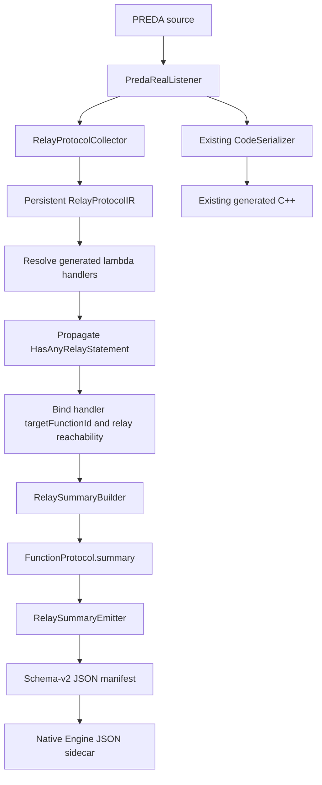

# R-PREDA Static Relay Protocol Summary Implementation

## 1. Scope

This change extends the persistent `RelayProtocolIR` with conservative,
machine-readable summaries for every collected `FunctionProtocol`.

The summary layer is compiler analysis only. It does not change:

- PREDA relay lowering or generated `prlrt::relay*` calls;
- relay argument serialization;
- `SimuTxn`;
- target hashing, shard selection, routing, or queue insertion;
- per-shard workers, batching, scheduling, or execution behavior.

The existing relay protocol manifest fields remain available. The manifest is
now schema version `2`, and each function entry has an additive `summary`
field.

## 2. Analysis architecture



The integration order in
`PredaRealListener::exitContractDefinition()` is:

```text
DefinePendingRelayLambdas()
-> RelayProtocolCollector::Finalize()
-> PropagateFunctionFlagAcrossCallingGraph()
-> RelayProtocolCollector::SetFunctionRelayReachability()
-> RelayProtocolCollector::BuildSummaries()
```

This order ensures that:

1. generated lambda handler names, opcodes, and function IDs are resolved;
2. ordinary-call reachability information has reached a fixed point;
3. summary construction reads a complete protocol snapshot;
4. no summary result participates in code generation.

## 3. New files

| File | Responsibility |
|---|---|
| `oxd_preda/transpiler/relay_protocol/analysis/RelayCardinalityExpr.h` | Tagged cardinality expression: `Constant`, `Sum`, `Product`, `Ite`, `Unknown` |
| `oxd_preda/transpiler/relay_protocol/analysis/RelayDepthExpr.h` | Tagged depth expression: `Constant`, `Maximum`, `Successor`, `Unknown` |
| `oxd_preda/transpiler/relay_protocol/analysis/RelayProtocolSummary.h` | Per-function summary, fanout, ordering, and analysis-status types |
| `oxd_preda/transpiler/relay_protocol/analysis/RelaySummaryBuilder.h` | Summary builder interface |
| `oxd_preda/transpiler/relay_protocol/analysis/RelaySummaryBuilder.cpp` | Cardinality, depth, target, opacity, fanout, and ordering analysis |
| `oxd_preda/transpiler/relay_protocol/analysis/RelaySummaryEmitter.h` | Summary JSON emitter interface |
| `oxd_preda/transpiler/relay_protocol/analysis/RelaySummaryEmitter.cpp` | Deterministic schema-v2 summary serialization |

## 4. Updated files

| File | Change |
|---|---|
| `oxd_preda/transpiler/relay_protocol/RelayProtocolIR.h` | Adds `FunctionProtocol::summary`, exact handler function identity, relay reachability facts, loop early-exit fact, and schema version `2` |
| `oxd_preda/transpiler/relay_protocol/RelayProtocolCollector.h/.cpp` | Records exact handler identity, classifies early loop exits, invokes the summary builder, and keeps target-only opacity at expression level |
| `oxd_preda/transpiler/PredaRealListener.cpp` | Binds named/lambda handlers to stable function IDs and supplies propagated relay reachability before summary construction |
| `oxd_preda/transpiler/relay_protocol/RelayManifestEmitter.cpp` | Emits handler analysis fields, loop early-exit facts, and each function's `summary` |
| `oxd_preda/transpiler/CMakeLists.txt` | Builds all analysis sources |
| `oxd_preda/transpiler/test/RelayProtocolIRTests.cpp` | Adds schema-v2 integration and conservative-analysis tests |
| `oxd_preda/transpiler/testcase/relay_protocol/summary_conditional.prd` | Conditional relay fixture |
| `oxd_preda/transpiler/testcase/relay_protocol/summary_sequential.prd` | Two relay-site fixture |
| `oxd_preda/transpiler/testcase/relay_protocol/summary_recursive_handler.prd` | Recursive handler fixture |
| `oxd_preda/transpiler/testcase/relay_protocol/summary_unmodeled_call.prd` | Direct relay plus an unmodeled relay-reachable ordinary call |

## 5. Summary data model

Each `FunctionProtocol` owns:

```cpp
analysis::RelayProtocolSummary summary;
```

The summary contains:

```text
relayCount
relayCountUpperBound
maxDepth
relaySiteIds
targetScopeKinds
fanoutKinds
targetsKnownBeforeExecution
hasOpaque
hasUnmodeledRelayReachableCall
ordering
analysisStatus
```

`relayCount`, its upper bound, and `maxDepth` are tagged expressions rather
than a mixture of integers and nulls. Consumers can therefore distinguish a
proved constant, a symbolic expression, and an unknown result without
out-of-band conventions.

## 6. Relay cardinality analysis

Cardinality is the number of logical relay emissions performed directly by
the source function. It does not expand the relays of asynchronous handlers.
Handler protocols are used only by depth analysis.

The builder implements:

| Protocol node | Exact cardinality |
|---|---|
| `End` | `0` |
| `Call` | `0` in the source function's direct count |
| `Emit` | `1 + continuation.count` |
| `Sequence` | Sum of child counts |
| `Parallel` | Sum of logical child sites; physical shard fanout is separate |
| `Branch` | `ite(predicate, body, 0)`, with arms exchanged for negative polarity |
| Statically bounded `Repeat` | `trip_count * body.count` |
| Unbounded `Repeat` | `Unknown` |
| `Opaque` protocol node | `Unknown` |

The expression constructors fold constant sums, products, and maxima with
checked `uint64_t` arithmetic. Overflow becomes `Unknown`; it is never
silently wrapped.

### 6.1 Branch upper bounds

If a branch predicate is represented by `RelayExprIR`, the exact result is an
`Ite`. Its upper bound is the branch body's upper bound because the absent arm
emits zero relays.

If the predicate itself is opaque:

```text
relay_count             = Unknown
relay_count_upper_bound = body upper bound
```

This preserves a useful finite bound without claiming an exact execution
condition.

### 6.2 Loop trip counts

The existing collector recognizes a finite trip count only for canonical
literal, strict, unit-step loops:

```text
literal initialization
+ induction-variable < literal bound with ++
or induction-variable > literal bound with --
+ no write or shadowing of the induction variable in the body
```

Decimal and hexadecimal integer literals with supported PREDA integer
suffixes are parsed with checked `uint64_t` conversion.

For example:

```preda
for (uint32 i = 0u32; i < 3u32; i++) {
    relay@target receive(value);
}
```

produces exact count and upper bound `3`.

If a statically bounded loop body contains `break`, `continue`, or `return`,
the exact count is `Unknown`, while the proven full-trip product remains a
finite upper bound.

## 7. Maximum relay depth

Maximum depth is the longest asynchronous relay-handler chain reachable from
one relay emitted by the source function.

The rules are:

| Protocol node | Depth |
|---|---|
| `End` / standalone `Call` | `0` |
| `Emit` | `max(1, 1 + target-handler depth)` |
| `Branch` | Maximum child depth |
| `Sequence` / `Parallel` | Maximum child depth |
| `Repeat` | Maximum body depth; a proved zero-trip loop has depth `0` only when its body is not opaque |
| `Opaque` protocol node | `Unknown` |

### 7.1 Exact handler identity

Depth analysis does not join handlers to protocols by display name or
parameter spelling. `RelayHandler` now records:

```text
targetFunctionId
targetFunctionSignature
targetFunctionOverloadIndex
```

The stable ID uses the same canonical signature as
`FunctionProtocol::sourceFunctionId`. This avoids incorrect joins for
overloads and for user types whose `inputName` and `exportName` differ.

Named handlers receive the identity when `enterRelayStatement()` resolves the
target `FunctionRef`. Lambda handlers receive it after
`DefinePendingRelayLambdas()` creates their generated function.

### 7.2 Missing protocols and ordinary calls

The persistent protocol currently models relay statements, not every ordinary
synchronous call. A handler without a direct `FunctionProtocol` is considered
a depth-`1` leaf only when propagated compiler flags prove that it cannot
reach another relay.

`RelayHandler` therefore also records:

```text
relayReachabilityKnown
mayEmitRelay
```

If a handler may reach another relay but no reusable function protocol is
available, depth is `Unknown`. This avoids an unsound leaf assumption.

The call graph is also checked for each function that already has a direct
protocol. If it makes an ordinary call to a callee whose propagated flags say
that relay code is reachable, the call is not represented by protocol nodes.
The function records:

```text
hasUnmodeledRelayReachableCall = true
```

and its maximum depth becomes `Unknown`. A direct relay protocol is therefore
never treated as complete when a separate relay-reachable synchronous call
path exists.

### 7.3 Recursive handlers

Handler depth uses DFS over exact target function IDs with a visiting stack
and memoized completed results. Re-entering a visiting function is a relay
recursion cycle:

```text
max_depth = Unknown
```

No finite recursion bound is inferred from unrelated local loop bounds.

## 8. Targets, scope, fanout, and opacity

### 8.1 Target scope kinds

`target_scope_kinds` is the sorted set of target `ScopeType` values used by
the source function, such as:

```json
["address", "shard"]
```

### 8.2 Target-known definition

`targets_known_before_execution` means that every target value is fixed before
runtime evaluation, not merely that the expression has a structured IR node.

The conservative rules are:

- literal targets: known;
- `global` and `shards`: known;
- groups, unary expressions, and binary expressions: known only if all
  required children are known;
- `next`: not known because it depends on execution context;
- identifier, member access, index, call, and opaque expressions: not known.

Thus an address parameter such as `relay@target` has
`targets_known_before_execution: false`.

### 8.3 Expression opacity versus protocol opacity

Schema v2 distinguishes:

- an opaque target or argument expression, which affects target knowledge and
  `has_opaque` but does not hide whether the relay statement executes;
- an opaque protocol/control node, which makes cardinality and depth
  `Unknown`.

A ternary target remains an owning `RelayExprIR::Opaque` with source text,
type, operator, reason, and location. It no longer wraps a known `Emit` in a
control-level `ProtocolNode::Opaque`. Therefore:

```text
relay@(cond ? first : second) receive(...)

relay_count                       = 1
relay_count_upper_bound           = 1
targets_known_before_execution    = false
has_opaque                        = true
```

Unsupported information is retained and is never silently discarded.

### 8.4 Logical fanout

`fanout` is independent of logical relay count:

```text
custom/global/next relay -> single_target
relay@shards             -> all_shards
```

One `relay@shards` statement therefore has:

```text
relay_count = 1
fanout      = all_shards
```

The runtime shard count is intentionally not multiplied into
`relay_count`.

## 9. Conservative ordering

The current `FunctionProtocol.root` stores relay sites in listener discovery
order. That order is not a proved control-flow order.

The summary therefore emits:

```json
{
  "ordering": {
    "status": "unknown",
    "must_precede": [],
    "listener_order_used_as_proof": false,
    "reason": "listener discovery order is not a proved execution order"
  }
}
```

For zero or one site, ordering is `trivial`. For multiple sites, it is
`unknown` until a future CFG analysis proves constraints. No
`must_precede` edge is synthesized from source offsets or collection indexes.

## 10. Schema-v2 JSON

The original top-level collections remain:

```text
relay_sites
handlers
edges
functions
```

The version is:

```json
{
  "schema_version": 2
}
```

Every `functions[]` item adds:

```json
{
  "summary": {
    "relay_count": {
      "kind": "constant",
      "value": 1
    },
    "relay_count_upper_bound": {
      "kind": "constant",
      "value": 1
    },
    "max_depth": {
      "kind": "constant",
      "value": 1
    },
    "relay_site_set": [
      "relay_site_0"
    ],
    "target_scope_kinds": [
      "address"
    ],
    "targets_known_before_execution": false,
    "has_opaque": false,
    "has_unmodeled_relay_reachable_call": false,
    "fanout": [
      "single_target"
    ],
    "ordering": {
      "status": "trivial",
      "must_precede": [],
      "listener_order_used_as_proof": false,
      "reason": "at most one distinct relay site occurs in this function"
    },
    "analysis_status": "conservative"
  }
}
```

### 10.1 Conditional example

```json
{
  "relay_count": {
    "kind": "ite",
    "predicate": {
      "kind": "identifier",
      "text": "enabled",
      "type": "bool"
    },
    "children": [
      {
        "kind": "constant",
        "value": 1
      },
      {
        "kind": "constant",
        "value": 0
      }
    ]
  },
  "relay_count_upper_bound": {
    "kind": "constant",
    "value": 1
  }
}
```

`children[0]` is the then arm and `children[1]` is the else arm.

### 10.2 Unknown loop example

```json
{
  "relay_count": {
    "kind": "unknown",
    "reason": "loop update is not a canonical ++ or -- of the induction variable"
  },
  "relay_count_upper_bound": {
    "kind": "unknown",
    "reason": "loop update is not a canonical ++ or -- of the induction variable"
  },
  "max_depth": {
    "kind": "constant",
    "value": 1
  }
}
```

An unknown number of direct emissions does not by itself make the
handler-chain depth unknown.

### 10.3 Recursive handler example

```json
{
  "relay_count": {
    "kind": "constant",
    "value": 1
  },
  "max_depth": {
    "kind": "unknown",
    "reason": "recursive relay handler cycle reaches RelayProtocolTests.ProtocolSummaryRecursiveHandler::recur(address)"
  }
}
```

## 11. Sidecar output

`CContractDatabase::CompileContract()` continues to write:

```text
<db_path>/relay_protocol/<dapp>.<contract>.relay_protocol.json
```

An end-to-end Native Engine smoke run produced and validated:

```text
~/.preda/chsimu_repo/native/relay_protocol/chsimu.ProtocolNamedAddress.relay_protocol.json
```

The observed sidecar had schema version `2`, `relay_count = 1`, and
`max_depth = 1`.

## 12. Tests

The integration test compiles real PREDA fixtures through the public
transpiler API, parses `GetRelayProtocolJson()`, and validates:

| Required case | Fixture | Expected result |
|---|---|---|
| Named single relay | `named_address.prd` | count `1`, depth `1` |
| Conditional relay | `summary_conditional.prd` | `ite(enabled,1,0)`, upper bound `1` |
| Two relay sites | `summary_sequential.prd` | count `2`, no inferred `must_precede` |
| Shard broadcast | `shards.prd` | logical count `1`, fanout `all_shards` |
| Literal bounded loop | `bounded_for.prd` | count `3` |
| Unbounded/opaque loop | `unbounded_zero_step.prd` | count and upper bound `Unknown` |
| Nested lambda | `nested_lambda.prd` | root count `1`, maximum depth `2` |
| Ternary opaque target | `opaque_fallback.prd` | count `1`, target-known false |
| Recursive handler | `summary_recursive_handler.prd` | depth `Unknown` |
| Direct relay plus relay-reachable ordinary call | `summary_unmodeled_call.prd` | depth `Unknown`; no incomplete-protocol underestimation |

An additional synthetic protocol test verifies that a genuine
`ProtocolNode::Opaque` yields unknown count, upper bound, and depth.

Validation result:

```text
18 relay protocol IR tests passed
CTest: 1/1 passed
Native Engine sidecar smoke: passed
```

All existing generated-C++ size/FNV golden checks remain enabled and passed.
The summary code runs after relay lowering and does not write to
`CodeSerializer`, so the checked generated C++ remains byte-for-byte
unchanged.

## 13. Analysis status

`analysis_status` summarizes the combination of facts:

- `exact`: all emitted facts are exact, targets are statically known, no
  opaque information exists, and ordering is not unknown;
- `conservative`: at least one fact is symbolic, opaque, target-dependent,
  order-unknown, or otherwise conservatively approximated, while useful facts
  remain;
- `unknown`: count, count upper bound, and depth are all unknown.

Consumers should still inspect individual tagged fields. `analysis_status`
does not replace the exact/upper-bound distinction or the reason carried by an
`Unknown` expression.

## 14. Current limitations

1. Function protocols do not yet persist the full synchronous call graph.
   Propagated compiler flags and direct call-graph checks prevent unsound
   finite-depth assumptions; relay-reachable behavior not represented by the
   protocol is reported as `Unknown`.
2. Ordering constraints require a future CFG pass. Listener discovery order is
   deliberately not promoted into an execution guarantee.
3. Only canonical strict unit-step literal `for` loops receive exact trip
   counts.
4. No finite bound is currently inferred for recursive relay-handler cycles.
5. Cardinality is a logical relay-site count; physical shard fanout remains a
   separate fact.
