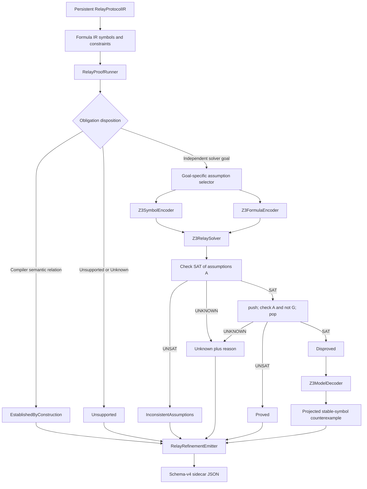

# R-PREDA Z3 Solver Backend Implementation

## 1. Scope and result

This change adds an optional Z3 backend for the existing solver-independent
R-PREDA refinement Formula IR. It consumes the persistent symbols,
constraints, and proof obligations emitted by the transpiler and attaches a
machine-readable `solver_result` to each obligation when the backend is
enabled.

The implementation is analysis-only. It does not change:

- generated `prlrt::relay*` calls or generated contract C++;
- relay serialization or `SimuTxn`;
- relay target calculation, scope/shard routing, or enqueue behavior;
- queues, shard workers, batching, scheduling, or runtime execution.

The manifest remains schema version 4. With `RPREDA_ENABLE_Z3=OFF`, the
existing schema-v4 JSON is retained without solver-only fields and the build
does not search for, download, compile, or link Z3.

## 2. Architecture



The production integration point remains after refinement generation in
`RelayProtocolCollector::BuildRefinement()`. The solver reads finalized
analysis artifacts and never feeds a result back into lowering.

## 3. New files

| File | Responsibility |
|---|---|
| `oxd_preda/transpiler/relay_protocol/refinement/solver/RelaySolverBackend.h` | Backend-independent solver request and interface |
| `oxd_preda/transpiler/relay_protocol/refinement/solver/RelaySolverResult.h` | Solver statuses, elapsed time, actual assumptions, and projected model values |
| `oxd_preda/transpiler/relay_protocol/refinement/solver/RelayProofRunner.h/.cpp` | Obligation disposition, sound assumption selection, circularity rejection, and per-obligation dispatch |
| `oxd_preda/transpiler/relay_protocol/refinement/solver/z3/Z3SymbolEncoder.h/.cpp` | Formula-sort and stable-symbol encoding, including one context-local Address sort |
| `oxd_preda/transpiler/relay_protocol/refinement/solver/z3/Z3FormulaEncoder.h/.cpp` | Owning Formula IR to Z3 expression translation |
| `oxd_preda/transpiler/relay_protocol/refinement/solver/z3/Z3RelaySolver.h/.cpp` | Two-stage satisfiability algorithm, timeout handling, and result classification |
| `oxd_preda/transpiler/relay_protocol/refinement/solver/z3/Z3ModelDecoder.h/.cpp` | Deterministic projection of countermodels onto stable refinement symbols |

## 4. Updated files

| File | Change |
|---|---|
| `oxd_preda/transpiler/relay_protocol/refinement/RelayConstraint.h` | Adds `SemanticDefinition`, `SolverAssumption`, and `SolverGoal` constraint roles |
| `oxd_preda/transpiler/relay_protocol/refinement/RelayProofObligation.h` | Adds construction/solver disposition, `BooleanRefinement`, and owning solver result |
| `oxd_preda/transpiler/relay_protocol/refinement/RelayConstraintGenerator.cpp` | Classifies compiler definitions, count assumptions, and upper-bound goals |
| `oxd_preda/transpiler/relay_protocol/refinement/RelayRefinementEmitter.cpp` | Emits additive solver roles and `solver_result` in Z3-enabled manifests |
| `oxd_preda/transpiler/relay_protocol/RelayProtocolCollector.cpp` | Runs the optional backend after Formula IR and constraints are finalized |
| `oxd_preda/transpiler/CMakeLists.txt` | Adds the default-OFF option, local Z3 discovery, conditional sources/linking, and test runtime library path |
| `oxd_preda/transpiler/test/RelayProtocolIRTests.cpp` | Adds solver, soundness, bit-vector, model, and compatibility coverage |

## 5. Non-circular proof boundary

The compiler now distinguishes three uses of formulas.

### 5.1 Semantic definitions

The following are copied directly from compiler semantics:

- `RelayTargetEquality`;
- `RelayArgumentEquality`;
- `RelayGuardNecessity`;
- `RelayCountEquality`.

Their solver result is `EstablishedByConstruction`. No Z3 context is created
for these obligations, and their own constraint IDs are not reported as
solver assumptions. This avoids the unsound pattern:

```text
assume G
prove G
```

### 5.2 Solver assumptions

Only facts selected by a goal-specific whitelist enter the assumption set.
`RelayCountNonNegative` is classified as a solver assumption. Semantic
definitions may support a different goal, but never their own obligation.

### 5.3 Solver goals

The initial automatically generated goals are:

- `RelayCountUpperBound`;
- `TargetNonAliasCandidate`.

`BooleanRefinement` is an additive generic Boolean goal used for explicit
refinement checks and focused tests. `RelayGuardEquivalence` remains
unsupported without CFG sufficiency evidence.

`RelayCountUpperBound` constraints are explicitly marked `SolverGoal`, not
assumptions. The legacy `constraint_ids` field remains provenance; the new
`solver_result.assumption_constraint_ids` field records the exact formulas
actually asserted to Z3.

Both `RelayProofRunner` and `Z3RelaySolver` reject a selected assumption that:

- is classified as `SolverGoal`;
- is the obligation's own provenance constraint; or
- is structurally identical to the goal.

The result is `EncodingError` with a `circular_assumption_rejected` reason,
never `Proved`.

## 6. Goal-specific assumption selection

### 6.1 Relay count upper bound

For a source function, the runner selects only:

- its independent `RelayCountEquality` semantic definition; and
- its `RelayCountNonNegative` fact.

The `RelayCountUpperBound` formula itself is excluded. If no exact count
definition exists, the upper-bound solver goal is `Unsupported` rather than
checking an unconstrained count variable.

For a conditional relay this gives:

```text
A:
  direct_count = ite(condition, 1, 0)
  direct_count >= 0

G:
  direct_count <= 1
```

### 6.2 Target non-alias

For sites `a` and `b`, the runner selects only:

- target relations for `a` and `b`; and
- guard-necessity relations for `a` and `b`.

It excludes argument, count, other-site, and other-function constraints. A
same-target pair is therefore disproved with a concrete model. An if/else
pair with mutually exclusive guards is proved because both emission Booleans
cannot hold simultaneously under the compiler-established guard facts.

### 6.3 Explicit Boolean refinements

An explicit `BooleanRefinement` receives only constraints deliberately marked
`SolverAssumption`. There is no default "assert every manifest constraint"
fallback.

## 7. Z3 encoding

### 7.1 Sorts

| Formula IR sort | Z3 encoding |
|---|---|
| `Bool` | `Bool` |
| mathematical `Int` | `Int` |
| `UnsignedBitVector(w)` | `BitVec(w)` |
| `Address` | one uninterpreted `RPreda.Address` sort per Z3 context |
| `Unknown` | encoding failure; no fresh unconstrained value is created |

Supported unsigned widths remain 8, 16, 32, 64, 96, 128, 160, 256, and 512.
The required 32 through 512 widths are preserved exactly.

### 7.2 Unsigned semantics

Unsigned operations use Z3 bit-vector operations:

- addition, subtraction, multiplication, unary minus, and bitwise operators
  wrap modulo `2^w`;
- division and remainder use `udiv` and `urem`;
- comparisons use `ult`, `ule`, `ugt`, and `uge`;
- right shift uses logical `lshr`.

No fixed-width value is silently converted to mathematical `Int`.

### 7.3 Explicit casts

Only Formula IR `Cast` nodes introduce conversions:

- narrower unsigned BV to wider BV: zero extension;
- wider unsigned BV to narrower BV: low-bit extraction;
- mathematical Int to BV: `int2bv`;
- unsigned BV to mathematical Int: unsigned `bv2int`.

Operand and result sorts must otherwise match exactly. This preserves the
`uint16` to `uint32` casts in MillionPixel.

### 7.4 Literals and unsupported formulas

Decimal and hexadecimal PREDA integer spelling and width suffixes are parsed
without host-width truncation. Address literals become constants of the one
Address sort. Formula symbols must resolve to emitted stable symbol metadata
with exactly the same sort.

An `Unknown` node/sort, unknown symbol, unsupported operator, invalid cast,
or incompatible sort returns an explicit failure reason. It never becomes a
fresh Z3 value.

## 8. Solver algorithm and statuses

For assumptions `A` and goal `G`, `Z3RelaySolver` performs:

```text
check SAT(A)
  UNSAT   -> InconsistentAssumptions
  UNKNOWN -> Unknown with reason_unknown
  SAT     -> continue

push
assert not G
check SAT(A and not G)
  UNSAT   -> Proved
  SAT     -> Disproved plus projected counterexample
  UNKNOWN -> Unknown with reason_unknown
pop
```

A total per-obligation timeout is divided across the two checks. The second
check receives only the remaining budget. Z3 exceptions and encoding
failures become `EncodingError` with a diagnostic reason.

The complete result status set is:

```text
NotRun
EstablishedByConstruction
Proved
Disproved
Unknown
Unsupported
InconsistentAssumptions
EncodingError
```

Counterexamples include only stable refinement symbols referenced by the
actual assumptions or goal, sorted by symbol ID. Internal helper declarations
and unrelated manifest symbols are not exposed.

## 9. Manifest extension

When Z3 is enabled, each proof obligation retains its original `status`,
`goal`, and `constraint_ids`, and adds `proof_role` and `solver_result`.

### 9.1 Proved upper-bound example

```json
{
  "id": "rpreda.obligation.count.F.upper_bound",
  "kind": "RelayCountUpperBound",
  "status": "Generated",
  "proof_role": "SolverGoal",
  "constraint_ids": [
    "rpreda.constraint.count.F.upper_bound"
  ],
  "goal": {
    "kind": "Binary",
    "operator": "<=",
    "sort": { "kind": "Bool" },
    "children": []
  },
  "solver_result": {
    "backend": "z3",
    "status": "Proved",
    "elapsed_time_ms": 0,
    "assumption_constraint_ids": [
      "rpreda.constraint.count.F.equality",
      "rpreda.constraint.count.F.non_negative"
    ],
    "reason": "the assumptions and negated goal are unsatisfiable",
    "projected_counterexample": []
  }
}
```

The abbreviated `goal.children` above omits the recursive Formula IR only for
readability. The real manifest retains the full goal.

### 9.2 Disproved non-alias example

```json
{
  "kind": "TargetNonAliasCandidate",
  "status": "Generated",
  "proof_role": "SolverGoal",
  "solver_result": {
    "backend": "z3",
    "status": "Disproved",
    "elapsed_time_ms": 0,
    "assumption_constraint_ids": [
      "rpreda.constraint.target_relation.site.a",
      "rpreda.constraint.target_relation.site.b"
    ],
    "reason": "Z3 found a model satisfying the assumptions and negated goal",
    "projected_counterexample": [
      {
        "symbol_id": "rpreda.symbol.relay_emitted.fn.F.site.a",
        "sort": { "kind": "Bool" },
        "value": "true"
      }
    ]
  }
}
```

### 9.3 Compiler-established example

```json
{
  "kind": "RelayTargetEquality",
  "status": "Generated",
  "proof_role": "EstablishedByConstruction",
  "solver_result": {
    "backend": "compiler",
    "status": "EstablishedByConstruction",
    "elapsed_time_ms": 0,
    "assumption_constraint_ids": [],
    "reason": "the relation is established directly by compiler construction; no solver query was run",
    "projected_counterexample": []
  }
}
```

## 10. Optional build

Z3 is disabled by default:

```bash
cmake -S . -B build \
  -DRPREDA_ENABLE_Z3=OFF
cmake --build build --target relay_protocol_ir_tests
```

This path does not invoke `find_package(Z3)` and has no Z3 source or link
dependency.

Enable the backend with an already installed Z3 C++ SDK:

```bash
cmake -S . -B build-z3 \
  -DRPREDA_ENABLE_Z3=ON \
  -DZ3_ROOT=/path/to/z3
cmake --build build-z3 --target relay_protocol_ir_tests
ctest --test-dir build-z3 -R '^relay_protocol_ir$' --output-on-failure
```

Discovery first accepts a CMake package exporting `z3::libz3`. It then falls
back to local `z3++.h` and `libz3` discovery via `Z3_ROOT`. If enabled but the
SDK is unavailable, configuration fails with a clear error. No dependency is
downloaded by this CMake path.

CTest receives the discovered Z3 runtime library directory only in enabled
builds.

## 11. Tests and validation

The Z3-enabled suite covers:

| Required case | Result |
|---|---|
| Conditional relay count `<= 1` | `Proved`; count equality is an assumption, upper-bound goal is not |
| Same-target non-alias | `Disproved` with projected counterexample |
| If/else guarded targets | `Proved` from mutually exclusive guard necessities |
| `uint32` wraparound | `x + 0xffffffffu32 + 1u32 == x` is `Proved` |
| Explicit `uint16` to `uint32` cast | high 16 bits are zero; `Proved` |
| MillionPixel key | equal `(x,y)` pairs imply equal `uint32(x) * 65536u32 + uint32(y)` keys |
| Opaque/Unknown formula | `Unsupported` |
| Conflicting assumptions | `InconsistentAssumptions` before the goal check |
| No circular proof | semantic target equality is `EstablishedByConstruction`, backend `compiler`, with no solver assumptions |
| Generated C++ invariance | all nine existing size/FNV-1a goldens remain enabled and pass |

Validation performed on 2026-07-29:

```text
RPREDA_ENABLE_Z3=ON:
  relay_protocol_ir_tests: 34/34 passed
  CTest: 1/1 passed

RPREDA_ENABLE_Z3=OFF:
  relay_protocol_ir_tests: 25/25 passed
  CTest: 1/1 passed
  Z3 source references in build.ninja: 0
  Z3 link references in build.ninja: 0
  transpiler.so Z3 dependency: none
```

The existing nine generated-C++ byte-count/FNV-1a checks run in both modes.
They cover named and lambda relays, global/shards relays, if/else and else-if,
bounded loops, nested lambdas, and opaque targets.

## 12. Conservative limits

1. Guard equivalence remains unsupported until the protocol IR has sufficient
   CFG evidence.
2. Loop occurrence-indexed target, argument, and guard goals remain
   unsupported.
3. Recursive finite-depth goals remain outside the Formula IR solver layer.
4. A formula containing `Unknown` is never partially encoded.
5. Different Address literal spellings are not assumed distinct solely from
   their names; Address remains an uninterpreted sort.
6. The initial backend proves validity of represented Boolean goals. It does
   not change relay execution or enforce a proved fact at runtime.
